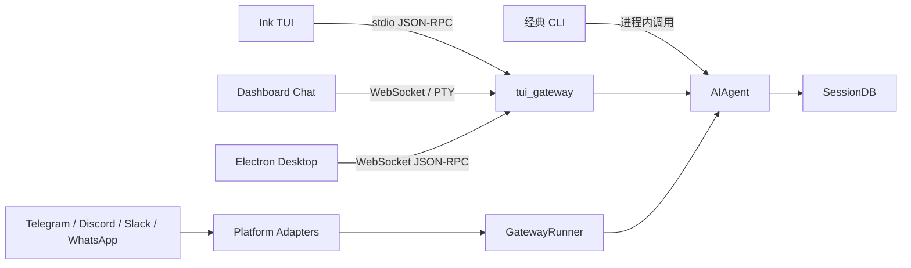

# 第 15 讲：CLI、TUI、Gateway、Dashboard 与 Desktop

前面十四讲一直在 Agent 内部观察 Hermes：prompt 怎么构建，工具怎么执行，会话怎么持久化，定时任务怎么运行。这一讲把镜头移到系统边界。用户从终端、浏览器、桌面应用或消息平台发来一句话之后，消息究竟经过哪些进程和协议，才会进入 `AIAgent`？

这不是一篇界面使用说明。真正要学的是：Hermes 怎样让同一个 Agent 内核服务多种交互表面，同时避免把界面状态、实时会话、持久化历史和消息平台身份混为一谈。

## 这篇先解决什么问题

读完这一讲，应该能讲清楚这些问题：

- 经典 CLI 为什么直接调用 `AIAgent`，TUI 为什么要隔一层 JSON-RPC。
- `gateway/` 和 `tui_gateway/` 都叫 Gateway，为什么不是同一个模块。
- `hermes dashboard`、`hermes serve` 和 Desktop 共享了什么，又各自保留了什么。
- Telegram、Discord 等平台消息怎样被归一化，怎样映射到稳定的 session key。
- Agent 正在工作时又收到新消息，`queue`、`steer`、`interrupt` 分别是什么意思。
- Gateway 重启后怎样处理被打断的会话，为什么恢复不能只靠重新读取聊天记录。

## 先建立全局地图：Hermes 其实有两类 Gateway

源码中有两个容易混淆的名字：

| 名称 | 主要目录 | 服务对象 | 核心职责 |
| --- | --- | --- | --- |
| UI Gateway | `tui_gateway/` | Ink TUI、Web、Desktop | 用 JSON-RPC 暴露 session、prompt、config 和事件流 |
| 消息平台 Gateway | `gateway/` | Telegram、Discord、Slack、WhatsApp 等 | 接入平台事件，鉴权，划分会话，处理并发输入并把结果发回平台 |

它们最终都能创建 `run_agent.py` 中的 `AIAgent`，但入口协议、会话身份和生命周期完全不同。



这里还要先纠正一个直觉：多个表面使用同一个 `SessionDB`，只代表它们可以读取同一份持久化历史，不代表它们共享同一个正在运行的 Python 对象。实时 session registry、当前 turn、流式 token 和待审批请求通常属于某个具体后端进程。

## 功能 1：命令行怎样选择经典 CLI 或 TUI

### 入口只有一个，交互实现有两套

安装包在 `pyproject.toml` 中把 `hermes` 命令指向 `hermes_cli.main:main`：

```toml
[project.scripts]
hermes = "hermes_cli.main:main"
hermes-agent = "run_agent:main"
```

`hermes` 是完整产品入口，负责解析配置、子命令、profile 和显示模式。`hermes-agent` 更接近直接运行 Agent 的底层入口，不能把两者当成等价命令。

`hermes_cli/main.py` 中的 `_resolve_use_tui` 决定聊天命令走哪套界面。它的优先级大致是：

1. 显式 `--cli` 强制经典 CLI。
2. 显式 `--tui` 或环境配置要求 TUI。
3. 配置文件中的 `display.interface`。
4. 都没有指定时使用经典 CLI 默认值。

决定完成后，`cmd_chat` 才真正分叉：

```python
def cmd_chat(args):
    # 先解析 continue / resume 等会话参数
    ...

    if _resolve_use_tui(args):
        return _launch_tui(...)

    from cli import main as cli_main
    return cli_main(...)
```

这一步的输入是命令行参数和 Hermes 配置，输出不是模型回复，而是“由哪套前端接管本次进程”。

### 经典 CLI：最短的调用链

经典 CLI 的主链路可以压缩成：

```text
hermes
  -> hermes_cli.main.cmd_chat
  -> cli.main
  -> HermesCLI
  -> CLIAgentSetupMixin._init_agent
  -> AIAgent.run_conversation
```

`cli.py` 中的 `HermesCLI` 自己维护输入循环、终端显示和 Agent 引用。用户提交一句话后，它可以直接调用：

```python
result = cli.agent.run_conversation(
    user_message,
    ...
)
```

中间没有 HTTP，也没有 JSON-RPC。这样做的优点是链路短、调试直接、依赖少。代价是 UI 和 Agent 生命周期处在同一个 Python 进程里，其他语言编写的界面无法直接复用这套交互边界。

### TUI：Node 前端加 Python Agent 后端

TUI 使用 Ink 构建，运行在 Node.js 进程中。`_launch_tui` 会寻找或构建前端 bundle，然后启动 Node：

```text
hermes --tui
  -> hermes_cli.main._launch_tui
  -> Node / Ink TUI
  -> spawn python -m tui_gateway.entry
  -> JSON-RPC over stdin/stdout
  -> tui_gateway.server.dispatch
  -> AIAgent
```

这里采用协议边界不是为了让架构显得复杂，而是解决三个具体问题：

- Ink 擅长终端 UI，Agent 内核和工具生态仍在 Python。
- 前端崩溃、重绘和键盘输入不必侵入 Agent loop。
- 同一套 RPC 方法以后还能通过 WebSocket 被 Dashboard 和 Desktop 复用。

TUI 默认自己启动 `python -m tui_gateway.entry`。如果设置了 `HERMES_TUI_GATEWAY_URL`，它也可以附着到已经运行的 WebSocket Gateway，不再创建自己的 Python 子进程。这是 Dashboard 内嵌 TUI 时会用到的连接方式。

## 功能 2：UI Gateway 怎样把 JSON-RPC 变成一次 Agent 运行

### stdio 只是传输，`server.dispatch` 才是协议核心

`tui_gateway/entry.py` 启动后会先输出一个 `gateway.ready` 事件，再逐行读取 stdin。每一行都是一个 JSON-RPC frame：

```python
write_json({
    "jsonrpc": "2.0",
    "method": "event",
    "params": {
        "type": "gateway.ready",
        "payload": {"skin": resolve_skin()},
    },
})

for line in sys.stdin:
    request = json.loads(line)
    response = dispatch(request)
    write_json(response)
```

代码细节可能随版本变化，但职责边界很稳定：

- `entry.py` 负责进程 I/O 和 JSON frame。
- `server.py` 负责方法注册、session 状态和 Agent 调用。
- UI 只消费 RPC 结果与事件，不直接导入 `AIAgent`。

同一套 `server.dispatch` 还能被 `tui_gateway/ws.py` 放到 WebSocket 上。换句话说，stdio 和 WebSocket 是两种 transport，RPC 方法和 Agent 行为仍由同一个 server 模块决定。

### 方法注册和分发

`tui_gateway/server.py` 用装饰器维护方法表：

```python
_methods = {}

def method(name):
    def decorator(fn):
        _methods[name] = fn
        return fn
    return decorator
```

`dispatch` 根据 `method` 找 handler。耗时操作会交给线程池，轻量状态查询可以内联执行。当前连接对应的 transport 会通过上下文变量绑定到这次请求，使后台 worker 发出的 token、tool event 和审批事件能够回到正确客户端。

如果所有 handler 都直接阻塞读取循环，`prompt.submit` 一旦运行几十秒，`session.interrupt`、状态查询和审批响应也会被堵住。因此“耗时方法离开 I/O 线程”不是性能微调，而是可中断交互成立的前提。

### 一次 UI 会话的生命周期

核心 RPC 可以按下面的顺序理解：

| RPC | 负责什么 | 触发时机 | 输出给谁 |
| --- | --- | --- | --- |
| `session.create` | 建立轻量 live session，认领会话租约 | 用户打开新聊天 | 返回 session id 和初始界面状态 |
| `session.resume` | 从 `SessionDB` 恢复历史并清理不完整 tool tail | 用户打开旧会话 | 返回可继续运行的 live session |
| `prompt.submit` | 提交用户输入，启动或排队一次 turn | 用户发送消息 | 先返回接收状态，随后持续发事件 |
| `session.interrupt` | 协作式中断当前 Agent，清理本 session 的待处理输入和审批 | 用户按停止 | 返回中断结果，后台 turn 逐步退出 |
| `session.close` | 释放 live session 和相关资源 | 用户关闭会话 | 结束当前进程里的实时绑定 |
| `session.branch` | 从历史节点创建分支 | 用户希望改写后续对话 | 返回新的 session |
| `session.steer` | 给正在运行的 Agent 注入引导 | 用户补充方向 | 影响后续模型迭代 |

这张表不能理解成数据库 CRUD。`session.create` 创建的是可交互的运行时壳，`SessionDB` 中的持久记录可以推迟到第一次真正提交 prompt 时再创建。这样用户只是打开一个空标签页，不会马上污染历史列表。

### 为什么 Agent 要延迟构建

构建 `AIAgent` 可能涉及 provider、工具、MCP、skills 和插件发现。如果 `session.create` 同步做完全部初始化，用户每次打开聊天都要等完整冷启动。

源码用 `_start_agent_build` 把这部分工作放到后台：

```text
session.create
  -> 建立轻量 session record
  -> 返回 UI shell
  -> 后台构建 AIAgent

prompt.submit
  -> 确保持久化记录存在
  -> 等待或复用 agent build
  -> worker 执行 run_conversation
```

这里有一个常见误解：延迟构建不是“第一次消息来了才一定从零初始化”。`session.create` 后可以立即预热，只是不让 UI 等待它。`prompt.submit` 则承担最终同步点：Agent 没准备好时必须等，准备好时直接复用。

### 恢复时为什么要清理 tool-call 尾巴

进程可能在模型已经产生 tool call、但工具结果还没写回时退出。这样的历史尾部不满足多数模型 API 对消息配对的要求：有 assistant tool call，却没有对应 tool result。

`session.resume` 会调用类似 `sanitize_replay_history` 的逻辑，识别并修复悬空尾巴。否则恢复会话后的第一次 provider 请求就可能被 API 拒绝。这里解决的是“协议历史可重放”，不是把失败工具伪装成成功。

### 中断为什么是协作式的

`session.interrupt` 会调用 `agent.interrupt`，拒绝当前 session 中等待的审批，并清理它自己的 pending prompts。它不会粗暴杀死整个后端进程，也不会默认杀掉所有后台子进程。

原因是一个 `tui_gateway` 进程可能同时服务多个 live session。杀进程会让不相关会话一起消失，也可能留下数据库、工具结果和子进程状态不一致。协作式中断让 Agent loop 在安全检查点退出，并把“用户要求停止”作为明确状态向上返回。

## 功能 3：Dashboard、serve 和 Desktop 如何复用 UI Gateway

### `dashboard` 与 `serve` 共用后端

`hermes_cli/subcommands/dashboard.py` 把两个命令都交给 `cmd_dashboard`：

```python
dashboard_parser.set_defaults(func=cmd_dashboard)
serve_parser.set_defaults(func=cmd_dashboard, no_open=True)
```

两者最终启动 `hermes_cli/web_server.py` 中的 FastAPI/Uvicorn 服务。主要区别是：

- `hermes dashboard` 面向浏览器管理界面，默认可以打开浏览器。
- `hermes serve` 只启动后端，不打开页面，适合 Desktop 或远程客户端。

所以 `serve` 不是另一套 Agent server，它是同一个 Web 后端的 headless 使用方式。

### Web 后端同时承担三类通道

Dashboard 后端并非只有一条“聊天 API”。它同时提供：

| 通道 | 用途 | 典型调用方 |
| --- | --- | --- |
| REST `/api/*` | 配置、状态、历史会话、Gateway 管理、memory 等管理操作 | React Dashboard、Desktop |
| WebSocket `/api/ws` | 结构化 JSON-RPC、流式 Agent 事件 | Desktop、附着模式 TUI |
| WebSocket `/api/pty` | 在浏览器里桥接一个终端 PTY | Dashboard 的 Chat 页 |
| WebSocket `/api/pub`、`/api/events` | PTY 侧事件转发到浏览器侧栏 | Dashboard 内嵌聊天 |

REST 更适合“给我当前配置”“列出持久化会话”这类短请求。JSON-RPC WebSocket 更适合 prompt、token stream、tool status、approval 等双向长连接事件。PTY 则保留 Ink TUI 已有的完整终端体验。

### Dashboard 的 Chat 不是另一套 Agent 前端

当前实现里，Dashboard Chat 页的主要链路是：

```text
React ChatPage + xterm
  -> /api/pty
  -> 启动或连接 Ink TUI
  -> TUI 通过 /api/ws 附着 UI Gateway
  -> tui_gateway.server.dispatch
  -> AIAgent
```

浏览器看到的是终端组件中的 TUI，而不是 React 重新实现了一套完整消息渲染器。这个选型的收益是行为一致：TUI 新增命令、工具状态或快捷交互后，Web Chat 可以直接复用。代价是 PTY 支持受操作系统环境影响；例如原生 Windows 下相关路径可能要求 WSL2，而管理页面本身仍可正常运行。

### Desktop 不嵌入 Dashboard 页面

Desktop 使用 Electron 外壳和原生 React chat surface。主进程负责找到 Hermes runtime、启动后端和把连接信息交给 renderer：

```text
Electron main
  -> spawn hermes serve --host 127.0.0.1 --port 0
  -> 等待后端 ready
  -> renderer 取得 URL / token
  -> apps/shared JsonRpcGatewayClient
  -> /api/ws
  -> tui_gateway
  -> AIAgent
```

旧版本 runtime 没有 `serve` 命令时，`apps/desktop/electron/backend-command.cjs` 会退回 `dashboard --no-open`。这是兼容旧安装的 fallback，不代表 Desktop 依赖浏览器 Dashboard UI。

### 共享客户端怎样管理 RPC 请求

`apps/shared/src/json-rpc-gateway.ts` 中的 `JsonRpcGatewayClient` 被 Web 与 Desktop 复用。它维护：

- 递增 request id。
- `pending` map，把响应 id 对回 Promise。
- 连接超时和单次请求超时。
- 普通事件与 wildcard event handler。
- 连接关闭时统一拒绝所有未完成请求。

`AbortSignal` 只能让客户端放弃等待并删除本地 pending resolver。它不等于服务器已经停止执行 Agent。真正的服务端取消仍要调用 `session.interrupt` 等协作式 RPC。这是前后端系统里很常见、也很容易讲错的边界：取消等待和取消工作不是一回事。

### 为什么共享历史不等于共享正在运行的 turn

假设 CLI 和 Desktop 指向同一个 `HERMES_HOME`：

- 它们可以从同一个 `SessionDB` 看到已持久化消息。
- Desktop 可以恢复 CLI 创建的 session，反过来也可能成立。
- 但 CLI 进程里的 `AIAgent` 对象、当前 token stream、pending approval 不会自动迁移到 Desktop 后端。

如果两个后端同时恢复同一个 session，必须依赖租约和并发保护避免互相覆盖。不能把 SQLite 当成实时进程协调器的全部答案。

## 功能 4：消息平台 Gateway 怎样把外部事件变成 Agent 输入

### GatewayRunner 是常驻运行时

`hermes gateway` 由 `hermes_cli/gateway.py` 接管，随后进入 `gateway/run.py` 中的 `start_gateway`。它会创建 `GatewayRunner`，持有 PID/运行锁，安装信号处理，发现 MCP 和插件，启动平台 adapter、cron scheduler 与后台维护任务。

它和 TUI Gateway 最大的差别是生命周期。TUI Gateway 通常服务一个用户界面；消息 Gateway 要长时间在线，面对平台断线、重复事件、用户鉴权、群聊隔离、重启恢复和多个会话同时运行。

### 平台 adapter 先做协议归一化

Telegram update、Discord event 和 Slack message 的字段并不相同。Hermes 不让 Agent loop 逐个平台判断，而是在 adapter 层统一成 `gateway/platforms/base.py` 的 `MessageEvent`：

```python
@dataclass
class MessageEvent:
    text: str
    message_type: MessageType = MessageType.TEXT
    source: SessionSource = None
    raw_message: Any = None
    message_id: Optional[str] = None
    media_urls: List[str] = field(default_factory=list)
    media_types: List[str] = field(default_factory=list)
    reply_to_message_id: Optional[str] = None
    reply_to_text: Optional[str] = None
```

字段的准确数量会随版本变化，但设计重点不变：adapter 把平台差异收敛成“内容 + 来源 + 媒体 + 路由元数据”。后面的 GatewayRunner 只处理统一事件。

`BasePlatformAdapter.handle_message` 还会先归一化命令、恢复 topic id、生成 session key，并识别 `/stop`、`/new`、`/reset`、`/approve` 等控制命令。这些命令不能像普通用户消息一样排到忙碌会话末尾，否则用户可能永远无法停止任务或批准当前工具。

### SessionSource 不只是来源标签

`gateway/session.py` 中的 `SessionSource` 描述平台、chat、user、thread、scope 和 profile。它被用于三件事：

- 决定这条消息属于哪个 session。
- 给 prompt 注入平台和会话上下文。
- 决定最终回复发到哪个 chat/thread。

真正生成 key 的单一入口是 `build_session_key`。概念上可以理解为：

```text
namespace + platform + chat_id + thread_id + optional user_id
```

不同场景的隔离规则不同：

| 场景 | key 的主要组成 | 设计原因 |
| --- | --- | --- |
| 私聊 | platform + chat id + 可选 thread | 不同私聊用户不能共享历史 |
| 群聊/频道 | chat id + thread/topic | 同一话题需要连续上下文 |
| 按参与者隔离的群聊 | 再加入 user id | 防止群内不同用户互相继承私人上下文 |
| profile 模式 | namespace 使用 profile | 不同 Agent 配置与身份分开 |

session key 是安全边界，不只是字典索引。如果少拼了 `thread_id`，两个话题可能串线；如果该按用户隔离却漏掉 `user_id`，就可能把一个人的历史和 memory 暴露给另一个人。

### `_handle_message` 的关口为什么这么多

平台消息到达 `GatewayRunner._handle_message` 后，大致经过下面的顺序。每一项都决定消息是否能进入下一步：

| 顺序 | 关口 | 做什么 | 跳过或做错会怎样 |
| --- | --- | --- | --- |
| 1 | ContextVar 重置 | 清掉上一个异步任务继承的 platform/chat 上下文 | A 会话的路由信息可能泄漏到 B 会话 |
| 2 | 启动恢复闸门 | Gateway 正在恢复中时，先缓存真实新消息 | 新消息可能与恢复 turn 争用同一 session |
| 3 | 活跃标记 | 真实平台输入刷新 activity；内部事件不伪装成人类活跃 | scale-to-zero 和空闲判断会失真 |
| 4 | `pre_gateway_dispatch` hook | 插件可允许、改写或跳过事件 | 无法在 Agent 前实施平台策略 |
| 5 | 鉴权与配对 | 校验 sender、allowlist 和 pairing | 未授权用户可驱动工具和读取上下文 |
| 6 | 待处理响应路由 | 先识别审批、澄清、更新确认等回复 | “批准”会被误当成新问题，原 turn 继续死等 |
| 7 | busy policy | 同 session 已运行时选择 queue/steer/interrupt | 两个 turn 可能并发改写同一历史 |
| 8 | 获取 session 并运行 Agent | 恢复历史、创建 `AIAgent`、执行对话 | 进入真正的模型与工具循环 |
| 9 | 流式发送与队列排空 | 将 partial/final 发回来源平台，再处理 follow-up | 可能重复发送、丢失后续消息 |

这里最值得学的是顺序，而不只是关口名字。审批回复必须早于 busy policy，因为它属于当前 turn 的控制输入；鉴权必须早于 Agent 构建，因为未授权消息不应该触发昂贵初始化；ContextVar 必须最先重置，因为异步任务会继承创建时的上下文。

## 功能 5：Agent 忙碌时，queue、steer、interrupt 有什么区别

### 为什么“再发一句”不是简单追加消息

模型正在调用工具时，用户又发来一句“等等，不要改数据库，只查日志”。系统至少有三种合理解释：

- 等当前任务完整结束，再把这句话作为下一轮用户输入。
- 把它注入当前任务，让模型下一次迭代及时改方向。
- 停止当前任务，然后立刻用新消息开始下一轮。

Hermes 把这三种语义显式建模为 `queue`、`steer` 和 `interrupt`。

### queue：保留一个完整的新 turn

`queue` 把事件放入该 session 的待处理队列。当前 Agent 完成后，Gateway 按 FIFO 取出事件，再运行一次完整对话。

```text
turn A 正在运行
  -> 用户消息 B 进入 pending slot / overflow FIFO
  -> A 结束并持久化
  -> B 作为新的 user turn 运行
```

它适合“不必打断当前工作，但这件事随后要做”。源码不仅保存字符串，还尽量保留 `MessageEvent` 边界，因为媒体、回复关系和平台 metadata 也属于输入。显式 `/queue` 的多条消息还需要 overflow 列表，不能让后来的消息覆盖前一条。

失败边界是：当前 turn 如果长时间不结束，队列就长时间不被消费。因此用户仍需要 `/stop` 等旁路控制命令。

### steer：改变当前 Agent 的后续方向

`steer` 调用正在运行的 Agent 的 steer 能力，把文本注入后续模型迭代。它不创建一个独立 user turn，也不会立刻终止正在执行的工具。

```text
工具执行完成
  -> Agent 准备下一次 provider 请求
  -> 读取 steering message
  -> 模型在当前任务上下文中调整计划
```

它适合“当前目标不变，只补充约束”。如果当前 Agent 无法接受 steer，Gateway 会退回 queue，保证消息不丢。这里的关键取舍是：steer 响应更及时，但 transcript 语义没有完整新 turn 那么清晰，因此不能把所有输入都偷偷 steer。

### interrupt：停止当前工作，再处理 follow-up

`interrupt` 会先保存 follow-up，再调用 `agent.interrupt(event.text)`。Agent loop 在可中断位置退出后，Gateway 运行排队的新消息。

为什么要先排队再中断？因为如果中断成功而新消息还没入队，进程异常或竞态可能让用户的真正意图丢失。

Hermes 还会在某些昂贵或敏感阶段把 interrupt 降级为 queue，例如：

- 当前有子 Agent 正在运行。
- 当前正在做上下文压缩。
- 输入是内部 completion event，而不是用户真实消息。

强行中断子 Agent 可能留下后台工作与父会话脱节；压缩中断可能让 summary 与历史偏移不一致；内部完成事件更不应该反过来打断用户任务。

### 三种模式的对照

| 模式 | 当前 turn | 新输入是否是独立 turn | 适合场景 | 主要风险 |
| --- | --- | --- | --- | --- |
| `queue` | 继续 | 是 | “做完这个再做那个” | 等待时间可能很长 |
| `steer` | 继续，但后续迭代改方向 | 通常不是 | “继续做，但加一个限制” | 历史语义不如独立 turn 清楚 |
| `interrupt` | 协作式停止 | 是 | “立即停下，改做这件事” | 工具和子任务可能处于中间状态 |

### generation token 解决什么竞态

中断以后，旧 worker 不一定瞬间消失。它可能晚一点才返回 final result。如果这时新 turn 已经开始，旧 worker 的清理代码不能把新 Agent 从 `_running_agents` 删除，也不能把旧结果覆盖到新历史上。

`GatewayRunner` 为每个 session 维护 run generation。启动新 run 时 generation 递增，worker 完成时只清理自己那一代：

```text
run A: generation = 7
用户中断
run B: generation = 8
run A 晚到的 finally 发现 7 != 8
  -> 不清除 run B 的 active state
```

这是长期运行服务常见的“陈旧完成结果”问题。单靠一个 `is_running` 布尔值无法区分是哪一轮在清理。

## 功能 6：重启、恢复和优雅关闭

### 仅保存消息还不够

Gateway 重启时，数据库可能已经有用户消息、assistant tool call 和部分 tool result。系统还要知道上一轮究竟是正常结束、主动停止，还是被进程关闭打断。

Hermes 会给被 drain 打断的会话记录 `resume_pending` 一类持久标记。下次启动时，只对足够新鲜的中断尝试自动继续。新鲜度窗口很重要：几天前的失败任务不应该在今天部署新版本后突然重新执行外部操作。

### 启动恢复期间为什么要缓存新消息

假设 Gateway 刚启动，正在为 session S 恢复一个中断 turn，此时 Telegram 又收到 S 的新消息。如果两条路径同时创建 Agent，就可能：

- 各自从同一历史偏移开始。
- 同时调用工具。
- 后写入者覆盖先写入者的状态。

所以源码设置 startup restore gate。恢复阶段的新真实消息先进入 `_startup_restore_queue`，恢复完成后再按 session 处理。它解决的是启动期竞态，不是普通 busy queue 的替代品。

### graceful drain 的目标

优雅关闭通常会做这些事：

| 动作 | 目的 |
| --- | --- |
| 停止接受或直接执行新工作 | 不让关闭窗口不断被延长 |
| 等待当前 Agent 到安全点 | 减少半条 tool call 历史 |
| 为未完成 session 写恢复标记 | 下次启动知道哪些任务可能需要继续 |
| 关闭 adapter 和后台 scheduler | 释放平台连接与定时资源 |
| 释放 PID、运行锁和 session lease | 避免新进程误判旧实例仍然存活 |

“优雅”不等于无限等待。达到 drain 超时后仍可能中断，但系统会尽量留下可判断、可恢复的状态。

## 功能 7：多表面架构中的安全边界

### 本地 UI Gateway 也不能默认没有风险

UI Gateway 能提交 prompt、调用工具、读取 session 和修改配置，本质上是 Agent 控制面。只监听 loopback 时，Dashboard 可以使用临时 session token。绑定非 loopback 地址时则必须启用更严格的认证，WebSocket 还要单独检查 host、origin 和 ticket/token。

原因是普通 HTTP 中间件未必覆盖 WebSocket upgrade。只保护 REST、不保护 `/api/ws`，等于把真正能运行 Agent 的入口裸露出去。

### 消息 Gateway 的身份要经过两层判断

平台 adapter 先验证事件确实来自平台连接，Gateway 再根据 pairing、allowlist 和 profile 策略判断 sender 能否驱动 Agent。平台 bot 收到一条消息，不代表该发送者自动获得工具权限。

控制命令和审批回复也必须绑定原 session、原用户和待处理 request。否则群聊中的另一个人可能替用户批准危险命令。

### 回复路由为什么不能让模型自由决定

普通平台回复通常沿消息来源 adapter 和 `SessionSource` 返回原 chat/thread。cron 或显式跨平台投递才使用更通用的 delivery route。

让模型凭字符串选择 `chat_id` 会放大两个问题：

- 模型可能发错用户或话题。
- prompt injection 可以诱导模型把内容发送到攻击者指定位置。

因此内容生成和目标路由要分离。模型产生回答，可信运行时根据事件来源决定发到哪里。

## 和 Codex / Claude Code 的差异

### Codex：App Server 与 UI Gateway 很接近

当前 Codex 不只有终端 CLI。[Codex App Server](https://developers.openai.com/codex/app-server) 也把 Agent 能力通过双向 JSON-RPC 暴露给客户端，支持 stdio JSONL，并提供实验性的 WebSocket/远程连接方式。这个结构与 Hermes 的 `tui_gateway` 很像：界面不直接嵌入 Agent 内核，而是通过协议操作 thread/session、turn 和事件流。

主要差别在产品边界：

| 问题 | Hermes | Codex |
| --- | --- | --- |
| 本地终端 | 经典 CLI 可直接调用 Agent；Ink TUI 走 UI Gateway | Codex CLI 使用自己的任务运行时 |
| UI 后端协议 | `tui_gateway` JSON-RPC，stdio 与 WebSocket 复用 | App Server JSON-RPC，服务 Codex 客户端 |
| 消息平台 | 仓库内有独立 `gateway/`，管理 adapter、chat/thread key、pairing、busy policy | App Server 本身不是 Telegram/Discord adapter 框架 |
| 长期在线行为 | Gateway、cron、平台投递和重启恢复是一等能力 | 更集中在 coding task、thread/turn 和客户端运行时 |

所以不能简单说“Codex 是 CLI，Hermes 是 Gateway”。更准确的说法是：两者都在把 Agent runtime 与客户端解耦；Hermes 还在同一仓库里实现了一套面向消息平台的常驻运行时。

[Codex CLI](https://developers.openai.com/codex/cli/features) 仍然强调在本地仓库中检查、编辑、运行命令和权限控制；这与 Hermes 经典 CLI 的短链路目标相近，但 Hermes 的多平台身份和消息并发问题更重。

### Claude Code：Channels 也是外部事件入口，但绑定模型不同

Claude Code 当前提供终端、IDE、Desktop、Web 和 Remote Control 等表面。[Claude Code Remote Control](https://code.claude.com/docs/en/remote-control) 允许其他设备继续控制本机运行的 session。

[Claude Code Channels](https://code.claude.com/docs/en/channels) 进一步允许 MCP server 把 Telegram、Discord、iMessage、webhook 等事件推入一个正在运行的 Claude Code session。Channel 可以双向回复，也可以在受信 sender 路径中转发权限请求。[Channels reference](https://code.claude.com/docs/en/channels-reference) 说明它是可扩展的 MCP 能力，而不只是写死的三个聊天平台。

与 Hermes 对比时要注意：

- Claude Channels 以“向一个正在运行的 Claude Code session 推送事件”为中心，需要 session 和 channel 进程处于运行状态。
- Hermes Gateway 以“常驻多平台 Agent 服务”为中心，自己建立平台 session key、恢复持久历史、控制同 session 的 busy policy，并与 cron、profile 和平台 delivery 集成。
- 两者都做 sender allowlist/pairing，也都不能把聊天平台消息当成天然可信输入。
- Claude Channels 把扩展协议建立在 MCP server/plugin 上；Hermes 的内置平台 adapter 使用 `BasePlatformAdapter` 和 `MessageEvent`，插件与 MCP 是旁边的扩展层。

Claude Code 的不同表面也不意味着所有 live state 自动共享。[Claude Code sessions](https://code.claude.com/docs/en/sessions) 区分各表面的历史与恢复方式。这和 Hermes 需要区分“持久化 session”与“某个后端进程里的 live session”是同一类工程问题。

## 常见误解与问答

### `gateway/` 是否就是 Dashboard 的后端？

不是。Dashboard 的结构化聊天后端在 `tui_gateway/`，HTTP/WebSocket 服务在 `hermes_cli/web_server.py`。`gateway/` 主要处理 Telegram、Discord 等消息平台。它们最终都调用 `AIAgent`，但不共享同一个入口层。

### 为什么经典 CLI 不直接复用 `tui_gateway`？

经典 CLI 已经和 Python Agent 位于同一进程，直接调用最简单，也保留了较低依赖的退路。强制它经过 RPC 会增加序列化、并发和错误处理成本。TUI、Web 与 Desktop 需要跨语言或跨进程，RPC 的收益才明显大于成本。

### `session.create` 返回成功，是否说明 SessionDB 已经有一条新记录？

不一定。UI Gateway 可以先建立 live session，再在首次 `prompt.submit` 时惰性持久化。这样打开后马上关闭的空会话不会污染历史。要区分 live session id、持久化 session row 和当前 Agent 对象。

### 浏览器关闭后，Agent 会不会自动停止？

不能只根据客户端断开下结论。客户端关闭会让未完成 RPC Promise 失败，transport 也会解绑；服务端工作是否停止取决于 session 生命周期和中断策略。客户端 `AbortSignal` 只取消本地等待，真正停止 Agent 要发送服务端中断请求。

### 同一 session 的两条消息为什么不能直接并发跑？

因为两条 turn 会读取和写入同一段历史，也可能同时调用有副作用的工具。即使数据库写入不冲突，语义也会冲突：两个模型都以为自己接在上一条消息后面。Hermes 用 active session、lease、busy policy 和 generation token 把它们串行化或显式改向。

### steer 和追加一条 user message 有什么本质差别？

追加 user message会形成下一轮独立对话；steer 是给当前运行中的 Agent 补充控制信息，让下一次模型迭代调整方向。前者适合新任务，后者适合修正当前任务。steer 失败时回退 queue，说明系统把“不丢消息”放在实时改向之前。

### 为什么审批回复必须绕过普通队列？

当前 turn 正在等待审批。如果“允许”被排到当前 turn 结束后才处理，就形成死锁：turn 等审批，审批等 turn。`/stop`、`/approve` 等控制输入必须由 adapter/Gateway 先识别并交给正在等待的状态机。

### Gateway 重启后，为什么不把所有未完成会话都自动继续？

未完成任务可能包含写文件、发消息或调用外部 API。时间过去太久后自动重放，风险往往大于收益。Hermes 用 `resume_pending`、中断原因和 freshness window 限制恢复范围，并清理不完整 tool-call 尾巴，尽量避免重复副作用。

## 本篇要记住的东西

Hermes 有两类 Gateway。`tui_gateway/` 是 UI 与 Agent 之间的 JSON-RPC 边界，服务 Ink TUI、Dashboard 和 Desktop；`gateway/` 是消息平台常驻运行时，负责 adapter、身份、session key、忙碌会话和结果路由。

经典 CLI 直接调用 `AIAgent`，链路最短。TUI 用 Node/Ink 加 Python RPC 后端。Dashboard 和 `serve` 共用 FastAPI 后端；Dashboard Chat 通过 PTY 复用 TUI，Desktop 则用原生 React 客户端通过 `/api/ws` 连接同一套 UI Gateway。

消息平台真正困难的部分不是“收到字符串再调用模型”，而是稳定划分 session、先处理审批和控制命令、在 `queue / steer / interrupt` 之间明确选择，并用 generation、lease 和恢复标记守住并发与重启边界。

可以用一句话概括这一讲：Hermes 复用的是 Agent 内核和持久化能力，不是把所有入口硬塞进同一个进程和同一种会话模型。

## 参考资料

- Hermes 源码：`pyproject.toml`
- Hermes 源码：`hermes_cli/main.py`
- Hermes 源码：`cli.py`
- Hermes 源码：`hermes_cli/cli_agent_setup_mixin.py`
- Hermes 源码：`tui_gateway/entry.py`
- Hermes 源码：`tui_gateway/server.py`
- Hermes 源码：`tui_gateway/ws.py`
- Hermes 源码：`ui-tui/src/gatewayClient.ts`
- Hermes 源码：`hermes_cli/subcommands/dashboard.py`
- Hermes 源码：`hermes_cli/web_server.py`
- Hermes 源码：`apps/shared/src/json-rpc-gateway.ts`
- Hermes 源码：`apps/desktop/electron/backend-command.cjs`
- Hermes 源码：`apps/desktop/electron/main.cjs`
- Hermes 源码：`gateway/run.py`
- Hermes 源码：`gateway/platforms/base.py`
- Hermes 源码：`gateway/session.py`
- OpenAI 文档：[Codex CLI features](https://developers.openai.com/codex/cli/features)
- OpenAI 文档：[Codex App Server](https://developers.openai.com/codex/app-server)
- Anthropic 文档：[Claude Code overview](https://code.claude.com/docs/en/overview)
- Anthropic 文档：[Claude Code Remote Control](https://code.claude.com/docs/en/remote-control)
- Anthropic 文档：[Claude Code Channels](https://code.claude.com/docs/en/channels)
- Anthropic 文档：[Claude Code Channels reference](https://code.claude.com/docs/en/channels-reference)
- Anthropic 文档：[Claude Code sessions](https://code.claude.com/docs/en/sessions)
