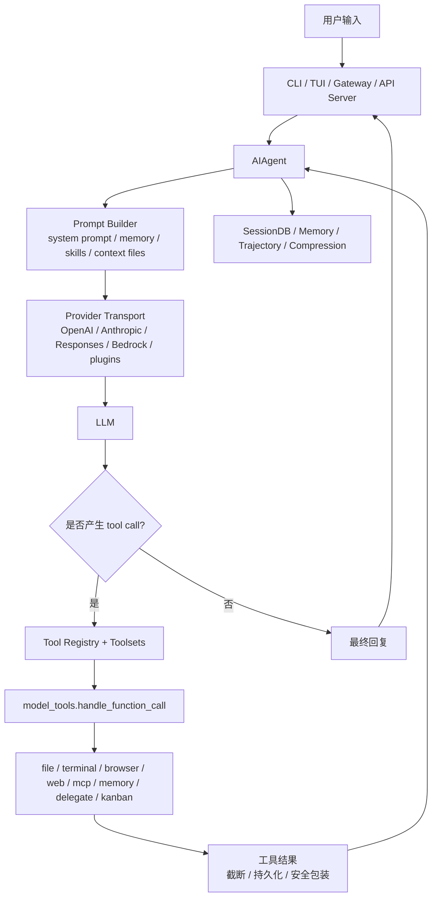
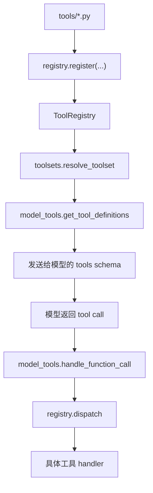

# Hermes 全局架构地图

## 一句话结论

Hermes 不是一个简单的“LLM + tools”脚本，而是一个长生命周期 Agent 系统：它把模型调用、工具注册、会话持久化、上下文压缩、记忆、技能、插件、网关、多 Agent 和安全策略组合成一个可以长期运行的工程产品。

## 第一眼应该看什么

先看四个入口：

| 入口 | 源码位置 | 作用 |
| --- | --- | --- |
| Agent 外观类 | `E:\coding\hermes-agent\run_agent.py:393` `class AIAgent` | 对外仍然以 `AIAgent` 作为主入口，但很多实现已拆入 `agent/` |
| 对话循环 | `E:\coding\hermes-agent\agent\conversation_loop.py:518` `run_conversation` | 一次用户输入如何变成多轮模型调用、工具调用和最终回复 |
| 工具系统 | `E:\coding\hermes-agent\tools\registry.py:208` `class ToolRegistry` | 所有工具的声明、schema、handler、toolset、可用性检查 |
| 会话状态 | `E:\coding\hermes-agent\hermes_state.py:869` `class SessionDB` | SQLite 会话库、消息历史、FTS5 搜索、压缩/分支/子会话关系 |

这四个入口能串起 Hermes 的核心闭环：

## Wiki 设计对应关系

第一讲主要对应这些 Wiki 文档：

- `E:\coding\Hermes-Wiki\concepts\agent-loop-and-prompt-assembly.md`
- `E:\coding\Hermes-Wiki\concepts\prompt-builder-architecture.md`
- `E:\coding\Hermes-Wiki\concepts\tool-registry-architecture.md`
- `E:\coding\Hermes-Wiki\concepts\model-tools-dispatch.md`
- `E:\coding\Hermes-Wiki\concepts\session-search-and-sessiondb.md`

注意：当前本机 PowerShell 读取 Wiki 时中文有编码错显，但标题、路径、代码符号和结构仍可验证。后续笔记会使用 UTF-8 中文重新整理，不把乱码复制进学习文档。

## Hermes 的核心分层

### 1. 交互层

交互层负责接收用户输入，并把运行环境信息带进 Agent。

典型入口：

- `cli.py`
- `hermes_cli/`
- `tui_gateway/`
- `gateway/`
- `web/`
- `ui-tui/`
- `apps/`

CLI/TUI 是本地终端体验，Gateway 是 Telegram、Discord、Slack、WhatsApp、Signal、API Server 等平台入口。它们的共同目标是创建或恢复一个 session，把用户消息交给 `AIAgent`。

### 2. Agent 核心层

`run_agent.py` 仍然保留 `AIAgent`，但它已经不是把所有逻辑堆在一个类里的老式实现。很多方法是 forwarder：

- `AIAgent.__init__` 转发到 `agent.agent_init.init_agent`
- `AIAgent.run_conversation` 转发到 `agent.conversation_loop.run_conversation`
- `AIAgent.switch_model` 转发到 `agent.agent_runtime_helpers.switch_model`
- `AIAgent._create_openai_client` 转发到 `agent.agent_runtime_helpers.create_openai_client`

这说明 Hermes 的演进方向是：保留稳定 API，内部逐步模块化。

核心源码锚点：

- `E:\coding\hermes-agent\run_agent.py:393` `class AIAgent`
- `E:\coding\hermes-agent\agent\agent_init.py:166` `init_agent`
- `E:\coding\hermes-agent\agent\conversation_loop.py:518` `run_conversation`
- `E:\coding\hermes-agent\agent\agent_runtime_helpers.py:2064` `invoke_tool`
- `E:\coding\hermes-agent\agent\chat_completion_helpers.py` provider 调用桥接

### 3. Prompt 与上下文层

Prompt 层负责回答一个关键问题：模型在这一轮到底应该看到什么？

主要来源：

- 系统身份与行为约束
- 当前用户消息
- 历史消息
- context files
- memory
- skills
- platform hints
- tool definitions
- provider/model-specific guidance

源码锚点：

- `E:\coding\hermes-agent\agent\prompt_builder.py:1047` `build_environment_hints`
- `E:\coding\hermes-agent\agent\prompt_builder.py:1417` `build_skills_system_prompt`
- `E:\coding\hermes-agent\agent\prompt_builder.py:1924` `build_context_files_prompt`
- `E:\coding\hermes-agent\agent\context_compressor.py:662` `class ContextCompressor`

这层是 Hermes 和许多轻量 Agent 框架拉开差距的地方：它不是只把 history 塞给模型，而是有长期记忆、技能、项目上下文、平台上下文和压缩策略。

### 4. Provider 与模型传输层

Hermes 支持多种模型 provider 和 API 风格。它把 provider 的身份、endpoint、认证方式、模型列表、请求差异等收敛到 `ProviderProfile`。

源码锚点：

- `E:\coding\hermes-agent\providers\base.py:39` `class ProviderProfile`
- `E:\coding\hermes-agent\providers\__init__.py:53` `register_provider`
- `E:\coding\hermes-agent\agent\chat_completion_helpers.py`
- `E:\coding\hermes-agent\agent\anthropic_adapter.py`
- `E:\coding\hermes-agent\agent\codex_responses_adapter.py`

工程重点：

- OpenAI Chat Completions、OpenAI Responses、Anthropic Messages、Bedrock 等并不完全一致。
- tool call、reasoning、vision、temperature、max tokens、streaming、error body 都有 provider-specific 差异。
- Hermes 用声明式 profile 加适配器逻辑处理这些差异。

### 5. 工具层

Hermes 的工具不是集中手写在一个大列表里，而是由每个工具模块自注册。

源码锚点：

- `E:\coding\hermes-agent\tools\registry.py:356` `ToolRegistry.register`
- `E:\coding\hermes-agent\tools\registry.py:521` `ToolRegistry.get_definitions`
- `E:\coding\hermes-agent\tools\registry.py:574` `ToolRegistry.dispatch`
- `E:\coding\hermes-agent\model_tools.py:279` `get_tool_definitions`
- `E:\coding\hermes-agent\model_tools.py:1019` `handle_function_call`
- `E:\coding\hermes-agent\toolsets.py:687` `resolve_toolset`

工具暴露流程：

这个设计的直接好处：

- 新增工具时，工具模块自己声明 schema 和 handler。
- toolsets 可以控制暴露范围。
- check_fn 可以动态判断工具是否可用。
- 插件和 MCP 可以扩展工具集合。
- `model_tools.py` 作为薄编排层，避免工具实现和模型调用逻辑互相污染。

### 6. 状态、记忆与压缩层

Hermes 的长期能力依赖持久化，不只是进程内 list。

`hermes_state.py` 的文件头说明了几个关键设计：

- 使用 SQLite 替代 per-session JSONL。
- 使用 WAL 支持并发读写。
- 使用 FTS5 做跨会话全文搜索。
- 使用 parent session chain 表达压缩、分支、子 Agent 等关系。

源码锚点：

- `E:\coding\hermes-agent\hermes_state.py:869` `class SessionDB`
- `E:\coding\hermes-agent\agent\context_compressor.py:662` `class ContextCompressor`
- `E:\coding\hermes-agent\agent\conversation_compression.py`
- `E:\coding\hermes-agent\tools\session_search_tool.py`
- `E:\coding\hermes-agent\tools\memory_tool.py`

理解这层时，要把三个概念分开：

- **Session history**：完整对话记录，偏事实日志。
- **Memory**：跨会话可复用的用户偏好、长期事实和经验。
- **Compression summary**：为了让长上下文继续运行而生成的结构化摘要。

三者都会影响模型看到什么，但目标完全不同。

### 7. 安全与权限层

Hermes 的工具非常强：能读写文件、执行终端、打开浏览器、连接 MCP、发消息、创建子 Agent。因此安全层不是附属功能，而是主架构的一部分。

源码锚点：

- `E:\coding\hermes-agent\tools\approval.py`
- `E:\coding\hermes-agent\tools\path_security.py`
- `E:\coding\hermes-agent\tools\url_safety.py`
- `E:\coding\hermes-agent\tools\threat_patterns.py`
- `E:\coding\hermes-agent\tools\tirith_security.py`
- `E:\coding\hermes-agent\tools\file_tools.py`
- `E:\coding\hermes-agent\tools\terminal_tool.py`

第一阶段只需要先记住：Hermes 的安全防线分布在工具执行前、工具执行中、工具结果进入上下文前、状态持久化前、平台投递前这几个位置。

## 与其他 Agent 框架的第一层对比

### Hermes vs Codex

Codex 的核心体验更聚焦“软件工程任务 + 工作区 + 受控工具环境”。工具权限和 sandbox 更多由宿主环境提供，agent 不一定要自己实现完整的跨平台网关、长期记忆、技能生态和消息平台投递。

Hermes 更像一个长期在线的个人/团队 Agent 操作系统：它把 CLI、TUI、Gateway、Skills、Memory、Cron、Kanban、Provider 插件、MCP 插件都纳入一个产品级系统。

### Hermes vs LangGraph

LangGraph 强调显式状态图，适合把 Agent 流程建模成 node/edge/state/reducer。

Hermes 的主循环更偏产品型 agent runtime：核心 loop 是模型驱动的工具调用循环，外面叠加持久化、压缩、技能、记忆、网关和安全策略。

### Hermes vs OpenHands / SWE-agent / Aider

OpenHands、SWE-agent、Aider 都更聚焦代码任务和软件工程环境。

Hermes 也能做代码任务，但它的架构目标更宽：跨平台沟通、长期记忆、自我技能沉淀、自动化调度、多 Agent 任务板和 provider/plugin 生态。

## 第一讲要掌握的 8 个问题

1. `AIAgent` 为什么还留在 `run_agent.py`，但实现被拆到 `agent/`？
2. 一次用户消息进入 Hermes 后，先经过 CLI/Gateway/TUI，还是直接进入模型？
3. Prompt Builder 负责拼什么内容？
4. 工具 schema 是在哪里生成并暴露给模型的？
5. 模型返回 tool call 后，哪个函数负责执行？
6. 工具结果如何回到下一轮模型调用？
7. 会话历史为什么要进入 SQLite，而不是只存在内存里？
8. Memory、Session、Compression 三者有什么区别？

## 最小心智模型

先把 Hermes 理解成五个环：

1. **对话环**：`AIAgent` 与模型反复交互，直到没有 tool call 或达到预算。
2. **工具环**：模型提出 tool call，registry 找 handler，执行后把结果塞回消息列表。
3. **状态环**：每轮消息进入 SessionDB，支持恢复、搜索、压缩、分支。
4. **学习环**：Memory 和 Skills 从历史任务中提取长期可复用知识。
5. **产品环**：CLI/TUI/Gateway/Dashboard/Cron/Kanban 让 agent 可以长期在线和多人/多平台协作。

下一篇建议阅读：`docs/stage-0/01-源码目录导读.md`，然后进入 `docs/modules/01-agent-loop.md`。
