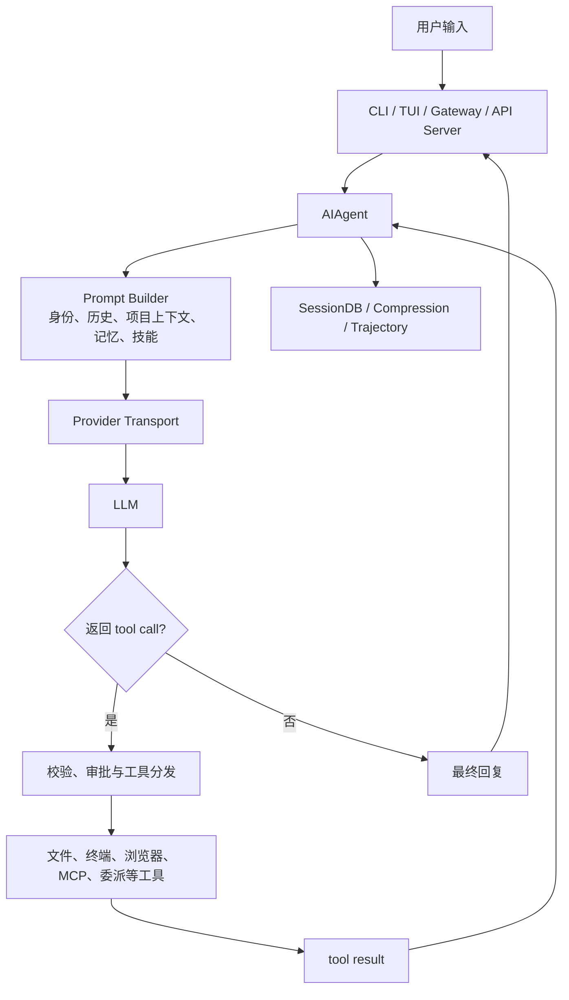
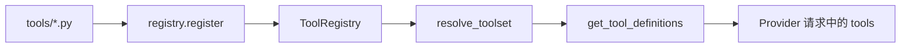
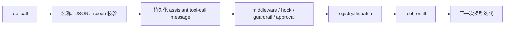

# Hermes 全局架构地图

本文基于 `NousResearch/hermes-agent@590a19332e898fc9bda55a31999926572d8fbc26`，按一条用户消息的运行路径划分 Hermes。目录名称只用于定位文件，架构边界以调用关系、状态归属和持久化位置为准。

## 范围

这张地图集中处理三个问题：

1. 一条消息怎样从产品入口进入 `AIAgent`，再经过模型与工具循环得到回复。
2. 工具怎样注册、筛选、暴露和执行，哪些环节负责阻止不安全的副作用。
3. SessionDB、Memory 与 Context Compression 分别保存什么，为什么不能合并成一个“记忆系统”。

Hermes 的核心不是一次模型调用，而是一套长期运行的 Agent Runtime。模型请求只是其中一个步骤，旁边还有工具协议、会话持久化、上下文管理、平台路由和后台任务。

## 1. 对话运行时

### 职责

Hermes 的一次对话不是“用户输入后调用一次模型”。Runtime 先准备系统提示和消息历史，再请求模型。模型返回 tool call 时，Runtime 校验并执行工具，把 tool result 追加回消息流，然后发起下一次模型请求。循环在得到可接受文本、预算耗尽、用户中断或不可恢复错误时结束。



### 源码入口

| 角色 | 文件/符号 | 职责 |
| --- | --- | --- |
| Agent 门面 | `run_agent.py` 中的 `AIAgent` | 对 CLI、Gateway 和子 Agent 提供稳定入口 |
| 初始化 | `agent/agent_init.py` 中的 `init_agent` | 组装 Provider、工具、状态和回调 |
| turn 序章 | `agent/turn_context.py` 中的 `build_turn_context` | 恢复提示词、追加用户消息、预压缩并初始化本轮状态 |
| 对话循环 | `agent/conversation_loop.py` 中的 `run_conversation` | 推进模型迭代、重试、工具分支和停止条件 |
| 工具执行 | `agent/tool_executor.py`、`agent/agent_runtime_helpers.py` | 处理工具批次并进入单个 handler |
| 收尾 | `agent/turn_finalizer.py` 中的 `finalize_turn` | 闭合消息协议、持久化、清理资源并组装返回值 |

`AIAgent` 的构造函数把主要初始化工作转发给 `init_agent`：

```python
class AIAgent:
    def __init__(self, ..., max_iterations=90, ...):
        from agent.agent_init import init_agent
        init_agent(
            self,
            ...,
            max_iterations=max_iterations,
            ...,
        )
```

`run_agent.py` 因此同时承担兼容门面和少量运行时桥接。模型传输、上下文处理、工具执行与收尾逻辑已经拆入 `agent/`，只读 `run_agent.py` 无法还原完整调用链。

### 状态推进

一次用户 turn 的主干可以写成：

```text
产品入口恢复 session
  -> build_turn_context 组装本轮状态
  -> conversation_loop 构建 Provider 请求
  -> 模型返回文本或 tool calls
  -> tool_executor 执行并回填 tool results
  -> 回到下一次模型迭代
  -> finalize_turn 持久化并返回宿主结果
```

用户 turn、模型迭代、API retry 和 tool call 是四种不同时间尺度。一次用户输入可能触发多次模型请求；一次模型响应又可能携带多个 tool calls。把它们都称为“一轮”，会掩盖预算、重试和持久化边界。

### 失败边界

运行时需要分别处理空响应、损坏的 arguments、Provider 限流、工具异常、结果过长、上下文超限和用户中断。可恢复错误通常会变成模型可见的反馈；协议损坏、安全阻断或预算耗尽则可能结束当前 turn。主循环捕获并汇合的正常结束、中断和预算退出会进入 finalizer，由它闭合消息协议并处理最终持久化。

## 2. 工具系统

### 职责

Hermes 的工具集合会随 toolset、profile、平台、环境依赖、插件和 MCP 连接变化。工具不能只维护在一个静态列表中。Registry 保存能力定义，toolset 决定候选范围，可用性检查过滤当前环境，Prompt 请求只携带本轮实际可见的 Schema。

### 源码入口

| 角色 | 文件/符号 | 职责 |
| --- | --- | --- |
| 注册中心 | `tools/registry.py` 中的 `ToolRegistry` | 保存 Schema、handler、toolset、可用性和结果上限 |
| 工具集解析 | `toolsets.py` 中的 `resolve_toolset` | 将配置中的工具集展开为具体工具名 |
| 模型可见定义 | `model_tools.py` 中的 `get_tool_definitions` | 生成当前请求的 tools Schema |
| Runtime 执行 | `agent/tool_executor.py` | 决定顺序或并发执行，并回填结果 |
| 最终分发 | `tools/registry.py` 中的 `dispatch` | 调用已注册 handler |

`ToolEntry` 保存的不只是函数引用：

```python
class ToolEntry:
    __slots__ = (
        "name", "toolset", "schema", "handler", "check_fn",
        "requires_env", "is_async", "description", "emoji",
        "max_result_size_chars", "dynamic_schema_overrides",
    )
```

这些字段分别处理模型协议、运行环境和执行结果。`schema` 约束模型怎样提交参数，`check_fn` 判断工具当前是否可用，`max_result_size_chars` 防止结果占满上下文，`dynamic_schema_overrides` 允许 Schema 随运行配置调整。

### 暴露链与执行链

工具注册到模型可见 Schema 的路径是：



模型返回 tool call 后走另一条路径：



模型提出的 tool call 是不可信协议输入，不等于 Python handler 已经执行。副作用发生前还要经过范围检查、中间件、插件 Hook、guardrail 和审批。assistant tool-call message 先于副作用持久化，进程中断后才能解释某个写文件或发消息动作来自哪次模型决策。

### 失败边界

工具可能因为未安装依赖、环境不可用、参数错误、安全策略、handler 异常或重复调用而失败。失败结果仍要使用原 `tool_call_id` 写回 tool message，保证下一次 Provider 请求的消息协议完整。并发执行只改变 handler 的运行时间，不改变 tool results 回填到历史中的稳定顺序。

## 3. 状态与记忆

### 三种状态的职责

| 状态 | 保存内容 | 生命周期 | 主要入口 |
| --- | --- | --- | --- |
| Session history | 用户、assistant、tool calls、tool results、模型和 system prompt 快照 | 跨 turn，可恢复和搜索 | `hermes_state.py` 中的 `SessionDB` |
| Memory | 稳定偏好、环境事实和可长期复用信息 | 跨 session | `tools/memory_tool.py` 与外部 Memory Provider |
| Compression state | 摘要、保留头尾、active/compacted 标记 | 当前长会话及其续接 | `agent/context_compressor.py`、`agent/conversation_compression.py` |

SessionDB 是会话事实来源，Memory 是提炼后的长期信息，Compression 是上下文窗口内的状态迁移。三者都会影响模型后续看到的内容，但写入时机、可信度和淘汰策略不同。

### SessionDB

`hermes_state.py` 使用 SQLite 和 FTS5 保存 session 与 messages。WAL 模式适合 Gateway 常见的多读单写模式；FTS5 支持 `session_search`；`parent_session_id` 表达压缩续接、分支和子 Agent 关系。

SessionDB 保存结构化消息，而不是只保存拼接后的文本。恢复时必须保留 role、tool call ID、tool name 和消息顺序，否则 Provider 可能拒绝后续请求。

### Memory

内置 Memory 使用 `MEMORY.md` 和 `USER.md` 保存小规模、人工可读的长期条目。session 开始时形成冻结快照并进入 system prompt；session 中途写盘不会立刻改变当前提示词前缀。外部 Memory Provider 可以在 turn 开始前按当前用户输入检索临时上下文。

### Context Compression

上下文接近窗口上限时，Hermes 保留受保护的头部和尾部，裁剪旧工具输出，并把中间窗口总结成摘要。压缩后的 live context 变短，旧消息仍可在 SessionDB 中以 compacted 记录保留并供 `session_search` 检索。

## 4. 产品入口与 Runtime 的边界

CLI、TUI、Dashboard、Desktop 和消息平台 Gateway 最终都能创建 `AIAgent`，但不会共享同一个实时 Python 会话对象。产品入口负责身份、输入协议、审批交互和结果投递；Agent Runtime 负责 Prompt、模型迭代、工具执行与规范会话历史。

Codex 的开源核心更集中在工作区任务、强类型事件协议和 OS sandbox。Claude Code 的公开协议更集中在开发会话、权限、Hooks、Skills 和 MCP。Hermes 的明显特征是同一 Runtime 还要支撑消息平台、cron、Kanban 和跨 Provider 运行。比较这些系统时，应对齐同一层的状态与约束，而不是比较功能名称。

## 架构要点

1. `AIAgent` 是稳定门面，主要实现分布在 `agent/`、`tools/` 和状态模块中。
2. 对话主链是模型请求、受控工具执行、结果回填和下一次模型迭代。
3. Registry 决定工具怎样登记，toolset 与运行环境决定本轮模型能看到哪些工具。
4. tool call 是模型请求，handler 调用是通过 Runtime 管线后的副作用。
5. SessionDB、Memory 和 Compression 分别管理会话事实、长期信息和上下文窗口。
6. 产品入口与 Agent Runtime 共享能力，不共享所有实时状态。

各模块文档分别展开这些边界。第 20 讲沿一次完整对话核对初始化、Provider 请求、tool call、持久化和 finalizer 的先后顺序。
