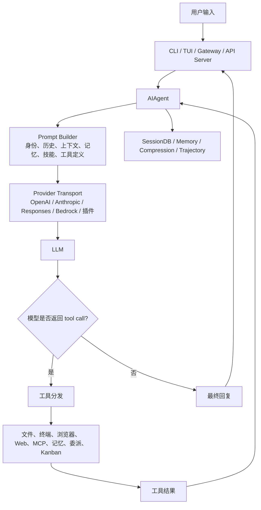
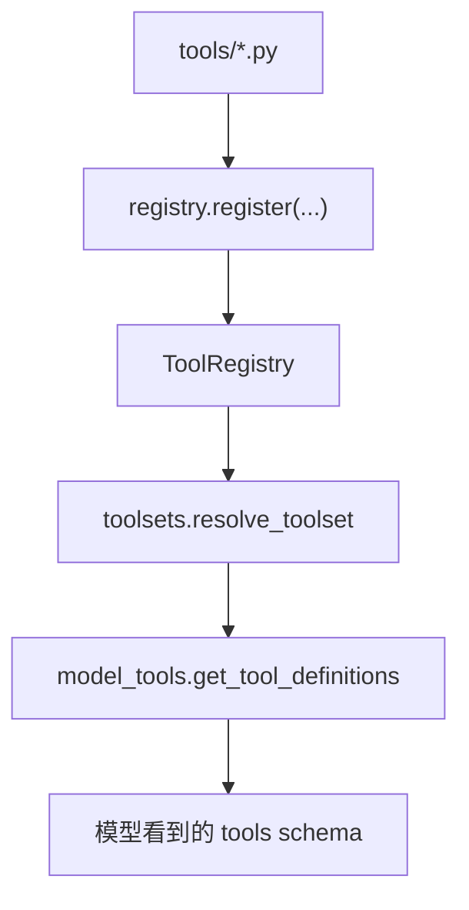
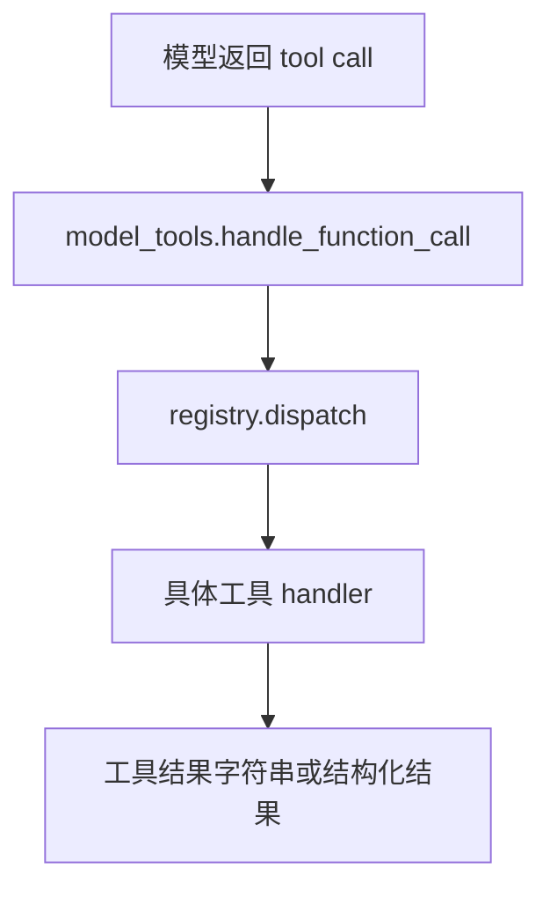

# Hermes 全局架构地图

## 这篇先解决什么问题

学 Hermes 不能从目录开始背。这个项目太大，入口很多：CLI、TUI、Gateway、工具、记忆、技能、插件、Provider、多 Agent、定时任务都在里面。

第一课先抓主线：用户发来一句话后，Hermes 怎样把它变成一次 Agent 任务，又怎样在工具调用、状态保存、上下文压缩和最终回复之间循环。

先记住一句话：

> Hermes 的重点不只是“让模型调用工具”，而是把工具调用放进一个可以长期运行、可以恢复、可以扩展、可以跨平台交互的 Agent runtime 里。

## 功能 1：一次对话的主流程

### 先讲人话

一次对话不是“用户输入 -> 模型回答”这么短。Hermes 会先准备上下文，再调用模型。模型如果要求使用工具，Hermes 会执行工具，把结果放回消息列表，再次调用模型。这个循环会一直走到模型给出最终回答，或者达到迭代预算。

主流程可以先画成这样：



### 源码入口

| 角色 | 文件/符号 | 说明 |
| --- | --- | --- |
| Agent 门面 | `run_agent.py` 中的 `AIAgent` | 对外主入口，保留稳定 API |
| 初始化 | `agent/agent_init.py` 中的 `init_agent` | 给 `AIAgent` 填充模型、工具、状态、回调等运行时字段 |
| 对话循环 | `agent/conversation_loop.py` 中的 `run_conversation` | 处理模型调用、工具调用、停止条件和最终回复 |
| 工具执行 | `agent/agent_runtime_helpers.py` 中的 `invoke_tool` | 从 agent loop 进入具体工具调用 |

### 关键源码

`AIAgent` 的构造函数本身没有把初始化逻辑全写在类里，而是转发给 `agent.agent_init.init_agent`：

```python
class AIAgent:
    def __init__(
        self,
        base_url: str = None,
        api_key: str = None,
        provider: str = None,
        api_mode: str = None,
        model: str = "",
        max_iterations: int = 90,
        enabled_toolsets: List[str] = None,
        disabled_toolsets: List[str] = None,
        # ... 还有很多运行时参数
    ):
        """Forwarder - see ``agent.agent_init.init_agent``."""
        from agent.agent_init import init_agent
        init_agent(
            self,
            base_url=base_url,
            api_key=api_key,
            provider=provider,
            api_mode=api_mode,
            model=model,
            max_iterations=max_iterations,
            enabled_toolsets=enabled_toolsets,
            disabled_toolsets=disabled_toolsets,
            # ...
        )
```

这个片段很重要。它说明 `run_agent.py` 现在更像兼容层和门面层：外部仍然使用 `AIAgent`，内部实现已经拆进 `agent/` 包。读 Hermes 时不要误以为 `run_agent.py` 一个文件就能解释全部逻辑。

### 工程实现

一次对话大致经过这些步骤：

1. CLI、TUI 或 Gateway 收到用户消息。
2. 上层创建或恢复一个 `AIAgent`。
3. `AIAgent.run_conversation(...)` 进入 `agent/conversation_loop.py`。
4. Prompt Builder 准备系统提示、历史消息、上下文文件、记忆、技能和工具定义。
5. Provider 适配层把请求发给具体模型。
6. 如果模型返回普通文本，Hermes 结束本轮。
7. 如果模型返回 tool call，Hermes 执行工具，把工具结果加入 messages。
8. 带着工具结果再次调用模型。
9. 本轮结束后，消息进入 SessionDB，必要时触发压缩、记忆或轨迹记录。

先不要纠结每个细节。第一阶段只要抓住：Hermes 的主循环是“模型调用”和“工具执行”交替推进。

### 失败路径

这个主流程里最常见的失败有几类：

- 模型返回空内容。
- 模型返回损坏的 tool call arguments。
- 工具执行失败。
- 工具结果太长。
- 上下文太长。
- Provider 报错或限流。
- 用户中断任务。

Hermes 在 `agent/` 里放了大量修复和降级逻辑。后面讲 agent loop 时，会单独拆 `empty response recovery`、`tool guardrails`、`context compression`、`provider fallback`。

### 和 Codex / Claude Code 的差异

Codex 和 Claude Code 更聚焦开发者工作区里的编码任务。它们当然也有工具调用、上下文和安全边界，但产品形态更贴近“本地或云端代码助手”。

Hermes 的主流程更宽。它要同时服务 CLI、TUI、消息平台、API server、定时任务和多 Agent 协作。也就是说，Hermes 的 agent loop 不是孤立存在的，它旁边长期挂着 SessionDB、Gateway、Memory、Skills、Cron、Kanban、MCP 和插件系统。

### 小实验

在 Hermes 源码仓库里运行：

```powershell
rg -n "class AIAgent|def init_agent|def run_conversation|def invoke_tool" .
```

你要看到四类入口：

- `run_agent.py` 里的 `AIAgent`
- `agent/agent_init.py` 里的 `init_agent`
- `agent/conversation_loop.py` 里的 `run_conversation`
- `agent/agent_runtime_helpers.py` 里的 `invoke_tool`

这个实验的目的不是记行号，而是建立地图：门面、初始化、循环、工具执行分别在哪里。

## 功能 2：工具为什么不是一个静态列表

### 先讲人话

很多小型 Agent 项目会写一个静态工具列表：这里有 `read_file`、那里有 `run_shell`，启动时一次性塞给模型。

Hermes 没这么做。它有很多工具，工具还能来自插件和 MCP。不同平台、不同配置、不同运行环境下，可用工具也不一样。所以 Hermes 需要一个中心 registry，让工具自己注册，再由 toolsets 和可用性检查决定哪些工具暴露给模型。

### 源码入口

| 角色 | 文件/符号 | 说明 |
| --- | --- | --- |
| 工具注册中心 | `tools/registry.py` 中的 `ToolRegistry` | 保存工具 schema、handler、toolset 和检查函数 |
| 工具发现和导出 | `model_tools.py` 中的 `get_tool_definitions` | 给模型生成本轮可见的工具定义 |
| 工具调用分发 | `model_tools.py` 中的 `handle_function_call` | 接收模型 tool call，转交 registry dispatch |
| 工具集解析 | `toolsets.py` 中的 `resolve_toolset` | 把用户启用的工具集展开成具体工具名 |

### 关键源码

工具 registry 的文件头已经把设计说得很清楚：

```python
"""Central registry for all hermes-agent tools.

Each tool file calls ``registry.register()`` at module level to declare its
schema, handler, toolset membership, and availability check.  ``model_tools.py``
queries the registry instead of maintaining its own parallel data structures.
"""
```

再看 `ToolEntry` 的字段，可以知道 Hermes 认为一个工具至少由这些东西组成：

```python
class ToolEntry:
    """Metadata for a single registered tool."""

    __slots__ = (
        "name", "toolset", "schema", "handler", "check_fn",
        "requires_env", "is_async", "description", "emoji",
        "max_result_size_chars", "dynamic_schema_overrides",
    )
```

这比“函数名 + 函数体”复杂得多。Hermes 关心的不只是能不能调用函数，还关心：

- 属于哪个 toolset。
- schema 如何暴露给模型。
- handler 是同步还是异步。
- 当前环境是否满足要求。
- 工具结果最多多长。
- schema 是否要根据运行时配置动态调整。

### 工程实现

工具暴露给模型之前，大致经过这条链：



模型真的调用工具时，则走另一条链：



这个拆法有一个好处：工具实现不用知道模型请求怎么发，模型请求层也不用知道每个工具内部怎么跑。中间靠 registry 和 `model_tools.py` 接起来。

### 失败路径

工具系统的失败不只是 handler 抛异常。更麻烦的是这些情况：

- 工具所属环境不可用，比如 Docker、浏览器、MCP server 没启动。
- 工具 schema 太宽，模型误用。
- 工具结果太长，挤爆上下文。
- 同一工具重复失败，模型陷入循环。
- 文件或终端工具触发安全策略。

所以 Hermes 在工具周围加了几层保护：`check_fn`、toolset 暴露控制、结果长度限制、工具循环守卫、安全审批、路径和 URL 检查。后面的工具章节会逐个拆。

### 和 Codex / Claude Code 的差异

Codex 的工具面更依赖宿主环境。工具能做什么、能访问哪里，通常由当前运行环境和 sandbox 直接定义。

Claude Code 的工具更围绕本地开发流程：读写文件、执行命令、理解项目上下文。

Hermes 的工具层更像一个可扩展平台。它要同时接住内置工具、插件工具、MCP 工具，还要能按平台、profile、toolset 和环境状态动态暴露。

### 小实验

在 Hermes 源码仓库里运行：

```powershell
rg -n "registry.register|def get_tool_definitions|def handle_function_call|def resolve_toolset" tools model_tools.py toolsets.py
```

你会看到三类东西：

- 哪些工具模块在自注册。
- `model_tools.py` 如何导出工具定义。
- `toolsets.py` 如何把工具集展开。

如果只想看工具注册中心：

```powershell
rg -n "class ToolEntry|class ToolRegistry|def register|def dispatch" tools/registry.py
```

## 功能 3：会话为什么要进数据库

### 先讲人话

如果只是做一个 demo，消息存在内存里就够了。但 Hermes 要支持恢复会话、跨会话搜索、Gateway 长期运行、压缩后继续、分支、子 Agent、历史回忆。这些能力都要求状态落盘。

所以 Hermes 使用 SQLite 做 session store。

### 源码入口

| 角色 | 文件/符号 | 说明 |
| --- | --- | --- |
| 会话数据库 | `hermes_state.py` 中的 `SessionDB` | 保存 session 元数据和 messages |
| 搜索 | `hermes_state.py` 中的 FTS5 相关逻辑 | 支持跨会话全文搜索 |
| 会话搜索工具 | `tools/session_search_tool.py` | 让 Agent 可以搜索过去会话 |
| 压缩关系 | `hermes_state.py` 中的 parent session 逻辑 | 表达压缩、分支、子 Agent 等关系 |

### 关键源码

`hermes_state.py` 开头的设计说明值得记住：

```python
"""
SQLite State Store for Hermes Agent.

Provides persistent session storage with FTS5 full-text search, replacing
the per-session JSONL file approach. Stores session metadata, full message
history, and model configuration for CLI and gateway sessions.

Key design decisions:
- WAL mode for concurrent readers + one writer (gateway multi-platform)
- FTS5 virtual table for fast text search across all session messages
- Compression-triggered session splitting via parent_session_id chains
- Batch runner and RL trajectories are NOT stored here (separate systems)
"""
```

这段说明了 Hermes 的状态层不是简单“存聊天记录”。它直接支撑几个上层功能：

- 多平台 Gateway 同时读写。
- `/resume` 和历史会话恢复。
- session search。
- context compression 之后继续对话。
- 分支和子 Agent 关系。

### 工程实现

可以把状态分成三类：

| 类型 | 作用 |
| --- | --- |
| Session history | 保存完整对话和模型配置，支持恢复和审计 |
| Memory | 保存跨会话长期信息，比如用户偏好、事实、经验 |
| Compression summary | 长上下文压缩后的摘要，用来让当前任务继续跑 |

这三者都可能影响模型下一轮看到什么，但目标不同。不要混在一起理解。

### 失败路径

状态层主要怕这些问题：

- SQLite WAL 在某些文件系统上不可用。
- 长期运行的 Gateway 并发读写。
- 压缩、分支、子 Agent 导致 session parent chain 复杂。
- 搜索输入可能不安全或过长。
- 会话删除时误删分支或子会话。

Hermes 在 `hermes_state.py` 里有不少保护逻辑，比如 WAL fallback、FTS 查询限制、branch child 和 delegate child 的区分。后面讲 SessionDB 时再细拆。

### 和 Codex / Claude Code 的差异

Codex 的会话状态更贴近当前任务和工作区。Claude Code 也更围绕本地开发会话。

Hermes 的状态层要支撑更长的生命周期：它可能从 Telegram 收消息，在云主机跑任务，隔天被 cron 唤醒，又从旧 session 搜索上下文。这个产品目标决定了它需要更重的状态系统。

### 小实验

先定位 `SessionDB`：

```powershell
rg -n "class SessionDB|FTS5|parent_session_id|WAL" hermes_state.py
```

看这些关键词就够了：

- `SessionDB`：数据库主类。
- `FTS5`：全文搜索。
- `parent_session_id`：压缩、分支、子会话关系。
- `WAL`：并发读写。

## 本篇要记住的东西

1. `AIAgent` 是门面，真正的初始化和对话循环已经拆到 `agent/`。
2. Hermes 的主循环是“模型调用 -> 工具调用 -> 工具结果回填 -> 再次模型调用”。
3. 工具不是静态列表，而是 registry + toolsets + runtime checks。
4. SessionDB 支撑长期运行，不只是保存聊天记录。
5. Hermes 和 Codex、Claude Code 的差异，不在于谁能不能调用工具，而在于 Hermes 把工具调用放进了更长生命周期的产品系统里。

## QA

### 为什么公开笔记里不写本机源码路径？

因为这套笔记以后要开源。读者拿到的是 GitHub 仓库，不会有作者机器上的 `E:\coding\...`。源码引用应该使用仓库相对路径，例如 `run_agent.py`、`tools/registry.py`。这样读者才能直接在自己的 clone 里定位。

### 为什么不把 Wiki 文档路径列在正文里？

学习时可以用 Wiki 做证据来源，但正文要像讲师讲课。读者要的是整理后的设计和源码实现，不是整理过程。Wiki 路径清单可以留在内部工作记录里，不应该占用公开笔记正文。

### 读 Hermes 第一眼应该看哪个文件？

先看 `run_agent.py` 的 `AIAgent`，但不要停在那里。马上跳到 `agent/agent_init.py` 和 `agent/conversation_loop.py`，再看 `tools/registry.py`、`model_tools.py`、`hermes_state.py`。这几处连起来，才是第一张地图。
