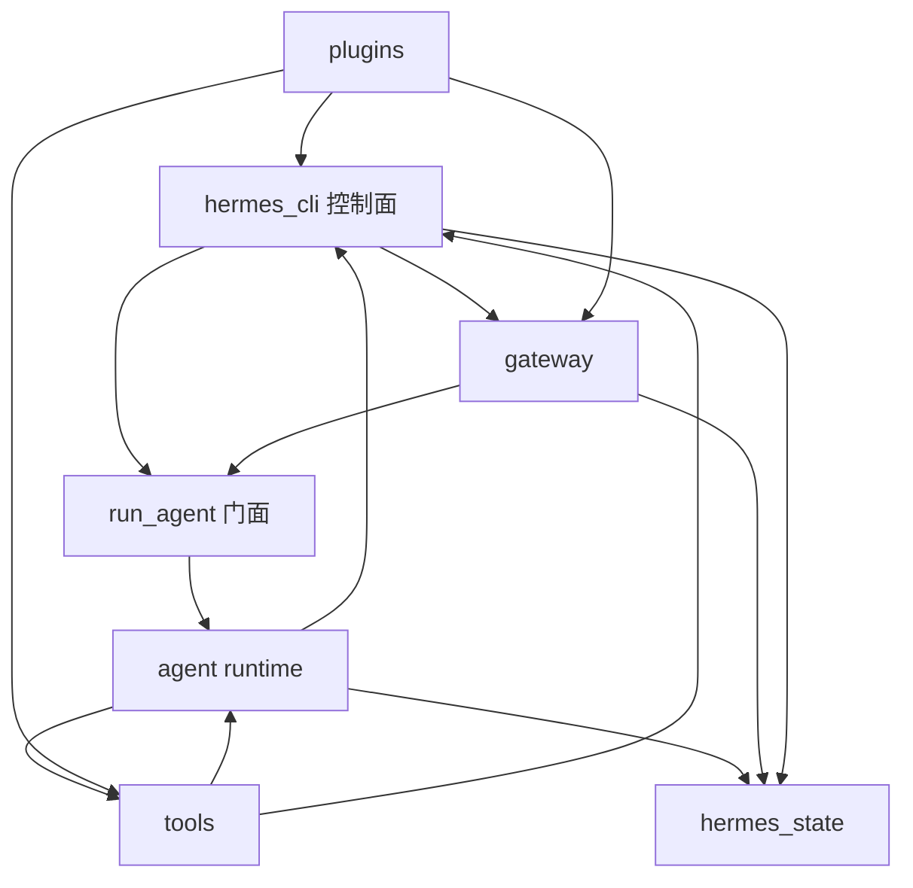
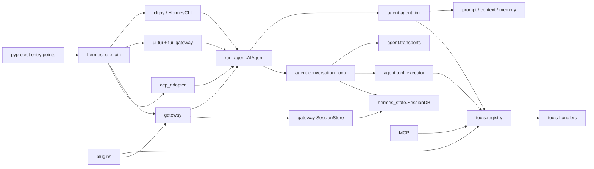

# 第 19 讲：Hermes 源码目录导读

源码目录导读最容易写成文件清单：`agent/` 负责 Agent，`tools/` 负责工具，`gateway/` 负责网关。这样的清单看完仍然不知道从哪里下手，因为 Hermes 的真实边界没有目录名这么整齐。

以 `NousResearch/hermes-agent@590a19332e898fc9bda55a31999926572d8fbc26` 为例，仓库同时包含：

- Python 顶层模块和 Python packages。
- 交互 CLI、React TUI、Web Dashboard 和 Electron Desktop。
- 常驻 Gateway、消息平台插件、cron 和 Kanban。
- 内置工具、MCP、Skills、Provider adapter 和插件系统。
- 安装脚本、Docker、Nix、网站与发布资产。
- 接近两千个测试文件。

如果从目录树第一行顺序读到最后一行，大量时间会消耗在产品外壳、兼容代码和发布脚本上。本讲换一种读法：先判断一个目录位于哪条运行链，再决定是否进入它。

## 这篇先解决什么问题

读完这一讲，应该能回答：

- 安装后的 `hermes` 命令先进入哪个文件。
- `hermes_cli/` 为什么不是单纯的界面层。
- `run_agent.py` 已经拆出许多模块，为什么还保留一个大类。
- `agent/`、`tools/`、`model_tools.py` 和 `toolsets.py` 怎样分工。
- Provider 实现为什么不集中在 `providers/` 目录。
- Gateway session 与 Agent 的 SessionDB 为什么分属不同模块。
- `ui-tui/` 和 `tui_gateway/` 为什么必须同时存在。
- 怎样从一个功能反查源码和测试，而不是在目录中漫游。

---

## 功能 1：先区分“源码主干”和“仓库内容”

### 1.1 顶层目录不等于同一层架构

先把仓库压缩成一张用途地图：

```text
hermes-agent/
├── run_agent.py              Agent 对外门面与兼容入口
├── model_tools.py            工具系统公共编排入口
├── toolsets.py               工具组解析与校验
├── hermes_state.py           SessionDB 与持久状态
├── hermes_constants.py       低依赖共享常量、HERMES_HOME
├── cli.py                    经典交互 CLI
│
├── agent/                    Agent runtime 内部实现
├── tools/                    工具实现、执行环境与安全辅助
├── hermes_cli/               命令控制面、配置、插件、服务管理
├── gateway/                  常驻消息网关与会话路由
├── cron/                     定时调度
├── acp_adapter/              编辑器 ACP 接入
├── plugins/                  内置插件与可插拔后端
│
├── ui-tui/                   React + Ink 的终端界面
├── tui_gateway/              TUI 与 Python Agent 之间的服务端协议
├── web/                      Web Dashboard 前端
├── apps/desktop/             Electron Desktop
├── apps/shared/              前端共享代码
├── website/                  Docusaurus 文档站
│
├── skills/                   随发行版提供的 Skills
├── optional-skills/          可选 Skills 目录
├── optional-mcps/            MCP 目录清单与 manifest
├── tests/                    单元、集成、端到端和压力测试
├── docker/  nix/  packaging/ 安装与发布
└── docs/  assets/  locales/  文档与数据资产
```

上面这些目录至少分成四种东西：

1. 运行时源码，例如 `agent/` 和 `tools/`。
2. 产品入口，例如 `hermes_cli/`、`gateway/` 和 `acp_adapter/`。
3. 独立前端工程，例如 `ui-tui/`、`web/` 和 `apps/desktop/`。
4. 随包数据与开发基础设施，例如 `skills/`、`locales/`、`docker/` 和 `tests/`。

它们都重要，但阅读优先级完全不同。想理解 tool call，不需要先读 Electron 打包；想排查 Telegram session 串线，也不能只盯着 `agent/conversation_loop.py`。

### 1.2 文件数量不能代表运行时重要性

当前快照中，`apps/`、`website/`、`skills/` 和 `optional-skills/` 包含大量前端源文件、文档和技能资源。真正推动一轮 Agent 对话的 Python 主干，集中在少数顶层模块以及 `agent/`、`tools/` 中。

反过来也不能用“文件少”判断目录简单。`providers/` 只有基础接口和说明，实际 Provider 逻辑分散在：

- `plugins/model-providers/`：Provider 的配置、认证和注册插件。
- `agent/transports/`：不同 API mode 的请求与响应归一化。
- `agent/*_adapter.py`：Anthropic、Bedrock、Gemini 等兼容逻辑。
- `hermes_cli/runtime_provider.py`、`provider_catalog.py` 等：运行时 Provider 选择和配置。

所以目录名回答的是“代码被放在哪里”，调用链才回答“功能怎样工作”。

### 1.3 先给每次阅读设一个问题

下面两种问题的阅读起点不同：

```text
问题 A：模型为什么没看到 write_file？
起点：model_tools.py -> tools/registry.py -> toolsets.py

问题 B：Telegram 的两个人为什么共用了历史？
起点：gateway/session.py -> gateway/run.py -> hermes_state.py
```

读源码前先把问题写成“谁在什么时机决定了什么”。如果问题里没有决策者、触发时机和输出，通常还不够具体。

---

## 功能 2：理解 Python 打包方式，才能看懂入口

### 2.1 Hermes 没有采用常见的 `src/` 布局

`pyproject.toml` 同时声明顶层模块和 packages。下面只节选与运行主干有关的条目：

源码锚点：

- `NousResearch/hermes-agent/pyproject.toml`

```toml
[project.scripts]
hermes = "hermes_cli.main:main"
hermes-agent = "run_agent:main"
hermes-acp = "acp_adapter.entry:main"

[tool.setuptools]
py-modules = [
  "run_agent", "model_tools", "toolsets", "cli",
  "hermes_state", "hermes_constants", "utils", "mcp_serve"
]

[tool.setuptools.packages.find]
include = [
  "agent", "agent.*", "tools", "tools.*",
  "hermes_cli", "hermes_cli.*", "gateway", "gateway.*",
  "tui_gateway", "tui_gateway.*", "cron", "cron.*",
  "acp_adapter", "plugins", "plugins.*"
]
```

这意味着仓库根目录就是 Python import 根：

- `import run_agent` 加载顶层文件。
- `from agent.conversation_loop import run_conversation` 加载 package 内模块。
- `from tools.registry import registry` 也是从仓库根解析。

它不是 `src/hermes_agent/...` 这种单包布局。读者不能假定所有生产代码都在一个同名 package 里。

### 2.2 为什么顶层布局会产生 import shadowing

仓库里有 `utils.py` 这种常见模块名。Python 启动时通常把当前工作目录放进 `sys.path`。如果用户项目也有一个 `utils/`，从那个项目目录启动 Hermes，错误的 `utils` 可能抢先被导入。

Hermes 用 bootstrap 修复这个问题。下面省略了 docstring，并保留路径处理主干：

源码锚点：

- `NousResearch/hermes-agent/hermes_bootstrap.py::harden_import_path`

```python
def harden_import_path(src_root=None):
    root = src_root or os.environ.get(
        "HERMES_PYTHON_SRC_ROOT"
    ) or os.path.dirname(os.path.abspath(__file__))

    sys.path[:] = [p for p in sys.path if p not in ("", ".")]

    root_abs = os.path.abspath(root)
    sys.path[:] = [
        p for p in sys.path if os.path.abspath(p) != root_abs
    ]
    sys.path.insert(0, root)
```

这个防护说明了顶层布局的工程代价：历史接口容易保留，直接运行脚本也方便，但通用模块名会与用户项目发生冲突。源码目录设计会影响运行安全，不只是美观问题。

### 2.3 三个安装命令进入三条不同链路

| 命令 | Python 入口 | 面向谁 |
|---|---|---|
| `hermes` | `hermes_cli.main:main` | 普通用户、CLI 子命令、Gateway 管理 |
| `hermes-agent` | `run_agent:main` | 直接 Agent 入口与兼容调用 |
| `hermes-acp` | `acp_adapter.entry:main` | Zed 等 ACP 客户端 |

多数用户输入 `hermes`，并不会先进入 `run_agent.main()`。`hermes_cli.main` 解析子命令：

- 没有子命令时，默认进入 chat。
- `gateway` 进入服务管理或常驻 Gateway。
- `cron` 管理定时任务。
- `sessions` 操作会话数据库。
- `dashboard`、`desktop`、`acp` 进入其他产品面。

主路由的末尾很简单：

```python
if args.command is None:
    cmd_chat(args)
    return

if hasattr(args, "func"):
    args.func(args)
else:
    parser.print_help()
```

简单的是最后一次分派，复杂的是前面的配置、profile、插件、容器和兼容检查。

### 2.4 默认 chat 还会分成经典 CLI 与 React TUI

`hermes_cli.main::cmd_chat` 先恢复 session、检查配置、同步 Skills、设置 safe mode，然后根据参数和配置选择界面：

```python
if use_tui:
    _launch_tui(...)

from cli import main as cli_main
cli_main(...)
```

这里的 TUI 不是 `cli.py` 换一套颜色。它是独立 Node/React 进程，通过 `tui_gateway/` 与 Python 后端通信。经典 CLI 则直接在 Python 进程内创建 `HermesCLI`。

### 2.5 入口链读到哪里算完成

只想理解“输入 `hermes` 发生什么”，读到下面这条链即可：

```text
pyproject.toml [project.scripts]
  -> hermes_cli/main.py::main
  -> hermes_cli/main.py::cmd_chat
  -> cli.py::main 或 _launch_tui
```

此时不要继续钻进 Agent loop。入口层的输出是：选好运行界面、配置、Provider、toolsets、session 和启动参数，然后把它们交给 Agent 或 TUI 后端。

---

## 功能 3：`run_agent.py` 是门面，也是迁移中的兼容层

### 3.1 `AIAgent` 仍是对外心智模型

源码锚点：

- `NousResearch/hermes-agent/run_agent.py::AIAgent`

下面是 `AIAgent` 两个方法的节选，参数列表用省略号收起：

```python
class AIAgent:
    """AI Agent with tool calling capabilities."""

    def __init__(...):
        from agent.agent_init import init_agent
        init_agent(self, ...)

    def run_conversation(...):
        from agent.conversation_loop import run_conversation
        return run_conversation(self, ...)
```

调用方仍然可以：

```python
agent = AIAgent(...)
result = agent.run_conversation("完成这个任务")
```

但初始化与对话循环已经移到 `agent/`。这是一种 façade：外部 API 尽量不变，内部逐步拆分。

### 3.2 为什么不直接删除 `run_agent.py` 的旧方法

Hermes 不只被自己的 CLI 调用。`batch_runner.py`、工具、子 Agent、测试和第三方集成都可能引用 `AIAgent` 的方法。一次性移动类和方法会造成大范围破坏。

当前做法是保留薄转发：

```python
def _execute_tool_calls_concurrent(self, ...):
    from agent.tool_executor import execute_tool_calls_concurrent
    return execute_tool_calls_concurrent(self, ...)
```

这有两个效果：

- 旧调用点继续工作。
- 新实现可以在更小的模块中独立测试。

代价也很明显。读者用 `rg` 搜一个方法名时，会先撞到 façade，再跳到真正实现；`AIAgent` 仍拥有大量动态字段，类型边界没有完全收紧。

### 3.3 `agent/agent_init.py` 负责组装运行时

`init_agent()` 不是普通构造函数拆分。它需要把许多子系统绑定到同一个 Agent 实例：

- Provider、model 和 `api_mode`。
- transport 与客户端。
- toolsets、Registry 和模型可见工具。
- SessionDB、Memory、Context Engine。
- iteration budget、checkpoint、trajectory。
- CLI/Gateway 回调与平台身份。
- 子 Agent、interrupt、streaming 和状态计数。

例如，API mode 会根据显式配置、Provider 和 endpoint 选择：

```python
if api_mode in SUPPORTED_MODES:
    agent.api_mode = api_mode
elif agent.provider == "openai-codex":
    agent.api_mode = "codex_responses"
elif agent.provider == "anthropic":
    agent.api_mode = "anthropic_messages"
else:
    agent.api_mode = "chat_completions"
```

初始化输出的不是一个轻量数据对象，而是已经连接好工具、状态、Provider 和回调的运行实例。

### 3.4 `agent/` 目录内部应该怎样分组

`agent/` 文件很多，按职责看比按字母看更清楚。

#### 对话生命周期

| 文件 | 负责什么 |
|---|---|
| `conversation_loop.py` | 一轮对话的主循环与恢复分支 |
| `turn_context.py` | 每轮开始时重置和装配状态 |
| `turn_finalizer.py` | 本轮结束、持久化与最终结果 |
| `turn_retry_state.py` | 重试计数和本轮恢复状态 |
| `iteration_budget.py` | 限制模型和工具迭代 |
| `replay_cleanup.py` | 清理中断后不完整的 tool call 历史 |

#### Prompt 与上下文

| 文件 | 负责什么 |
|---|---|
| `prompt_builder.py` | 拼装项目上下文、Memory、Skills 等区块 |
| `system_prompt.py` | 基础 system prompt 与稳定策略 |
| `prompt_caching.py` | Provider prompt cache 标记 |
| `context_engine.py` | Context Engine 抽象 |
| `context_compressor.py` | 自动压缩和结构化摘要 |
| `subdirectory_hints.py` | 访问新目录时加载局部规则 |

#### Provider 与模型协议

| 文件 | 负责什么 |
|---|---|
| `transports/` | 按 `api_mode` 归一请求、响应、tool call 和 usage |
| `chat_completion_helpers.py` | API 调用、streaming、错误处理与 continuation |
| `anthropic_adapter.py` | Anthropic Messages 兼容细节 |
| `bedrock_adapter.py` | Bedrock Converse 兼容细节 |
| `gemini_native_adapter.py` | Gemini 原生格式转换 |
| `codex_responses_adapter.py` | Responses/Codex 事件转换 |
| `credential_pool.py` | 多 credential 选择与轮换 |

#### 工具执行与安全衔接

| 文件 | 负责什么 |
|---|---|
| `tool_executor.py` | 顺序或并发执行一批 tool calls |
| `tool_dispatch_helpers.py` | 判断并发安全、修复和分派辅助 |
| `agent_runtime_helpers.py` | 单个工具调用前后的公共管线 |
| `tool_guardrails.py` | read/search loop 等运行时守卫 |
| `file_safety.py` | Agent 层文件安全判断 |
| `verification_stop.py` | 缺少验证证据时阻止结束 |

#### 学习、Memory 与媒体 Provider

`memory_manager.py`、`memory_provider.py`、`curator.py`、`learning_*` 处理长期状态和经验沉淀；`image_gen_provider.py`、`tts_provider.py`、`web_search_provider.py` 等定义可插拔能力接口和 Registry。

### 3.5 `agent/transports/` 为什么又有一套 Registry

工具 Registry 解决“模型能调用什么”。Transport Registry 解决“当前 Provider 的协议怎样收发”。两者名字相似，管理的对象不同。

```python
_REGISTRY = {}

def register_transport(api_mode, transport_cls):
    _REGISTRY[api_mode] = transport_cls

def get_transport(api_mode):
    if not _discovered:
        _discover_transports()
    cls = _REGISTRY.get(api_mode)
    return cls() if cls else None
```

Transport 把 Anthropic 的 `tool_use`、OpenAI 的 `tool_calls`、Bedrock 的 stop reason 等差异归一成内部类型。上层 conversation loop 才能尽量少写 Provider 分支。

源码锚点：

- `NousResearch/hermes-agent/agent/transports/__init__.py`
- `NousResearch/hermes-agent/agent/transports/types.py`
- `NousResearch/hermes-agent/agent/transports/base.py`

### 3.6 Agent runtime 路线

想回答“模型返回 tool call 后怎样继续”，沿这条线读：

```text
run_agent.py::AIAgent.run_conversation
  -> agent/conversation_loop.py::run_conversation
  -> agent/chat_completion_helpers.py
  -> agent/transports/<api_mode>.py
  -> agent/tool_executor.py
  -> agent/agent_runtime_helpers.py::invoke_tool
  -> tools/registry.py::ToolRegistry.dispatch
```

读到工具结果被追加为消息并重新进入模型调用，就已经闭合一轮。第 20 讲会把这条链完整串起来，本讲只建立文件定位能力。

---

## 功能 4：`tools/` 是能力实现，`model_tools.py` 是公共入口

### 4.1 四个容易混在一起的对象

| 对象 | 位置 | 职责 |
|---|---|---|
| 工具实现 | `tools/*.py` | 读取文件、执行终端、搜索会话等具体能力 |
| Tool Registry | `tools/registry.py` | 保存 Schema、handler、toolset 和可用性检查 |
| 工具公共 API | `model_tools.py` | 触发发现，向 Agent/CLI 提供统一函数 |
| Toolset 规则 | `toolsets.py` | 把工具组合成 coding、web、terminal 等集合 |

工具文件不应该由 conversation loop 逐个 `if name == ...` 引入。它们在模块加载时注册元数据和 handler，Registry 再生成模型可见定义。

### 4.2 工具发现为什么先解析 AST

`discover_builtin_tools()` 会检查 `tools/*.py` 顶层是否存在 `registry.register(...)`，只导入真正注册工具的模块：

```python
module_names = [
    f"tools.{path.stem}"
    for path in sorted(tools_path.glob("*.py"))
    if path.name not in {"__init__.py", "registry.py", "mcp_tool.py"}
    and _module_registers_tools(path)
]

for mod_name in module_names:
    importlib.import_module(mod_name)
```

源码锚点：

- `NousResearch/hermes-agent/tools/registry.py::discover_builtin_tools`

如果无条件导入 `tools/` 里每个文件，浏览器、MCP、媒体 SDK 和不同执行环境的初始化副作用会一起发生。AST 预筛选缩小了发现范围。

### 4.3 为什么 `tools/__init__.py` 故意保持为空

```python
"""Keep package import side effects minimal.

Importing ``tools`` should not eagerly import the full tool stack,
because several subsystems load tools while config is still initializing.
"""
```

这是处理 Python 循环依赖和启动成本的典型办法：

- `import tools` 不触发所有工具。
- 调用方显式导入具体子模块。
- `model_tools.py` 在需要构建工具目录时统一触发发现。

Hermes 大量使用函数内 import，也出于相似原因：延后可选依赖、避免 import cycle、减少不使用功能的启动成本。

### 4.4 `tools/` 内部怎样分组

#### 基础文件与终端

- `file_tools.py`、`file_operations.py`：读写、搜索和补丁。
- `terminal_tool.py`、`read_terminal_tool.py`：命令执行和终端会话。
- `environments/`：local、Docker、SSH、Modal、Daytona 等执行后端。
- `process_registry.py`、`daemon_pool.py`：进程生命周期。

#### 安全与审批

- `approval.py`：危险命令检测与用户审批。
- `path_security.py`、`url_safety.py`：路径和 URL 边界。
- `threat_patterns.py`：prompt injection 与数据外泄模式。
- `skills_guard.py`、`skills_ast_audit.py`：Skill 内容和脚本审查。
- `write_approval.py`：Memory/Skill 写入待批准状态。

#### 上下文与长期能力

- `memory_tool.py`：本地 Memory 与 USER profile。
- `session_search_tool.py`：SessionDB 历史检索。
- `skills_tool.py`：Skills 列表与渐进读取。
- `skill_manager_tool.py`：创建、修改和删除 Skill。
- `checkpoint_manager.py`：文件修改检查点。

#### 外部能力

- `browser_tool.py`、`browser_cdp_tool.py`：浏览器控制。
- `web_tools.py`、`x_search_tool.py`：Web 和 X 搜索。
- `mcp_tool.py`：MCP 客户端、动态工具注册与 sampling。
- `image_generation_tool.py`、`tts_tool.py`、`transcription_tools.py`：媒体能力。

#### 编排能力

- `delegate_tool.py`、`async_delegation.py`：子 Agent。
- `kanban_tools.py`：Kanban 任务操作。
- `cronjob_tools.py`：定时任务管理。
- `todo_tool.py`：当前任务内的计划状态。

### 4.5 `tools/` 不是无状态函数集合

许多工具需要持久资源或并发状态：

- Browser 有 supervisor 和会话状态。
- Terminal 有后端环境、进程 registry 和 cwd。
- MCP 有连接、OAuth、动态刷新和工具撤销。
- async delegation 有 worker pool、记录表和 completion queue。
- approval 按 session 保存待批准命令。

因此 Registry 中的 handler 只是入口。看到 `registry.dispatch()` 后，还要判断 handler 背后是否拥有长期对象、线程、事件循环或外部服务。

### 4.6 工具路线读到哪里算完成

想回答“为什么某个工具没有出现”，读：

```text
tools/<tool>.py 的 registry.register
  -> tools/registry.py 的 check_fn 与 get_definitions
  -> toolsets.py 的集合展开
  -> model_tools.py::get_tool_definitions
  -> agent 初始化后的 valid_tool_names / tools
```

想回答“工具为什么执行失败”，则从 `agent_runtime_helpers.invoke_tool` 向 handler 和执行环境读。工具暴露与工具执行是两条不同路径。

---

## 功能 5：插件、MCP 和 Provider 为什么分散在多个目录

### 5.1 `plugins/` 是扩展容器，不是一类功能

Hermes 插件可以注册：

- 工具和 toolset。
- lifecycle hooks 与 middleware。
- Gateway platform。
- Model Provider。
- Memory Provider、Context Engine、Web/Image/Video 后端。
- CLI 或 slash command。
- Skills 与辅助任务。

所以 `plugins/` 按扩展点再分目录，例如：

```text
plugins/
├── platforms/          Telegram、Discord、Slack、WhatsApp 等
├── model-providers/    OpenRouter、Anthropic、Codex、Gemini 等
├── memory/             Honcho、Hindsight、Mem0 等
├── context_engine/     Context Engine 实现
├── web/                Web Search Provider
├── image_gen/          图片生成 Provider
├── video_gen/          视频生成 Provider
├── cron_providers/     外部调度后端
└── observability/      观测扩展
```

### 5.2 Manifest 与 Python 注册函数分工

目录插件通常需要：

```text
plugin.yaml      名称、类型、版本、依赖和环境变量声明
__init__.py      register(ctx) 真实注册代码
```

`PluginContext` 是宿主交给插件的受控 façade。插件注册工具时，最终仍进入全局 Tool Registry：

下面是 `register_tool()` 的节选，只保留它委托 Registry 的部分：

```python
class PluginContext:
    def register_tool(self, name, toolset, schema, handler, ...):
        from tools.registry import registry
        registry.register(
            name=name,
            toolset=toolset,
            schema=schema,
            handler=handler,
            ...
        )
```

源码锚点：

- `NousResearch/hermes-agent/hermes_cli/plugins.py::PluginContext`
- `NousResearch/hermes-agent/hermes_cli/plugins.py::PluginManager`

插件工具与内置工具最终出现在同一 Registry 中，但来源和信任级别不同。插件若要覆盖内置工具，还需要用户显式允许 `allow_tool_override`，避免恶意插件替换 `shell_exec` 或 `write_file`。

### 5.3 MCP 为什么主要在 `tools/mcp_tool.py`

MCP 对模型表现为工具来源，对运行时却是一整套远程协议：连接、能力协商、OAuth、sampling、通知、工具变化和错误恢复。Hermes 把 MCP 的模型侧入口放进工具系统，同时在：

- `tools/mcp_tool.py` 维护连接和动态注册。
- `tools/mcp_oauth*.py` 处理认证。
- `hermes_cli/mcp_*.py` 处理配置、目录和 CLI 管理。
- `optional-mcps/` 保存可安装项目的 manifest。

这再次说明同一功能会横跨“运行时”和“控制面”。

### 5.4 Provider 的四层定位法

查一个 Provider 时，按下面四层找：

1. `plugins/model-providers/<name>/`：怎样注册、需要哪些凭证、默认 endpoint 是什么。
2. `hermes_cli/runtime_provider.py` 与 Provider catalog：怎样解析当前配置。
3. `agent/agent_init.py`：怎样决定 `api_mode` 和客户端。
4. `agent/transports/` 或 `agent/*_adapter.py`：怎样转换请求和响应。

只读 `plugins/model-providers/openai-codex`，看不到 Responses 事件怎样归一；只读 transport，又看不到凭证从哪里来。

---

## 功能 6：`hermes_cli/` 是控制面，不只是 CLI 皮肤

### 6.1 为什么目录名会误导

如果严格按经典分层，CLI 层应该只解析参数、显示文本，再调用 application service。Hermes 的 `hermes_cli/` 还包含：

- `config.py`：全局配置读取与默认值。
- `runtime_provider.py`、`model_catalog.py`：Provider 与模型选择。
- `plugins.py`：插件发现和生命周期。
- `kanban_db.py`、`kanban_swarm.py`：任务编排。
- `backup.py`、`service_manager.py`：运行状态备份和服务管理。
- `web_server.py`：Dashboard 后端。
- `profiles.py`：多 profile 控制。
- `gateway.py`、`cron.py`：服务命令入口。

它更接近产品 control plane。经典终端 UI 只占其中一部分。

### 6.2 `HermesCLI` 自己也正在拆分

`cli.py` 仍然很大，但 `HermesCLI` 已经使用 mixin：

```python
class HermesCLI(CLIAgentSetupMixin, CLICommandsMixin):
    """Interactive CLI for the Hermes Agent."""
```

- `cli_agent_setup_mixin.py` 负责 SessionDB、Provider 和 `AIAgent` 创建。
- `cli_commands_mixin.py` 负责 slash command 等交互命令。
- `cli.py` 仍保留 REPL、显示、输入、streaming 和许多兼容路径。

当你在 `cli.py` 搜到 `self.agent.run_conversation(...)` 时，上游是 UI 事件，下游才是 Agent runtime。不要把 CLI 的状态栏、键盘处理和 Agent loop 混成一个模块学习。

### 6.3 `HERMES_HOME` 是跨模块状态根

源码锚点：

- `NousResearch/hermes-agent/hermes_constants.py::get_hermes_home`

下面省略未设置 `HERMES_HOME` 时的 profile 告警，只保留目录选择逻辑：

```python
def get_hermes_home():
    override = get_hermes_home_override()
    if override:
        return Path(override)

    val = os.environ.get("HERMES_HOME", "").strip()
    if val:
        return Path(val)

    return _get_platform_default_hermes_home()
```

配置、SessionDB、Memory、Skills、MCP token、Gateway PID、cache 和 profile 数据都围绕这个状态根组织。Gateway 多 profile 并发时，Hermes 使用 `ContextVar` 提供任务局部 override，避免一个线程修改进程级环境变量后污染另一个 session。

这也是为什么 `hermes_constants.py` 强调“低依赖、可安全导入”。越靠近基础状态根的模块，越不能随意导入 CLI、插件或工具，否则很容易形成循环依赖。

---

## 功能 7：状态层分成 Agent 历史与 Gateway 路由

### 7.1 `hermes_state.py::SessionDB` 保存什么

`SessionDB` 是 SQLite 状态中心，主要保存：

- session metadata。
- 消息和 tool calls。
- system prompt 与模型配置。
- parent/child session 关系。
- token、成本和统计。
- FTS5 搜索索引。
- Gateway routing、部分调度和辅助状态表。

```python
class SessionDB:
    """SQLite-backed session storage with FTS5 search.

    Thread-safe for multiple reader threads and a WAL writer pattern.
    """
```

源码锚点：

- `NousResearch/hermes-agent/hermes_state.py::SessionDB`

它放在仓库根而不是 `agent/`，因为 CLI、Gateway、session search、Dashboard 和 cron 都需要访问。它是共享基础设施，不只属于对话循环。

### 7.2 为什么 Gateway 还需要 `SessionStore`

SessionDB 的 `session_id` 指向一条持久对话。Gateway 还要解决另一个问题：一条 Telegram、Slack 或 Discord 消息应该路由到哪个 session。

`gateway/session.py::build_session_key` 根据以下信息生成稳定路由键：

- profile。
- platform。
- DM、group 或 channel 类型。
- chat id 与 thread id。
- 是否按 user 隔离。

下面是路由算法的教学化简。真实函数还分别处理 DM、群聊、线程、WhatsApp 标识归一和按用户隔离：

```python
def build_session_key(source, ..., profile=None):
    ns = _session_key_namespace(profile)
    platform = source.platform.value
    # 根据 DM/group、chat、thread、participant 组成 key
    return ":".join(key_parts)
```

`SessionStore` 再保存 `session_key -> session_id` 的关系，并缓存活跃 Agent。

因此有两层身份：

```text
Gateway session_key
    负责“这条外部消息属于谁”
             ↓
SessionDB session_id
    负责“这条对话的历史和元数据是什么”
```

把两者合成一个 id，会让平台路由规则侵入 Agent 历史结构，也难以支持换 profile、thread 和 per-user isolation。

### 7.3 状态路线读到哪里算完成

想理解 CLI 的 `--continue`：

```text
hermes_cli/main.py::cmd_chat
  -> 根据 source 查最近 session
  -> cli.py / cli_agent_setup_mixin.py 恢复消息
  -> hermes_state.py::SessionDB
```

想理解消息平台续接：

```text
gateway/platform adapter 生成 SessionSource
  -> gateway/session.py::build_session_key
  -> gateway/session.py::SessionStore
  -> session_id 与 AIAgent
  -> hermes_state.py::SessionDB
```

两条链最终都使用 SessionDB，但“选择哪条 session”的规则不同。

---

## 功能 8：`gateway/` 是另一个长期运行的应用

### 8.1 Gateway 不是 CLI 的后台模式

`gateway/run.py::GatewayRunner` 负责：

- 加载和连接平台 adapters。
- 接收外部消息并做授权、mention 和 allowlist 判断。
- 生成 session key 并恢复/创建 Agent。
- 管理同一 session 的 queue、steer、interrupt。
- 消费 streaming 事件并向平台编辑消息。
- 投递文件、媒体、状态和后台任务完成通知。
- 处理断线重连、优雅排空、重启和 scale-to-zero。
- 多 profile multiplexing 与凭证隔离。

```python
class GatewayRunner(
    GatewayAuthorizationMixin,
    GatewayKanbanWatchersMixin,
    GatewaySlashCommandsMixin,
):
    """Manages platform adapters and routes messages to/from the agent."""
```

源码锚点：

- `NousResearch/hermes-agent/gateway/run.py::GatewayRunner`
- `NousResearch/hermes-agent/gateway/run.py::start_gateway`

### 8.2 平台实现为什么现在主要在 plugins 中

`gateway/platforms/base.py` 定义平台抽象和公共数据结构，`gateway/platform_registry.py` 管理 adapter。Telegram、Discord、Slack 等具体实现位于 `plugins/platforms/<name>/`，启动时由 PluginManager 注册。

这种拆法允许：

- 不使用的平台不必全部加载 SDK。
- 平台能独立声明环境变量和安装依赖。
- 新平台通过插件接入，而不是修改 `gateway/run.py` 的大分支。

`gateway/run.py` 仍然很大，因为所有平台共享的并发、session、投递和生命周期规则在这里汇合。

### 8.3 `gateway/` 中几个容易忽略的目录

- `stream_events.py`、`stream_consumer.py`、`stream_dispatch.py`：把 Agent 回调变成平台可消费事件。
- `delivery.py`：文本、媒体和附件投递。
- `drain_control.py`、`restart.py`、`restart_loop_guard.py`：服务重启与排空。
- `authz_mixin.py`：平台用户授权。
- `slash_commands.py`：消息平台命令。
- `kanban_watchers.py`：后台 Kanban 任务完成通知。
- `relay/`：平台中继能力。

排查 Gateway 问题时，先判断故障发生在“接收、路由、Agent、streaming、投递”哪一段。直接打开 `gateway/run.py` 从头读，通常效率最低。

### 8.4 Cron 与 Gateway 怎样相邻

`cron/` 是调度器，负责计算任务何时运行；Gateway 是消息入口和投递通道。cron job 可以触发 Agent，完成后再通过平台 delivery 发回结果。

相关目录：

- `cron/scheduler.py`：调度循环。
- `cron/jobs.py`：任务模型和持久化。
- `cron/scheduler_provider.py`：可插拔调度后端。
- `tools/cronjob_tools.py`：让模型管理定时任务。
- `hermes_cli/cron.py`：用户命令。

同一个功能横跨五层很常见：CLI 配置、持久状态、scheduler、Agent tool、平台投递。目录边界按职责拆，业务链路则横穿目录。

---

## 功能 9：前端目录怎样连接 Python runtime

### 9.1 四种交互面

| 交互面 | 前端目录 | Python 后端/协议 | 技术选择 |
|---|---|---|---|
| 经典 CLI | `cli.py` | 同进程 `AIAgent` | prompt_toolkit、Rich |
| React TUI | `ui-tui/` | `tui_gateway/` | React、Ink、TypeScript |
| Web Dashboard | `web/` | `hermes_cli/web_server.py` | React、Vite、WebSocket/HTTP |
| Desktop | `apps/desktop/` | 启动/连接 Hermes 后端 | Electron、React、Vite |

`website/` 是 Docusaurus 文档站，不是 Agent Dashboard。名字里的 web/website 很接近，职责完全不同。

### 9.2 为什么 TUI 要有两套目录

`ui-tui/` 负责终端里的 React 组件、状态和输入；它不能直接 import Python 的 `AIAgent`。`tui_gateway/` 提供跨进程 method/event 协议，把：

- `session.create`
- `prompt.submit`
- `session.interrupt`
- `session.steer`
- tool、reasoning、status 和 final events

映射到 Python runtime。

可以把它理解为：

```text
ui-tui/                 用户界面与客户端状态
    ↕ method/event
tui_gateway/            协议与 Agent 会话管理
    ↕ Python call
AIAgent                 真正的对话与工具执行
```

界面卡住不代表模型调用卡住。排查时要先判断事件是否已经从 Python 发出，还是 React 客户端没有消费。

### 9.3 Desktop 不是重写一套 Agent

`apps/desktop/` 是 Electron shell。它负责窗口、安装引导、系统集成、本地终端和连接配置，Agent 核心仍在 Python 后端。Desktop 的大量文件不应被算作第二套 Agent runtime。

### 9.4 ACP 是面向编辑器的另一种宿主协议

`acp_adapter/` 把 Hermes 接到支持 Agent Client Protocol 的编辑器。它包含：

- `entry.py`：命令入口。
- `server.py`：ACP 请求处理。
- `session.py`：编辑器会话。
- `tools.py`：把 Hermes 工具映射给 ACP。
- `edit_approval.py`、`permissions.py`：编辑和权限协商。

ACP 与 TUI Gateway 都是宿主协议，但对象不同：TUI Gateway 服务 Hermes 自己的界面，ACP 服务外部编辑器。

---

## 功能 10：Tests 是源码地图，不只是最后一道检查

### 10.1 测试目录部分镜像生产模块

`tests/` 下有：

```text
tests/
├── agent/
├── tools/
├── gateway/
├── hermes_cli/
├── cron/
├── acp_adapter/
├── providers/
├── plugins/
├── docker/
├── e2e/
├── integration/
├── stress/
└── ...
```

仓库还保留大量 `tests/test_*.py` 根级测试。这和生产源码相似：新模块逐步分目录，历史公共测试仍在根层。

### 10.2 从实现反查测试

读某个符号时，不要只按文件名猜。直接搜索符号和行为：

```powershell
rg -n "build_session_key|SessionStore" tests
rg -n "execute_tool_calls_concurrent" tests
rg -n "compression.*failure|abort_on_summary_failure" tests
```

测试能回答源码注释没有直接回答的问题：

- 哪些行为是稳定契约。
- 某个特殊分支对应过什么回归。
- 输入边界和失败输出是什么。
- 哪些外部依赖在测试中被 fake 或 monkeypatch。

### 10.3 测试层次不要混用

- 单元测试验证函数和状态机。
- integration 测试需要 API key、Docker 或外部服务，默认 pytest 配置会排除。
- e2e 测试跨入口和多个子系统。
- stress 测试验证并发与长时间行为。
- manual 测试不能作为 CI 已通过的证据。

`pyproject.toml` 中的默认设置是：

```toml
[tool.pytest.ini_options]
testpaths = ["tests"]
addopts = "-m 'not integration'"
```

看到某个测试存在，不等于普通 `pytest` 一定执行它。要同时看 marker 和 CI 配置。

### 10.4 测试路线读到哪里算完成

定位到生产函数后，至少找到：

1. 一个正常路径测试。
2. 一个错误或边界测试。
3. 这个测试是否属于默认 suite。

源码告诉你系统现在怎么写，测试告诉你维护者认为哪些行为不能随便改。

---

## 六条推荐阅读路线

目录已经认识了，下面把它们组成可执行的阅读顺序。

### 路线 1：从命令到 Agent 实例

适合回答“程序怎样启动、配置从哪里来”。

```text
pyproject.toml
  -> hermes_cli/main.py::main
  -> hermes_cli/main.py::cmd_chat
  -> cli.py::main
  -> HermesCLI
  -> hermes_cli/cli_agent_setup_mixin.py::_init_agent
  -> run_agent.py::AIAgent
  -> agent/agent_init.py::init_agent
```

读完标准：能说清 command、profile、Provider、toolsets 和 session 在哪一层确定。

### 路线 2：从用户消息到最终回复

适合回答 Agent loop、重试和工具回填。

```text
cli.py 或 gateway/run.py
  -> AIAgent.run_conversation
  -> agent/conversation_loop.py
  -> agent/chat_completion_helpers.py
  -> agent/transports/
  -> agent/tool_executor.py
  -> agent/turn_finalizer.py
```

读完标准：能指出谁决定继续调用模型，谁决定结束，工具结果在哪一步回到 messages。

### 路线 3：从工具 Schema 到真实副作用

适合回答工具可见性和执行失败。

```text
tools/<tool>.py::registry.register
  -> tools/registry.py
  -> toolsets.py
  -> model_tools.py
  -> agent/agent_runtime_helpers.py::invoke_tool
  -> tools/registry.py::dispatch
  -> handler / environment
```

读完标准：能区分“没有暴露”“调用被阻断”“handler 报错”“后端环境失败”。

### 路线 4：从 system prompt 到上下文压缩

适合回答模型到底看见什么。

```text
agent/system_prompt.py
  -> agent/prompt_builder.py
  -> context files / Memory / Skills
  -> agent/prompt_caching.py
  -> agent/context_engine.py
  -> agent/context_compressor.py
  -> hermes_state.py::SessionDB
```

读完标准：能区分稳定 system prompt、当前消息、冻结 Memory、压缩摘要和按需 session_search。

### 路线 5：从平台消息到同一条 session

适合回答 Gateway 身份、并发与投递。

```text
plugins/platforms/<platform>/
  -> gateway/platform_registry.py
  -> gateway/run.py::GatewayRunner
  -> gateway/session.py::build_session_key
  -> gateway/session.py::SessionStore
  -> AIAgent
  -> gateway/stream_*.py
  -> gateway/delivery.py
```

读完标准：能说明平台身份怎样映射到 session，以及 Agent 输出怎样回到原聊天。

### 路线 6：从外部客户端到 Hermes 后端

适合回答 TUI、Dashboard、Desktop 和编辑器集成。

```text
ui-tui/ <-> tui_gateway/ <-> AIAgent
web/ <-> hermes_cli/web_server.py <-> runtime
apps/desktop/ -> Hermes backend / Web UI
ACP client <-> acp_adapter/ <-> tools + AIAgent
```

读完标准：能区分客户端状态、宿主协议和 Agent runtime 状态，不把 UI 问题误判成模型问题。

---

## Hermes 的依赖边界为什么没有教科书式整齐

### `agent/` 仍会导入 `tools/` 和 `hermes_cli/`

理论上可以设计成：

```text
UI -> Application -> Domain -> Infrastructure
```

Hermes 当前更像：



图中的反向箭头是真实存在的。原因包括：

- 项目从较集中的 Python 脚本逐步拆包。
- 配置和 Provider 解析长期放在 `hermes_cli/`。
- 插件、MCP 和可选 SDK 需要延迟导入。
- Gateway、CLI 和 Agent 共用大量运行状态。
- 保持第三方和历史调用兼容比一次性重写更重要。

这不是说边界无需改进。读源码时应该把“当前事实”和“理想分层”分开：先按真实调用链理解系统，再评价哪些依赖值得倒置。

### 函数内 import 是架构信号

看到下面这种代码不要立刻当作风格问题：

```python
def run_conversation(...):
    from agent.conversation_loop import run_conversation
    return run_conversation(self, ...)
```

函数内 import 可能表示：

- 兼容 façade 转发。
- 避免循环依赖。
- 只在功能启用时加载可选包。
- 缩短普通启动路径。
- 允许插件先完成注册。

当然，它也会让静态依赖图更难看清。遇到函数内 import，要继续追到目标符号，不能只看文件顶部的 imports 判断依赖。

---

## 与 Codex、Claude Code 的源码组织对比

### Codex：crate 边界比 Hermes 的 package 边界更强

基于 `openai/codex@2f7d89b1419bf7064346855b0acde23514b1ebc5`，Codex 的核心位于 Rust workspace，常见边界包括：

- `codex-rs/protocol`：操作与事件协议。
- `codex-rs/core`：thread、turn、context、tools 和 Agent 控制。
- `codex-rs/app-server`：外部客户端服务。
- `codex-rs/app-server-protocol`：App Server 协议类型。
- `codex-rs/rollout`：事件记录。
- `codex-rs/state`：SQLite 索引与状态。
- 平台 sandbox crates：进程和系统权限边界。

Rust crate 的依赖、trait 和 enum 会在编译期暴露更多边界错误。Hermes 的 Python Registry、动态 import 和插件发现更适合快速接入 Provider 与平台，但跨包契约更依赖测试、运行时校验和团队约定。

这不是“Rust 更先进、Python 更灵活”的简单排名。Codex 的产品中心是 coding thread 与跨客户端协议，Hermes 的产品中心是多入口、可长期运行的通用 Agent。源码树围绕各自的中心生长。

### Claude Code：公开仓库不能提供同等深度的核心目录导读

基于 `anthropics/claude-code@d4d8fbbb333c627d8fe2c1c583a5ccc26fdb1aed` 和公开 Agent SDK，能够学习插件、Hooks、Skills、Agent 定义、SDK 类型和 CLI 启动方式，但 Claude Code CLI 核心运行时没有以 Hermes 或 Codex 同等形式完整公开。

因此不能看着公开仓库目录，推断 Claude Code 的内部 Agent loop 一定按某些文件拆分。目录对比首先要确认“仓库是否包含目标实现”，否则文件树会制造虚假的确定性。

---

## 常见问题

### 问题 1：第一次读 Hermes 应该先打开 `run_agent.py` 吗

可以把它当地图，但不要从第一行读到最后一行。先看 `AIAgent` 的构造函数和 `run_conversation` 转发，再跳到 `agent/agent_init.py` 与 `agent/conversation_loop.py`。当前 `run_agent.py` 同时承担公共 API、兼容逻辑和部分尚未迁出的实现。

### 问题 2：为什么 `cli.py` 和 `run_agent.py` 仍然这么大

两者都是历史稳定入口。项目正通过 mixin、forwarder 和子模块逐步拆分，同时要保证 CLI、Gateway、测试和第三方调用不被一次性破坏。大文件不代表所有逻辑都还写在里面，也不代表它们已经是纯 façade。

### 问题 3：`hermes_cli/` 可以理解为 MVC 的 View 吗

不可以。它包含配置、Provider、插件、Kanban、备份、服务管理和 Web Server，是产品控制面。经典 CLI 的显示和输入只是其中一部分。

### 问题 4：为什么 Provider 不全在 `providers/`

Provider 是一条跨层能力：插件负责声明和凭证，CLI 控制面负责选择，Agent 初始化决定 API mode，transport/adapter 负责协议。`providers/` 只提供少量公共抽象，不能代表全部 Provider 实现。

### 问题 5：`model_tools.py` 和 `tools/registry.py` 是否重复

Registry 是状态中心，保存工具条目并分派 handler；`model_tools.py` 是兼容的公共编排 API，负责触发发现、toolset 筛选、async bridge 和向旧调用者提供稳定函数。两者层次不同。

### 问题 6：为什么工具和插件都使用 Registry

Registry 让内置工具、插件工具和 MCP 动态工具汇入同一模型动作空间。不同来源仍保留各自的发现、权限和生命周期，统一 Registry 不等于统一信任等级。

### 问题 7：为什么 SessionDB 不放进 `agent/`

CLI session 恢复、Gateway、Dashboard、cron、session_search 和分析功能都要访问它。SessionDB 是共享状态基础设施，不只服务 Agent loop。

### 问题 8：`gateway/session.py` 与 SessionDB 是否重复保存会话

不重复。Gateway session key 解决外部身份到 session 的路由；SessionDB session id 解决消息历史和元数据持久化。两者可能互相引用，但职责不同。

### 问题 9：怎样判断一个目录是不是运行时必需

看四件事：是否被 `pyproject.toml` 打包，是否在入口调用链中，是否只在某个可选插件启用时导入，缺失时测试或启动怎样失败。目录在仓库里存在，不代表每次 session 都会加载。

### 问题 10：读源码时应该相信注释还是测试

先用注释理解设计意图，再用调用点和测试验证。Hermes 的注释经常记录真实 issue 和失败原因，价值很高；但代码持续演进，注释可能落后。调用链证明当前行为，测试证明维护者试图守住的行为。

---

## 本讲应形成的源码地图

最后把核心关系收回一张图：



阅读 Hermes 时，先确定自己位于图中的哪个节点，再沿箭头追一条闭环。不要把整个仓库一次装进脑子，也不要因为某个目录名字听起来像“核心”就从那里开始。

这套源码树最值得学习的地方，不是它是否符合某种整洁架构模板，而是一个不断扩展的 Python Agent 产品怎样在保留兼容性的同时，逐步拆分 runtime、工具、控制面、长期服务和多种客户端。理解这些真实边界后，后面的函数调用才不会变成孤立细节。
