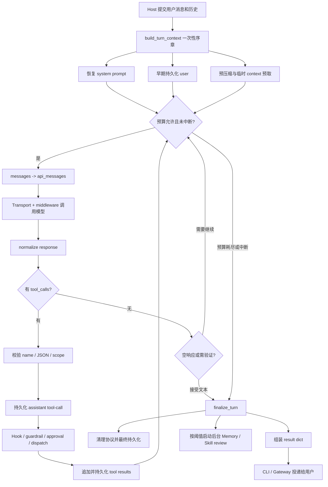

# 第 20 讲：一次对话从输入到工具调用，再到最终回复

前面的模块文档分别分析了 Agent Loop、Prompt Builder、Tool Registry、工具执行、SessionDB、上下文压缩和插件系统。本文把这些模块放回一次完整对话中，核对实际执行顺序。

本文使用的 Hermes 源码快照是：

```text
NousResearch/hermes-agent@590a19332e898fc9bda55a31999926572d8fbc26
```

调用链使用下面这条用户输入作为示例：

```text
读取 pyproject.toml，告诉我当前版本。
```

模型第一次请求 `read_file`，拿到文件内容后，第二次返回版本号。这个例子很短，却经过了 Hermes 对话运行时的大部分主干。

## 目标与范围

本文处理以下问题：

- 一条用户消息从 CLI 或 Gateway 进入后，谁调用 `run_conversation()`。
- 一次用户 turn、一次模型迭代、一次 API 重试和一次 tool call 有什么区别。
- `messages` 与 `api_messages` 为什么必须分开。
- system prompt、Memory、插件上下文和工具 Schema 在哪一步进入请求。
- 模型返回 tool call 后，为什么不能直接调用 `registry.dispatch()`。
- assistant tool-call message 为什么必须在工具产生副作用前持久化。
- tool result 怎样通过 `tool_call_id` 回到模型。
- 没有 tool call 时，Hermes 为什么仍可能拒绝立刻结束。
- 中断、预算耗尽、工具失败和 Provider 失败怎样收尾。
- Memory / Skill review 的介入时机到底在哪里。

---

## 功能 1：先分清五种时间尺度

Hermes 源码里经常同时出现 session、turn、iteration、retry 和 tool call。把它们都翻译成“轮”会直接读乱。

| 时间尺度 | 典型标识 | 生命周期 | 谁推进它 |
|---|---|---|---|
| Session | `session_id` | 多次用户输入，可恢复 | CLI、Gateway、SessionDB |
| 用户 turn | `turn_id` | 一次 `run_conversation()` | 调用 Hermes 的宿主 |
| 模型迭代 | `api_call_count` | 一次模型请求及其处理 | `conversation_loop.py` 外层 `while` |
| API 重试 | `retry_count` | 同一次模型迭代里的再次请求 | Provider 错误恢复循环 |
| Tool call | `tool_call_id` | 模型生成的一次工具调用实例 | 模型提出，Hermes 校验和执行 |

### 1.1 Session 可以包含很多个用户 turn

用户先说“读取版本”，过一会又说“继续解释依赖”，这是同一 session 中两个用户 turn。SessionDB 保存的是跨 turn 的历史。

一次 `run_conversation()` 通常只处理一个新的用户输入。它内部可以请求模型很多次，但这些请求仍属于同一个用户 turn。

### 1.2 模型迭代不等于用户 turn

这个例子至少需要两次模型迭代：

```text
用户 turn
  ├── 模型迭代 1：模型返回 read_file tool call
  ├── 工具执行：Hermes 读取文件并追加 tool result
  └── 模型迭代 2：模型根据结果返回最终文本
```

`api_call_count` 统计的是中间两次模型请求，不是用户说了几句话。

### 1.3 API retry 不会天然产生一条新历史

如果第一次 HTTP 请求超时，Hermes 可以在同一个模型迭代中重试。只要请求没有得到可接受响应，就不应该在 `messages` 中追加一个虚构的 assistant turn。

因此源码有两层循环：

```text
外层 while：模型和工具怎样交替
  └── 内层 retry while：当前模型请求怎样恢复
```

把 retry 当成新 turn，会造成重复消息、重复 tool call 和错误计费。

### 1.4 一个模型迭代可以产生多个 tool calls

模型一次响应可以同时要求读取两个互不相关的文件。两个调用有不同 `tool_call_id`，但共享一个 assistant message。Hermes 随后判断顺序执行还是并发执行。

### 1.5 这些标识怎样串起来

当前实现还生成 `effective_task_id` 和 `api_request_id`：

```text
session_id
  └── turn_id
        ├── api_request_id: api:1
        │     ├── tool_call_id: call_A
        │     └── tool_call_id: call_B
        └── api_request_id: api:2
```

- `effective_task_id` 隔离本轮使用的 VM、浏览器和其他任务资源。
- `turn_id` 关联一次用户 turn 的 Hook、日志和中间件。
- `api_request_id` 关联一次模型请求及其重试、观测和错误。
- `tool_call_id` 把某个工具结果精确配回模型提出的调用。

这几个 id 解决的是不同层次的关联问题，不能只保留一个通用 request id。

---

## 功能 2：宿主把输入和历史交给 `AIAgent`

### 2.1 经典 CLI 的调用点

源码锚点：

- `cli.py:12231 HermesCLI` 调用 `self.agent.run_conversation(...)`
- `run_agent.py:5745 AIAgent.run_conversation`
- `agent/conversation_loop.py:518 run_conversation`

经典 CLI 在调用前已经把当前用户消息加入自己的 `conversation_history`，所以传给 Agent 时使用 `[:-1]`：

```python
result = self.agent.run_conversation(
    user_message=agent_message,
    conversation_history=self.conversation_history[:-1],
    stream_callback=stream_callback,
    task_id=self.session_id,
)
```

如果把完整列表传进去，`build_turn_context()` 还会再追加一次当前 user message，历史里就会出现重复输入。

### 2.2 `AIAgent` 目前是稳定门面

`run_agent.py` 没有继续承载完整循环。它把调用转发给 `agent/conversation_loop.py`：

```python
def run_conversation(self, user_message, system_message=None,
                     conversation_history=None, task_id=None, ...):
    from agent.conversation_loop import run_conversation
    return run_conversation(
        self, user_message, system_message,
        conversation_history, task_id, ...
    )
```

调用方依赖 `AIAgent`，内部实现则可以继续从 `run_agent.py` 拆出去。这就是上一讲提到的兼容门面在真实调用中的位置。

### 2.3 `run_conversation()` 接收的不只是用户文本

几个参数很容易忽略：

| 参数 | 作用 | 为什么需要 |
|---|---|---|
| `conversation_history` | 本轮开始前的历史 | 让 CLI、Gateway 或子 Agent 自己决定恢复哪条 session |
| `task_id` | 任务资源隔离 id | 浏览器、终端和 VM 不能在并发任务间串用 |
| `stream_callback` | 流式文本消费者 | TTS 或界面可以在完整响应结束前消费 delta |
| `persist_user_message` | 另存一份干净用户文本 | API 请求可能带平台上下文前缀，持久历史不一定需要这些包装 |
| `persist_user_timestamp` | 保存平台事件时间 | 时间属于 metadata，不必写进用户正文 |
| `moa_config` | 本 turn 的 Mixture-of-Agents 配置 | 允许当前请求临时走参考模型聚合路径 |

`user_message` 是给模型看的内容，`persist_user_message` 是写进会话历史的内容。两者分开后，Gateway 可以给模型附加群聊观察上下文，又不把整段临时包装永久保存。

### 2.4 Gateway 也进入同一个核心

Gateway 在恢复 `agent_history`、选择 `session_id` 并建立 stream consumer 后，同样调用：

```python
result = agent.run_conversation(
    _api_run_message,
    conversation_history=agent_history,
    task_id=session_id,
    ...,
)
```

CLI 与 Gateway 的输入准备、并发控制和输出投递不同，但进入 `AIAgent.run_conversation()` 后使用同一条 Agent runtime 主干。

---

## 功能 3：`build_turn_context()` 完成一次性序章

源码锚点：

- `agent/turn_context.py:92 TurnContext`
- `agent/turn_context.py:119 build_turn_context`
- `agent/conversation_loop.py:571 build_turn_context(...)`

`run_conversation()` 先调用：

```python
_ctx = build_turn_context(
    agent,
    user_message,
    system_message,
    conversation_history,
    task_id,
    stream_callback,
    persist_user_message,
    persist_user_timestamp,
    ...,
)
```

这个函数只在当前用户 turn 开始时运行一次。后面的每次工具回填不会重新构建 TurnContext。

### 3.1 TurnContext 装的是循环局部变量

```python
@dataclass
class TurnContext:
    user_message: str
    original_user_message: Any
    messages: List[Dict[str, Any]]
    conversation_history: Optional[List[Dict[str, Any]]]
    active_system_prompt: Optional[str]
    effective_task_id: str
    turn_id: str
    current_turn_user_idx: int
    should_review_memory: bool = False
    plugin_user_context: str = ""
    ext_prefetch_cache: str = ""
```

它不是纯函数的返回值。`build_turn_context()` 同时会修改 `agent` 上的计数器、缓存、线程 id、SessionDB 状态和中断状态。dataclass 只是把主循环随后要读取的局部值集中起来。

这反映出 Hermes 当前的迁移状态：控制流已经拆成模块，运行状态仍大量保存在长生命周期 `AIAgent` 对象上。

### 3.2 恢复主 Provider，并刷新本轮工具快照

上一个 turn 可能因错误切到了 fallback Provider。新 turn 开始时先执行：

```python
agent._restore_primary_runtime()
```

随后检查已经加载的 MCP 模块。若某个 MCP server 在两个 turn 之间刚完成连接，Hermes 刷新 Agent 的 MCP 工具快照。本轮第一次构建 `tools=` 前完成刷新，可以避免在请求进行中修改模型工具表。

这里有一个明确的性能选择：如果 `tools.mcp_tool` 尚未进入 `sys.modules`，Hermes 不为了“看看有没有工具”而导入整套 MCP 包。

### 3.3 重置的是本 turn 状态，不是所有状态

序章会重置：

- invalid tool 与 invalid JSON 重试计数。
- empty response 与 thinking prefill 计数。
- tool guardrail 的本 turn 状态。
- 文件修改验证状态。
- iteration budget 和流式 scrubber。

这些状态只解释当前用户 turn，带到下一条用户消息会误伤正常调用。

`_turns_since_memory` 和 `_iters_since_skill` 不在这里重置。它们要跨 turn 累积，达到阈值后才触发 review。源码甚至专门留下了注释：

```python
# NOTE: _turns_since_memory and _iters_since_skill are NOT reset here.
agent.iteration_budget = IterationBudget(agent.max_iterations)
```

这正是 Memory / Skill review 能周期触发，而不是每条消息都执行的基础。

### 3.4 历史用浅拷贝，当前用户消息只追加一次

```python
messages = list(conversation_history) if conversation_history else []

user_msg = {"role": "user", "content": user_message}
messages.append(user_msg)
current_turn_user_idx = len(messages) - 1
```

外层 list 被复制，调用方的列表不会因为 `append` 改变。内部 message dict 仍然共享引用，所以这不是深拷贝。Hermes 后续用持久化 marker 标记已有消息时，正好可以让同一批 dict 在多个 turn 之间保留“已写入”状态。

`current_turn_user_idx` 后面用于把临时 Memory 和插件上下文只注入当前用户消息。

### 3.5 system prompt 先恢复，再创建 SessionDB row

源码顺序是：

```python
if agent._cached_system_prompt is None:
    restore_or_build_system_prompt(
        agent, system_message, conversation_history
    )

active_system_prompt = agent._cached_system_prompt
agent._ensure_db_session()
```

新 session 的数据库行需要保存 system prompt 快照。如果先 `create_session()`，后构建 prompt，第一条 row 会得到空 prompt，恢复时又要重建，Provider 的稳定前缀缓存也会丢一次。

`_ensure_db_session()` 是幂等入口。SQLite 临时锁定时，它保留 `_session_db` 并让后续 turn 重试，而不是永久关闭会话持久化。

### 3.6 用户输入会在模型调用前先落盘

```python
try:
    agent._persist_session(messages, conversation_history)
except Exception:
    logger.warning("Early turn-start session persistence failed", ...)
```

这次 early persist 发生在 Provider 请求之前。模型超时、进程崩溃或工具初始化失败时，用户刚刚发来的内容仍有机会留在 SessionDB。

持久化失败不会阻止本轮继续。Hermes 在这里选择“对话可继续，记录降级”，并把错误留到日志；这是可用性与严格持久性的取舍。

### 3.7 预压缩发生在插件和外部 Memory 注入前

序章根据历史消息、system prompt 和工具 Schema 估算请求大小。超过阈值时最多连续压缩三次，每次都重新估算，确认 message 数量或 token 数量确实下降。

完成后再执行 `pre_llm_call` Hook 和外部 Memory prefetch：

```text
历史 + 当前 user
  -> preflight compression
  -> pre_llm_call plugin context
  -> memory_manager.prefetch_all(original_user_message)
```

Hook 输出和外部 Memory 结果保存在 `TurnContext`，并没有立刻写进 `messages`。这样能保持持久历史干净，也能避免临时上下文改变 session 的稳定 system prompt。

---

## 功能 4：主循环同时受迭代数、预算和中断控制

源码锚点：

- `agent/conversation_loop.py:600` 本 turn 计数器
- `agent/conversation_loop.py:633` 外层 `while`
- `agent/iteration_budget.py:17 IterationBudget`

主循环条件是：

```python
while (
    api_call_count < agent.max_iterations
    and agent.iteration_budget.remaining > 0
) or agent._budget_grace_call:
    ...
```

### 4.1 为什么既有 `max_iterations` 又有 `IterationBudget`

`max_iterations` 是硬上限，`IterationBudget` 是可以消费、退款和给予 grace call 的运行预算。

例如，当前迭代只执行了 `execute_code` 这种程序化 RPC，Hermes 会 refund：

```python
if _tc_names == {"execute_code"}:
    agent.iteration_budget.refund()
```

两者通常同步增长，但语义不同。硬计数防止循环失控，budget 表达某些迭代是否应该消耗任务额度。

### 4.2 每次迭代开始先检查中断

```python
if agent._interrupt_requested:
    interrupted = True
    _turn_exit_reason = "interrupted_by_user"
    break
```

中断可能来自 CLI `/stop`、Gateway 新消息策略或宿主 API。外层循环先检查一次，工具执行器在每个工具开始前还会再检查。原因很实际：用户可能在模型思考时中断，也可能在一批工具执行到一半时中断。

### 4.3 预算在发请求前消费

```python
api_call_count += 1

if agent._budget_grace_call:
    agent._budget_grace_call = False
elif not agent.iteration_budget.consume():
    _turn_exit_reason = "budget_exhausted"
    break
```

先消费再发请求，失败路径才能知道这次尝试占用了多少预算。某些在请求发出前完成的压缩会把 `api_call_count` 减回去并 refund，因为它没有真正调用主模型。

### 4.4 checkpoint dedup 按模型迭代重置

每轮开始调用：

```python
agent._checkpoint_mgr.new_turn()
```

这里源码里的 `new_turn()` 实际对应一次工具循环迭代，不是新的用户 turn。命名有历史包袱。它让本迭代中多个文件写操作共享适当的 checkpoint 去重状态，下一次模型响应再开启新快照机会。

### 4.5 `/steer` 尽量进入下一次模型请求

如果 steer 在前一个模型请求期间到达，Hermes 会把它追加到最近一条 tool result。没有 tool message 时先保留 pending 状态，因为直接插入 user message 可能破坏 Provider 要求的角色顺序。

所以 steer 不是随时改写 system prompt。它作为运行中补充输入，借助已有 tool result 进入下一次 `api_messages`。

---

## 功能 5：`messages` 与 `api_messages` 是两份不同视图

这是整条链里最容易被忽略的设计。

### 5.1 `messages` 是当前 turn 的规范工作历史

它包含：

```text
过去持久化历史
+ 当前 user message
+ assistant tool-call message
+ tool result
+ 最终 assistant message
```

工具执行和最终持久化都围绕这份列表进行。

### 5.2 `api_messages` 是本次 Provider 请求快照

每次模型迭代都重新从 `messages` 构建：

```python
api_messages = []
for idx, msg in enumerate(messages):
    api_msg = msg.copy()
    ...
    api_messages.append(api_msg)
```

它可以按 Provider 要求调整字段，又不污染规范历史。例如：

- 把 Hermes 内部 `reasoning` 转成 Provider 需要的 `reasoning_content`。
- 移除严格 API 不接受的 `finish_reason` 和内部标记。
- 清理 Codex Responses 专用字段。
- 把多模态内容转换成当前 Provider 支持的形式。
- 规范 tool-call arguments JSON，增加前缀缓存命中率。

这些转换只服务当前请求，不一定应该永久写入 SessionDB。

### 5.3 临时上下文只修改当前 user 的 API 副本

```python
if idx == current_turn_user_idx and msg.get("role") == "user":
    injections = []
    if ext_prefetch_cache:
        injections.append(build_memory_context_block(...))
    if plugin_user_context:
        injections.append(plugin_user_context)
    api_msg["content"] = base + "\n\n" + "\n\n".join(injections)
```

原始 `messages[current_turn_user_idx]` 没有变化。结果是：

```text
模型看到：用户正文 + 外部 Memory recall + 插件临时上下文
数据库保存：用户正文，或 persist_user_message 指定的干净正文
```

这也解释了为什么某段外部 recall 在当前请求里有效，恢复 session 后却找不到一条对应 user message。它本来就是 API-call-time context。

### 5.4 system prompt 在最后作为单一前缀加入

```python
effective_system = active_system_prompt or ""
if agent.ephemeral_system_prompt:
    effective_system = (
        effective_system + "\n\n" + agent.ephemeral_system_prompt
    ).strip()

if effective_system:
    api_messages = [
        {"role": "system", "content": effective_system}
    ] + api_messages
```

稳定 prompt 与 Hermes 自己的 ephemeral system additions 都在这里进入 Provider 请求。插件上下文和外部 Memory recall 放在 user 副本里，避免每次改变 system prefix。

### 5.5 请求发送前还要修复消息协议

Hermes 会处理以下问题：

| 检查 | 处理方式 | 不处理的后果 |
|---|---|---|
| 损坏的 tool-call arguments | 修复或规范 JSON | Provider 解析失败 |
| 错误角色顺序 | 合并或修复 message sequence | 严格 Provider 返回 400 或空响应 |
| 孤立 tool result | 删除孤儿或补缺失结果 | tool call id 无法配对 |
| thinking-only assistant | 在 API 副本中删除并合并 user | Anthropic 拒绝尾部 thinking block |
| surrogate 字符 | 请求前清洗 | SDK 的 JSON 编码崩溃 |
| 上下文压力 | 模型请求前再次估算并压缩 | 大工具结果把下一次请求直接顶爆 |

序章只看到了“历史 + 新 user”。一次工具可能返回几十万字符，所以外层循环在每次 API call 前还要重新做 pressure check。

---

## 功能 6：Transport 把同一份内部历史变成不同 Provider 请求

源码锚点：

- `run_agent.py:5298 AIAgent._build_api_kwargs`
- `agent/chat_completion_helpers.py:606 build_api_kwargs`
- `run_agent.py:4957 AIAgent._get_transport`
- `agent/transports/`

### 6.1 `_build_api_kwargs()` 是转发入口

```python
def _build_api_kwargs(self, api_messages):
    from agent.chat_completion_helpers import build_api_kwargs
    return build_api_kwargs(self, api_messages)
```

真正的 `build_api_kwargs()` 根据 `api_mode` 选择 transport：

```python
if agent.api_mode == "anthropic_messages":
    return transport.build_kwargs(...)

if agent.api_mode == "bedrock_converse":
    return transport.build_kwargs(...)

if agent.api_mode == "codex_responses":
    return transport.build_kwargs(...)

return chat_transport.build_kwargs(...)
```

同一条内部 assistant/tool 历史，可以被转换成 OpenAI Chat Completions、Anthropic Messages、Bedrock Converse 或 Responses API 的请求形态。

### 6.2 工具 Schema 在这里与消息会合

`agent.tools` 是当前 Agent 已经筛选好的模型可见工具定义：

```python
tools_for_api = agent.tools
return transport.build_kwargs(
    model=agent.model,
    messages=api_messages,
    tools=tools_for_api,
    ...,
)
```

Registry 负责保存工具，toolset 负责决定当前集合，`build_api_kwargs()` 才把这份集合放进某一次模型请求。注册、可见和请求发送是三个时间点。

### 6.3 Provider Profile 与 legacy flags 并存

Chat Completions 路线优先查 `providers` Registry 中的 Provider Profile。已注册 Provider 通过 profile hooks 处理差异；未知 Provider 仍走历史 flag 分支。

这说明 Hermes 正在把散落的 Provider 判断迁移到 profile abstraction，但还没有完全删除旧兼容路径。阅读时不能只看 `providers/`，也不能把 `chat_completion_helpers.py` 里的所有判断都当成未来接口。

### 6.4 请求中间件与 Hook 的位置不同

一次请求大致经过：

```text
build_api_kwargs
  -> LLM request middleware 可重写 payload
  -> pre_api_request Hook 做观测或扩展
  -> LLM execution middleware 包住真实调用
  -> streaming / non-streaming client call
  -> post_api_request Hook
```

request middleware 接触的是“将要发送什么”，execution middleware 接触的是“怎样执行这次调用”。Hook 提供生命周期观察点。把三者都叫插件回调，会看不出谁能修改 payload、谁能包住调用、谁只收到事件。

### 6.5 Streaming 不改变 Agent loop 的分支模型

有 stream consumer 时，Hermes 使用 `_interruptible_streaming_api_call()`；没有消费者或当前 Provider 不适合 streaming 时，使用 `_interruptible_api_call()`。

两条路线最终都要返回 transport 能规范化的 response。stream delta 可以提前显示，但 tool call 是否完整、finish reason 是什么、是否进入工具分支，仍由完整响应处理阶段决定。

### 6.6 内层 retry loop 处理同一次请求的恢复

源码锚点：

- `agent/conversation_loop.py:1095` API retry loop
- `agent/turn_retry_state.py`

```python
while retry_count < max_retries:
    try:
        api_kwargs = agent._build_api_kwargs(api_messages)
        response = run_llm_execution_middleware(...)
        ...
    except Exception as api_error:
        ...
```

错误分类后可能采取：

- 刷新 credential。
- 重建连接或 client。
- 增加 output token 上限后继续。
- 压缩上下文后重试。
- 切换 fallback Provider。
- 对确定性拒绝停止重试。

这些动作不应随意追加普通用户或 assistant 消息。retry 的输入仍是当前 `api_messages`，除非某个恢复策略明确改变了上下文。

---

## 功能 7：Transport 先把响应归一，再决定走工具还是文本

源码锚点：

- `agent/conversation_loop.py:4208` 最终 response normalization
- `agent/transports/types.py`

```python
transport = agent._get_transport()
normalized = transport.normalize_response(response, ...)
assistant_message = normalized
finish_reason = normalized.finish_reason
```

上层循环不直接读取每个 SDK 的原始对象。Transport 统一提供：

- 可见文本 `content`。
- 结构化 `tool_calls`。
- 归一化 `finish_reason`。
- reasoning、usage 和 Provider 特有 metadata。

### 7.1 核心分支由 `tool_calls` 是否为空决定

```python
if assistant_message.tool_calls:
    # 校验并执行工具
else:
    # 处理最终文本
```

模型决定“想调用工具还是回答文本”，运行时决定“这个调用是否合法、是否允许执行、怎样执行以及结果怎样回填”。

因此不能说工具调用全靠模型，也不能说 Hermes 用规则决定什么时候读文件。模型提出动作，Runtime 掌握执行权。

### 7.2 finish reason 不能只当展示字段

Hermes 会把不同 Provider 的停止原因映射成内部语义：

| 内部原因 | 典型处理 |
|---|---|
| `stop` | 正常检查文本或 tool calls |
| `tool_calls` | 进入工具分支 |
| `length` | 处理截断，禁止执行不完整参数 |
| `incomplete` | Codex Responses continuation |
| `content_filter` | 视为确定性拒绝，尝试 fallback 或直接返回 |

一个 HTTP 200 不代表本轮成功。安全拒绝通常没有正文，如果把它误判为空响应并重复请求，只会消耗额度并得到同样结果。

---

## 功能 8：tool call 分支先验证协议，再允许副作用

源码锚点：

- `agent/conversation_loop.py:4401` tool-call branch
- `run_agent.py:5631 AIAgent._execute_tool_calls`
- `agent/tool_executor.py:306 execute_tool_calls_concurrent`
- `agent/tool_executor.py:965 execute_tool_calls_sequential`
- `agent/agent_runtime_helpers.py:2064 invoke_tool`
- `tools/registry.py:574 ToolRegistry.dispatch`

### 8.1 第一道检查是工具名

```python
for tc in assistant_message.tool_calls:
    if tc.function.name not in agent.valid_tool_names:
        repaired = agent._repair_tool_call(tc.function.name)
        if repaired:
            tc.function.name = repaired
```

Hermes 可以修复足够明确的名称偏差。仍然无效时，它不会调用一个相近工具碰碰运气，而是把错误写成与原 `tool_call_id` 匹配的 tool result，让模型自行修正。

连续三次生成无效工具名后，本 turn 以 partial failure 返回，避免模型永久自我纠错。

### 8.2 第二道检查是 arguments JSON

空字符串会被归一成 `{}`，dict/list 会先序列化。解析仍失败时，Hermes 区分两种情况：

1. 参数明显被截断。此时拒绝执行，因为半段 `shell_exec` 或 `write_file` 参数可能产生错误副作用。
2. 模型格式错误。前两次直接重试；达到阈值后，追加 assistant tool-call message 和 error tool results，让模型看到协议错误并重新生成。

错误结果使用 `role="tool"`，不是伪造一条 user message。这样能保留角色顺序和 tool-call 配对。

### 8.3 去重和 delegation 限额发生在执行前

```python
assistant_message.tool_calls = agent._cap_delegate_task_calls(...)
assistant_message.tool_calls = agent._deduplicate_tool_calls(...)
```

Provider 或模型可能生成重复 call id，也可能一次 fan-out 过多子 Agent。这里先收敛调用集合，工具执行器看到的才是本轮允许执行的 batch。

### 8.4 先追加 assistant tool-call turn

通过协议检查后，Hermes 构建规范 assistant message：

```python
assistant_msg = agent._build_assistant_message(
    assistant_message, finish_reason
)
messages.append(assistant_msg)
agent._emit_interim_assistant_message(assistant_msg)
```

此时历史形态是：

```json
[
  {"role": "user", "content": "读取 pyproject.toml..."},
  {
    "role": "assistant",
    "content": "",
    "tool_calls": [
      {
        "id": "call_01",
        "function": {
          "name": "read_file",
          "arguments": "{\"path\":\"pyproject.toml\"}"
        }
      }
    ]
  }
]
```

### 8.5 工具执行前必须增量持久化

```python
agent._flush_messages_to_session_db(
    messages, conversation_history
)

agent._execute_tool_calls(
    assistant_message, messages,
    effective_task_id, api_call_count
)
```

顺序不能反过来。工具可能修改文件、重启服务或终止进程。若副作用已经发生，而 assistant tool-call turn 没有写入数据库，恢复时就无法知道刚才为什么执行了这个动作。

这仍然不是跨 SQLite 与文件系统的 exactly-once transaction。进程可能在“文件已经改完、tool result 尚未持久化”之间崩溃。Hermes 能保存执行意图并修复消息协议，但无法自动证明所有外部副作用是否已经发生。真正高风险工具还需要 checkpoint、幂等 handler 或外部事务 id。

### 8.6 谁决定顺序执行还是并发执行

`AIAgent._execute_tool_calls()` 检查整个 batch：

```python
if not _should_parallelize_tool_batch(tool_calls):
    return self._execute_tool_calls_sequential(...)

return self._execute_tool_calls_concurrent(...)
```

只读工具通常可以并发；文件读写只有目标路径不重叠时才可能并发。这个判断属于 Runtime，不由模型通过参数自行声明。

并发路线预留与原 tool call 相同顺序的 result slots。即使后一个工具先结束，回填仍按原始 call 顺序进行，避免 Provider 看到错配的结果序列。

---

## 功能 9：一个工具真正执行前，还要穿过运行时管线

各模块文档已经逐项分析过这条管线，这里只核对它在完整调用中的先后关系。

### 9.1 工具执行管线

```text
解析 arguments
  -> Tool Search bridge 解包并复查 scope
  -> tool request middleware 重写参数
  -> plugin pre_tool_call 可阻断
  -> tool-loop guardrail 判断重复失败/循环
  -> checkpoint 与危险操作预处理
  -> tool execution middleware
  -> AIAgent._invoke_tool / handle_function_call
  -> 特殊 runtime tool 或 ToolRegistry.dispatch
  -> post_tool_call 与结果 guardrail
```

### 9.2 Tool Search bridge 为什么要重新检查 scope

模型表面调用的可能是 `tool_call` bridge，真实目标工具藏在参数里。解包后如果直接 dispatch，模型就可能通过 bridge 调用当前 toolset 没有授予的工具。

所以 executor 先得到 underlying tool name，再用 session 的 scoped names 检查。后续 Hook、审批和日志也应该看到真实工具，而不是只看到 bridge。

### 9.3 request middleware 改写的是后续所有人看到的参数

middleware 在 Hook、guardrail 和审批前运行。它若把路径标准化，后面的安全判断应针对标准化结果；如果安全判断先跑，middleware 再换成另一个路径，就会形成检查与执行不一致。

### 9.4 plugin block 与 guardrail block 不执行 handler

二者都会为原 `tool_call_id` 生成合成结果，但含义不同：

- plugin block 是扩展策略做出的拒绝。
- guardrail block 是 Runtime 检测到重复失败、危险循环等行为后停止。

blocked call 不应被记为真实工具成功或失败，也不应该占用文件 checkpoint。

### 9.5 特殊 runtime tool 不一定经过 Registry

`todo`、`session_search`、`memory`、`clarify`、`delegate_task`、Context Engine tools 和外部 Memory Provider tools 在 executor 中有专门分支。普通注册工具最终才进入 `handle_function_call()` 和 Registry。

因此这条概括并不精确：

```text
所有工具都由 registry.dispatch 执行
```

更准确的是：模型工具共享同一套前后管线，最后一跳可以是 Runtime 特殊分支、Memory/Context Provider，或者 Tool Registry handler。

### 9.6 handler 报错通常变成 tool result

工具失败并不自动让整个用户 turn 失败。executor 会把异常或错误返回值转换成字符串结果，仍然追加：

```json
{
  "role": "tool",
  "name": "read_file",
  "tool_call_id": "call_01",
  "content": "Error executing tool 'read_file': file not found"
}
```

下一次模型请求可以换路径、向用户说明错误或调用其他工具。Agent loop 的价值就在这里：环境反馈会重新进入模型决策，而不是任意一个工具异常都直接结束程序。

---

## 功能 10：tool result 回填后，控制权重新交给模型

### 10.1 tool result 先进入 `messages`

顺序执行路线的尾部是：

```python
tool_content = agent._tool_result_content_for_active_model(
    function_name, function_result
)
messages.append(
    make_tool_result_message(
        function_name, tool_content, tool_call.id
    )
)
```

此时的历史变成：

```text
user
assistant(tool_calls=[call_01 read_file])
tool(tool_call_id=call_01, content="...pyproject.toml...")
```

下一次循环重新构建 `api_messages`。模型看到自己提出的 call 和对应结果，才有依据生成版本号。

### 10.2 每个 tool result 都会尽快增量持久化

```python
_flush_session_db_after_tool_progress(
    agent,
    messages,
    stage=f"tool result {function_name}",
)
```

一批顺序工具执行到第三个时崩溃，前两个结果已经有机会写入数据库。并发路线也按原始调用顺序逐个收集、追加并 flush。

### 10.3 大结果可能被外置

`maybe_persist_tool_result()` 根据上下文预算把超长结果写入外部文件，再给模型较短内容或引用。多模态结果则转成当前模型支持的 text/image blocks。

这里解决的是“工具输出怎样进入上下文”，不是 SessionDB 的普通消息存储。即使工具 handler 返回一个大字符串，最终进入模型和数据库的表现也可能经过截断、摘要或外置。

### 10.4 子目录规则在结果后追加

文件工具访问新目录后，`SubdirectoryHintTracker` 可以发现局部 `AGENTS.md`、`CLAUDE.md` 等上下文文件。发现内容附在 tool result 后，模型下一次迭代才看到。

这条路径不会重建稳定 system prompt，也不会让尚未访问该目录的模型提前看到所有局部规则。

### 10.5 工具后再次检查上下文压力

工具结果加入后，Hermes 使用真实 Provider usage 或粗略估算判断是否压缩。若触发压缩，会更新 `messages` 和 `conversation_history` 基线，再进入下一次循环。

最后一行很普通：

```python
continue
```

但这个 `continue` 的含义很明确：不是继续执行下一个 Python handler，而是回到 Agent 外层循环，再发一次模型请求。

---

## 功能 11：没有 tool call 也不一定立刻结束

源码锚点：

- `agent/conversation_loop.py:4768` no-tool-call branch
- `agent/verification_stop.py`
- `agent/verification_evidence.py`
- `agent/verify_hooks.py`

### 11.1 普通情况：文本成为候选最终回复

```python
final_response = assistant_message.content or ""
final_response = agent._strip_think_blocks(
    final_response
).strip()
```

如果正文有效，Hermes 清理内部 thinking，再构建最终 assistant message。

### 11.2 空响应有自己的恢复状态机

正文为空时，Hermes 可能：

- 从 partial stream 恢复已收到文本。
- 使用“正文 + housekeeping tool call”那一轮保存的正文。
- 添加 thinking prefill 或 continuation scaffolding 后重试。
- 切换 fallback Provider。
- 达到阈值后返回可识别的 empty terminal。

这些 recovery scaffolding 会带内部标记。最终持久化前必须删除，否则用户下次说“继续”时，模型会把内部恢复提示当成真实对话。

### 11.3 中间确认语可能被判定为尚未完成

coding agent 有时只返回“我会先检查文件”，却没有执行任何工具。Hermes 的 `intent_ack_continuation_mode` 可以识别这种中间确认，追加一条内部 continuation user message，要求模型立即执行工具。

这不是把所有简短回答都强制继续。它受配置、工具可用性、次数上限和 coding context 条件约束。

### 11.4 Verification stop 可以否决模型的“完成”

模型给出文本，不代表 Runtime 必须马上接受结束。如果本 turn 修改过文件却没有验证证据，Hermes 可以把候选 final message 和 synthetic user nudge 加入内存历史，再 `continue`：

```python
if verify_nudge:
    messages.append(final_msg)
    messages.append({
        "role": "user",
        "content": verify_nudge,
        "_verification_stop_synthetic": True,
    })
    continue
```

候选回答不会先显示给用户，也不会作为正常消息持久化。模型获得一次机会去运行测试或检查结果。

Claude Code 公开 Hook 中的 Stop hook 也能阻止结束。Hermes 把一部分证据检查直接放进公开 Runtime，因此可以看到完整控制流。

### 11.5 当前版本在 Windows 上有一个 ad-hoc 验证识别缺口

没有标准测试命令的项目，可以运行位于系统临时目录、文件名以 `hermes-verify-` 或 `hermes-ad-hoc-` 开头的脚本。`record_terminal_result()` 会尝试把这类成功命令记为 targeted verification evidence。

当前实现先用 `shlex.split()` 拆命令：

```python
def _split_segment_tokens(command: str):
    for segment in _SHELL_SPLIT_RE.split(command.strip()):
        tokens = shlex.split(segment)
```

这里没有按操作系统切换解析规则。Windows 命令如果包含未加引号的反斜杠路径，例如 `python <临时目录>\\hermes-ad-hoc-xxx.py`，POSIX 模式的 `shlex` 会把反斜杠当作转义符并删掉。后续 `_is_temp_script_path()` 收到的已不是合法绝对路径，命令虽然执行成功，却不会写入验证证据账本。于是 verification stop 仍可能要求模型继续验证。

这是当前源码和对应测试在 Windows 上可以复现的边界，不是 verification stop 的设计目标。标准项目命令不依赖这条 ad-hoc 路径识别分支；修复时则需要采用平台匹配的命令解析方式，或者让 terminal 工具把 argv 作为结构化数据传入，避免事后重新解析命令字符串。

### 11.6 真正接受文本后才退出外层循环

```python
messages.append(final_msg)
_turn_exit_reason = (
    f"text_response(finish_reason={finish_reason})"
)
break
```

示例在此时得到：

```text
user: 读取 pyproject.toml，告诉我当前版本。
assistant: tool_call read_file(call_01)
tool: call_01 -> pyproject.toml 内容
assistant: 当前版本是 0.18.0。
```

外层循环结束，控制权进入 `finalize_turn()`。

---

## 功能 12：`finalize_turn()` 统一处理所有正常 `break`

源码锚点：

- `agent/conversation_loop.py:5275` 调用 finalizer
- `agent/turn_finalizer.py:30 finalize_turn`

主循环把局部状态交给 finalizer：

```python
return finalize_turn(
    agent,
    final_response=final_response,
    api_call_count=api_call_count,
    interrupted=interrupted,
    failed=failed,
    messages=messages,
    conversation_history=conversation_history,
    ...,
)
```

有些严重错误分支会在循环内 early return；正常文本、预算耗尽、guardrail halt 和普通中断通常汇合到这里。

### 12.1 预算耗尽时请求一次无工具总结

```python
if final_response is None and (
    api_call_count >= agent.max_iterations
    or agent.iteration_budget.remaining <= 0
):
    final_response = agent._handle_max_iterations(
        messages, api_call_count
    )
```

这次请求移除工具，要求模型概括已完成工作和剩余状态。目的不是假装任务完成，而是给用户一个可读的停机说明。

Kanban worker 还会把预算耗尽记录为 `timed_out`，让调度器的连续失败熔断能够生效。

### 12.2 `completed` 不是“最后一条消息存在”

```python
normal_text_response = str(exit_reason).startswith(
    "text_response("
)
completed = (
    final_response is not None
    and not failed
    and (
        api_call_count < agent.max_iterations
        or normal_text_response
    )
)
```

正常文本恰好出现在最后一次允许调用时，仍然算完成。因预算耗尽额外生成的 summary 有文本，但不应等价于任务按计划完成。

### 12.3 清理动作彼此隔离

finalizer 依次尝试：

1. 保存 trajectory。
2. 清理本任务 VM、Browser 等资源。
3. 清理临时消息并持久化 session。

每一步单独 `try/except`。某个浏览器关闭失败时，SessionDB 持久化仍要继续；SQLite 写失败时，已经得到的模型回复仍要返回。错误放入 `cleanup_errors`，而不是抛出后丢掉正文。

相关测试：

- `tests/agent/test_turn_finalizer_cleanup_guard.py`
- `tests/agent/test_turn_finalizer_final_response_persistence.py`

### 12.4 中断后的 tool tail 必须闭合

若用户在工具刚完成后中断，历史尾部可能是 `role="tool"`。下一个 user 直接接上会形成严格 Provider 不接受的序列。

`close_interrupted_tool_sequence()` 会补一条 assistant placeholder 或使用已有中断文本闭合：

```text
assistant(tool_calls)
tool(result)
assistant(interrupted placeholder)
```

这不是给用户编造答案，而是修复持久会话协议，使下一次恢复仍可发送给 Provider。

### 12.5 返回给用户的文本可能与持久原文不同

finalizer 先持久化规范 transcript，随后才可能：

- 添加文件修改失败 footer。
- 添加异常结束解释。
- 运行 `transform_llm_output` Hook。

所以 SessionDB 主要保存模型对话事实，宿主收到的 `final_response` 可以带运行时说明或插件转换。`post_llm_call` Hook 接收到的是转换后的回复。

这里存在两个观测面：调试“模型原本说了什么”应查看 messages/SessionDB，调试“用户最终看到了什么”应查看 final result 和平台投递日志。

### 12.6 result dict 是宿主协议

finalizer 返回的主要字段包括：

```python
result = {
    "final_response": final_response,
    "last_reasoning": last_reasoning,
    "messages": messages,
    "api_calls": api_call_count,
    "completed": completed,
    "turn_exit_reason": exit_reason,
    "failed": failed,
    "interrupted": interrupted,
    "model": agent.model,
    "provider": agent.provider,
    "session_id": agent.session_id,
    ...,
}
```

CLI 使用 `messages` 更新本地历史，Gateway 使用 `final_response` 做平台投递，也会读取 token、模型和 session id 处理统计与压缩后的 session 切换。

`turn_exit_reason` 是工程诊断字段。看到“Agent 突然停了”时，它比只看 `completed` 更能说明是文本结束、预算耗尽、中断、guardrail halt 还是 empty response。

---

## 功能 13：Memory / Skill review 在用户任务收尾后触发

这是前面总览中曾经暂时留下的问题，现在可以完整闭环。

### 13.1 Memory review 的触发判定在 turn 序章

`build_turn_context()` 每收到一条用户消息，增加 `_turns_since_memory`：

```python
if memory_enabled:
    agent._turns_since_memory += 1
    if agent._turns_since_memory >= interval:
        should_review_memory = True
        agent._turns_since_memory = 0
```

此时只记录“本 turn 结束后应该 review”，不会抢在用户任务前调用 curator。

### 13.2 Skill review 按工具迭代累计

外层循环每次准备模型调用时增加 `_iters_since_skill`，实际调用 `skill_manage` 会重置。finalizer 再检查是否达到阈值：

```python
if (
    agent._iters_since_skill >= agent._skill_nudge_interval
    and "skill_manage" in agent.valid_tool_names
):
    should_review_skills = True
    agent._iters_since_skill = 0
```

Memory 更接近“经过多少个用户 turn”，Skill 更接近“Agent 已经工作了多少个工具迭代”。两者触发单位不同。

### 13.3 真正 review 在 finalizer 尾部后台启动

```python
if final_response and not interrupted and (
    should_review_memory or should_review_skills
):
    agent._spawn_background_review(
        messages_snapshot=list(messages),
        review_memory=should_review_memory,
        review_skills=should_review_skills,
    )
```

它满足三个条件：

- 当前 turn 有最终回复。
- 用户没有中断。
- 至少一个 review 达到阈值。

review 使用消息快照和 persistence-isolated Agent fork。fork 保留必要上下文，但 `_persist_disabled` 阻止它把 curator 指令和 review 对话写回用户 SessionDB。

后台任务不参与当前用户任务的模型工具循环。它在 finalizer 尾部调度，`run_conversation()` 不等待 review 完成后才返回正文。

### 13.4 External Memory 同步也在这里

finalizer 调用 `_sync_external_memory_for_turn()`，把完成的 user/assistant turn 通知外部 Memory Provider，并为后续 recall 做准备。

注意 session 还没有结束。`run_conversation()` 每条用户消息调用一次，Memory Provider 的真正 `on_session_end()` 与 shutdown 由 CLI 退出、reset 或 Gateway session expiry 处理。

### 13.5 `on_session_end` Plugin Hook 的名字有历史语义

当前 `turn_finalizer.py` 的 `on_session_end` Plugin Hook 在每次 `run_conversation()` 尾部触发。它和 Memory Provider 的真实 session shutdown 不是同一个生命周期。

读插件时要以调用点为准，不能只凭 Hook 名称推断“整条多轮会话已经结束”。这是现有公共契约中的命名包袱。

---

## 功能 14：持久化不是最后一次统一保存

一次成功工具调用至少经过四个保存时机。

| 时机 | 保存什么 | 防什么故障 |
|---|---|---|
| turn 开始 | 新 user message | Provider 调用前崩溃 |
| 工具执行前 | assistant tool-call turn | 副作用发生后丢失执行意图 |
| 每个工具结束 | 对应 tool result | 一批工具中途崩溃 |
| turn finalizer | 最终 assistant 与整理后历史 | 正常结束和恢复闭环 |

### 14.1 `_persist_session()` 同时写两种存储

源码锚点：

- `run_agent.py:1649 AIAgent._persist_session`
- `run_agent.py:1726 AIAgent._flush_messages_to_session_db`

```python
def _persist_session(self, messages, conversation_history=None):
    self._drop_trailing_empty_response_scaffolding(messages)
    self._session_messages = messages
    self._save_session_log(messages)
    self._flush_messages_to_session_db(
        messages, conversation_history
    )
```

JSON session log 与 SQLite SessionDB 都在这里更新。不同产品入口还可能维护自己的 transcript 或路由状态。

### 14.2 DB flush 用 message marker 做幂等追加

每次 flush 都遍历 `messages`，跳过已有 `_DB_PERSISTED_MARKER` 的 dict。写入成功后在该 message 上盖 marker：

```python
if msg.get(_DB_PERSISTED_MARKER):
    continue

session_db.append_message(...)
msg[_DB_PERSISTED_MARKER] = True
```

这比单纯保存“已经写到列表第 N 项”稳健。消息修复和上下文压缩可能合并、删除或重排列表，位置 cursor 容易漂移。

### 14.3 临时消息永远不应进入真实 session

flush 会跳过 empty recovery、thinking prefill、verification nudge 等 ephemeral scaffolding。否则这些内部控制提示会在下一次 session 恢复时变成模型看到的历史指令。

后台 Memory/Skill review fork 还会设置 `_persist_disabled`，从入口上禁止写 canonical SessionDB。只靠“最后清理一下”不够安全，因为中途也有增量 flush。

### 14.4 持久化覆盖只作用于写入值

`persist_user_message` 不会改写 live `messages`。flush 在生成 DB row 时才替换当前 user 的持久内容。

这样 API-facing message 可以保留图片、群聊上下文或临时前缀，数据库仍保存适合后续检索和展示的干净文本。

---

## 一次工具调用的完整消息演化

把上面的代码压缩成四个快照。

### 快照 A：序章结束

规范 `messages`：

```json
[
  {
    "role": "user",
    "content": "读取 pyproject.toml，告诉我当前版本。"
  }
]
```

第一次模型请求的 `api_messages`：

```json
[
  {"role": "system", "content": "<稳定 Hermes prompt>"},
  {
    "role": "user",
    "content": "读取 pyproject.toml，告诉我当前版本。\n\n<临时 memory/plugin context>"
  }
]
```

工具 Schema 位于请求的 `tools` 字段，不是普通 message。

### 快照 B：模型提出工具调用

```json
[
  {"role": "user", "content": "读取 pyproject.toml..."},
  {
    "role": "assistant",
    "content": "",
    "tool_calls": [
      {
        "id": "call_01",
        "type": "function",
        "function": {
          "name": "read_file",
          "arguments": "{\"path\":\"pyproject.toml\"}"
        }
      }
    ]
  }
]
```

assistant turn 先持久化，随后 handler 才执行。

### 快照 C：工具结果回填

```json
[
  {"role": "user", "content": "读取 pyproject.toml..."},
  {"role": "assistant", "tool_calls": ["call_01"]},
  {
    "role": "tool",
    "name": "read_file",
    "tool_call_id": "call_01",
    "content": "[project]\nversion = \"0.18.0\"\n..."
  }
]
```

第二次模型请求重新发送 system、历史、工具调用及结果。`tool_call_id` 让模型协议知道这条结果回答的是哪个调用。

### 快照 D：最终文本

```json
[
  {"role": "user", "content": "读取 pyproject.toml..."},
  {"role": "assistant", "tool_calls": ["call_01"]},
  {"role": "tool", "tool_call_id": "call_01", "content": "..."},
  {
    "role": "assistant",
    "content": "当前 Hermes 版本是 0.18.0。"
  }
]
```

这才是一个协议闭合的工具 turn。

---

## 成功路径时序图

```mermaid
sequenceDiagram
    participant Host as CLI / Gateway
    participant Agent as AIAgent facade
    participant Prologue as build_turn_context
    participant Loop as conversation_loop
    participant Transport as Provider transport
    participant Exec as tool_executor
    participant Registry as Tool/runtime handler
    participant DB as SessionDB
    participant Final as finalize_turn

    Host->>Agent: run_conversation(user, history)
    Agent->>Loop: forward
    Loop->>Prologue: build_turn_context()
    Prologue->>DB: persist inbound user
    Prologue-->>Loop: TurnContext

    Loop->>Transport: API request #1 + tools
    Transport-->>Loop: assistant tool_call(call_01)
    Loop->>DB: persist assistant tool-call turn
    Loop->>Exec: execute batch
    Exec->>Registry: read_file(args)
    Registry-->>Exec: file content
    Exec->>DB: persist tool result(call_01)

    Loop->>Transport: API request #2 + tool result
    Transport-->>Loop: final assistant text
    Loop->>Final: finalize_turn(...)
    Final->>DB: persist closed transcript
    Final-->>Agent: result dict
    Agent-->>Host: final_response + metadata
```

图里没有画 API retry、压缩和 Hook。它们包在相应阶段内部，不会改变 user、assistant(tool call)、tool(result)、assistant(final) 这条核心协议。

---

## 失败路径：先判断故障发生在哪一层

### 1. 用户输入已到达，但 Provider 还没调用

可能原因包括 system prompt 构建失败、Ollama runtime context 明显过小或 preflight compression 无法继续。

用户消息已经 early persist。此时 `api_call_count` 可能被 refund，因为主模型请求没有真正发出。

### 2. Provider 请求失败

内层 retry loop 根据异常类型处理 credential、连接、限流、payload、context overflow 和 fallback。

同一次请求的暂时失败不会生成假的 assistant message。重试耗尽后，Hermes 持久化已有历史，并返回 `completed=False` 和错误说明。

### 3. Provider 返回安全拒绝

`finish_reason="content_filter"` 是确定性结果，不按普通空响应反复重试。Hermes 可以切换一次 fallback；没有 fallback 时明确告诉用户这是模型或 Provider 的 safety refusal。

### 4. tool call 参数被截断

Hermes 拒绝执行不完整参数。对于网络中断或 output limit，它可以提高输出上限并重试；达到阈值后返回 partial failure。

安全原则是：宁可不执行，也不猜测缺失的命令、路径或文件内容。

### 5. 工具 handler 失败

通常转换成 tool result，让模型获得纠错机会。整个 turn 是否失败，由模型后续是否能恢复以及 Runtime 是否触发 halt 决定。

### 6. Tool guardrail 判定应停止

executor 生成合成 tool result，并设置 `_tool_guardrail_halt_decision`。回到 conversation loop 后不再请求模型，直接构造用户可见 halt response，`turn_exit_reason="guardrail_halt"`。

### 7. 用户在工具批次中中断

顺序路线不会启动剩余工具，并为每个跳过的 call 补 cancelled tool result。并发路线取消尚未开始的 future，并向已运行线程传播 interrupt signal。

finalizer 再闭合 tool tail，保证恢复后的角色顺序有效。

### 8. 达到迭代预算

主循环停止调用工具，并发起一次无工具 summary。返回值可以包含已完成工作，但 `completed` 不会因为“有一段总结”就自动变成真。

### 9. finalizer 自己失败

trajectory、资源清理和 SessionDB 写入独立保护。用户正文仍返回，失败步骤放进 `cleanup_errors`。调用方可以区分“模型任务成功，但清理有问题”和“模型任务本身失败”。

---

## 四类状态分别由谁拥有

| 状态 | 例子 | 生命周期 | 主要风险 |
|---|---|---|---|
| 函数局部 | `api_call_count`、`response`、`finish_reason` | 当前 `run_conversation` | early return 绕过统一收尾 |
| Agent 实例 | budget、retry counters、transport cache、pending steer | 一个活跃 Agent，可跨 turn | 状态忘记重置或并发串扰 |
| 持久 Session | messages、system prompt、usage、parent id | 进程重启后仍在 | 重复写、孤立 tool result、临时提示泄漏 |
| 外部副作用 | 文件、进程、浏览器、远程 API | 超出会话数据库 | 无法与 SQLite 做原子提交 |

### 函数局部为什么逐步抽成 dataclass

`TurnContext` 与 `TurnRetryState` 把一组局部变量命名，减少 `conversation_loop.py` 继续膨胀。它们没有消除 `AIAgent` 的共享可变状态，但让“序章输出”和“重试状态”开始有边界。

### Agent 实例为什么容易成为隐式状态容器

流式回调、Gateway callback、tool guardrail、Context Compressor 和各类 Provider 兼容字段都挂在 `agent` 上。转发函数可以快速拆文件，但参数依赖仍是动态属性。

读代码时看到 helper 只接收 `agent`，不能据此认为依赖很少。它可能读写几十个字段。

### SessionDB 为什么要修复协议，而不只是保存 JSON

恢复后的 messages 还要再次发送给严格 Provider。数据库里的历史必须满足 tool call/result 配对和角色顺序，否则“保存成功”也无法继续对话。

### 外部副作用为什么需要额外工程约束

SessionDB 可以幂等追加消息，却无法回滚已经发送的 Slack 消息、已经执行的 Shell 命令或已经修改的远程文件。Hermes 使用执行前持久化、checkpoint、审批和 handler 级保护降低风险，仍不能把分布式副作用变成一个本地数据库事务。

---

## 与 Codex、Claude Code 的处理差异

### Codex：外层是 Session/Turn 事件系统

基于 `openai/codex@2f7d89b1419bf7064346855b0acde23514b1ebc5`，Codex 核心对宿主暴露 `Submission -> Event` 队列。用户输入、interrupt、steer 和 approval 都是明确协议操作；active turn 再推进模型 item 和工具 runtime。

可以粗略对照：

```text
Hermes
Host -> run_conversation -> messages loop -> result dict

Codex
Client -> Submission -> session control loop -> active turn -> Event stream
```

Hermes 也能流式发状态，但公开主干仍是同步 `run_conversation()` 返回 result dict。Gateway 和 TUI 在外层把 callback 转成事件。Codex 从核心协议开始就按 thread、turn、item 和 event 组织。

### Codex 的 tool call 更贴近强类型 runtime item

Codex 使用 Rust enum、trait、ToolRouter 和 ToolRegistry 表示 function call、custom tool call、审批与 terminal outcome。Hermes 以 Python dict/message、动态 Registry 和 executor 特殊分支为中心。

两边都需要：

- 把模型动作解析成内部调用。
- 在执行前做权限与 sandbox 判断。
- 把结果关联到 call id。
- 将结果重新交给模型。

差别主要在控制协议和类型约束。Codex 的编译期边界更强，Hermes 对动态插件、Provider 和工具来源的接入更直接。

### Codex 的 rollout 更适合事件回放

Hermes 把 session/message row 当作主要持久事实，并通过增量 marker 防重复。Codex 的 rollout 以 item/event 记录执行过程，天然贴近客户端事件和回放。

这不等于一个可靠、另一个不可靠。Hermes 更方便做 FTS5 session search 和长期消息平台会话；Codex 更方便按事件顺序调试 active turn。两者仍要解决外部副作用、tool tail 和中断恢复。

### Claude Code：能确认公开控制点，不能画内部源码图

基于 `anthropics/claude-code@d4d8fbbb333c627d8fe2c1c583a5ccc26fdb1aed`、公开 Agent SDK 和官方协议，可以确认：

- SDK 通过 stream-json 与 Claude Code CLI 通信。
- 模型 tool use 会经过工具可见性和 permission 控制。
- `PreToolUse`、`PostToolUse`、`Stop`、`PreCompact` 等 Hook 提供生命周期扩展。
- Stop Hook 可以拒绝当前结束，让 Agent 继续工作。

但 Claude Code CLI 的完整核心 loop 没有像 Hermes 一样公开。不能根据 SDK 的 Python transport 推断内部一定有某个 `conversation_loop.py`，也不能断言它的持久化顺序与 Hermes 相同。

工程上可比较的是公开契约：Hermes 把工具前后管线、verification stop 和持久化时机直接展示在源码中；Claude Code 把可扩展控制点作为 Hook/SDK 协议暴露给用户。

---

## 常见问题

### 问题 1：用户只发一条消息，为什么日志里有多次 API call？

一次用户 turn 可以包含多次模型迭代。模型提出工具、Hermes 回填结果、模型再回答，每次都需要一次 API call。API retry 又可能让底层 HTTP 尝试次数更多。应同时看 `turn_id`、`api_call_count` 和 retry 日志。

### 问题 2：模型怎么知道该调用 `read_file`？

Runtime 把 `read_file` 的名称、描述和 JSON Schema 放进当前请求的 `tools`。模型根据 system prompt、用户输入和工具描述生成 tool call。Hermes 不用规则替模型做语义选择，但会决定该工具是否可见，并在执行前校验权限、参数和安全策略。

### 问题 3：为什么 tool call 不能直接等于一次 Python 函数调用？

tool call 是模型生成的协议对象，可能名称错误、JSON 截断、越权、被 Hook 阻断或属于并发 batch。只有通过 Runtime 管线后，它才可能落到一个 Python handler。失败和拒绝也必须生成与 call id 配对的结果。

### 问题 4：一个工具失败后，为什么 Agent 还能继续？

大多数工具错误被表示为 `role="tool"` 的结果。模型下一次迭代可以修正参数、换工具或向用户解释。只有 Runtime 认为继续有风险、达到重试阈值或预算耗尽时，整个 turn 才停止。

### 问题 5：为什么用户消息、tool call、tool result 和 final response 要保存四次？

因为它们之间夹着不可控的网络调用和外部副作用。只在最后保存，任何中途崩溃都会丢掉已经发生的事实。增量保存缩小丢失窗口，message marker 负责避免同一条消息反复写入。

### 问题 6：流式输出已经显示了一些字，为什么 Hermes 还可能说本轮失败？

stream delta 是到达客户端的增量，不代表完整响应协议已经闭合。网络可能在 tool-call JSON 中途断开，Provider 也可能最终报告 `length` 或 `incomplete`。Hermes 需要完整 normalization 和 finish reason 才能决定能否执行工具或接受正文。

### 问题 7：用户说“继续”时，会回到上次 Python while 循环吗？

不会。上次 `run_conversation()` 已经结束。“继续”是一条新的 user message，宿主恢复同一 session 的历史，再调用一次 `run_conversation()`。模型根据历史理解“继续”指什么。

运行中的 `/steer` 不同。它会进入当前 active turn 的 pending steer，并尽量附在 tool result 后供下一次模型迭代读取。

### 问题 8：Memory / Skill review 会不会抢走当前任务的模型迭代？

不会走当前主循环。序章只计算 Memory review 标记，Skill 计数在本 turn 中累积；finalizer 得到最终回复后才启动 persistence-isolated 后台 review。review 失败不会改变当前 `final_response`。

### 问题 9：`on_session_end` 是否表示用户整条会话关闭？

当前 Plugin Hook 在每次 `run_conversation()` 尾部触发，名字比实际调用范围更宽。Memory Provider 的真正 session shutdown 在 CLI 退出、reset 或 Gateway session 过期时发生。判断 Hook 语义必须看调用点。

### 问题 10：`completed=True` 能证明用户任务真的完成了吗？

它证明 Runtime 按当前退出规则得到正常 final response，没有被 `failed` 标记或以预算 summary 代替。它无法从语义上证明代码正确、文件确实修改成功或用户目标全部满足。Hermes 用 verification stop 和 file-mutation footer 补一部分证据，最终仍要结合测试、工具结果和任务状态判断。

### 问题 11：为什么 final response 可能和 SessionDB 中的 assistant 内容不同？

finalizer 先保存规范 transcript，再添加运行时 footer、异常结束解释或执行 `transform_llm_output` Hook。数据库适合查看模型历史，平台最终投递记录适合查看用户真正收到的文本。

### 问题 12：Hermes 这条 loop 算不算 ReAct？

核心闭环符合 ReAct 的“模型动作、环境观察、继续推理”结构。工程实现远比论文伪代码多：Provider transport、消息协议修复、审批、并发工具、增量持久化、中断、压缩、fallback 和后台 review 都是把抽象 loop 变成长期可运行产品所需的部分。

---

## 面试或评审时怎样讲这条链

可以用下面这段结构回答，不必背五千行 `conversation_loop.py`：

> Hermes 的一次用户输入由宿主恢复 session history 后交给 `AIAgent.run_conversation()`。`build_turn_context()` 先完成本 turn 的状态重置、system prompt 恢复、用户消息早期持久化、预压缩以及临时 Memory/Plugin context 预取。外层 loop 每次从规范 `messages` 构建 Provider 专用 `api_messages`，通过 transport 和 middleware 调模型，再把响应归一成 content、tool calls 与 finish reason。
>
> 有 tool call 时，Runtime 先校验工具名和 arguments，持久化 assistant tool-call turn，然后经过 scope、middleware、Hook、guardrail、审批和 dispatch 执行工具。结果以相同 `tool_call_id` 追加并增量持久化，下一次模型迭代再读取。没有 tool call 时，还要经过空响应恢复和 verification stop；接受最终文本后进入 `finalize_turn()`，统一清理资源、闭合消息协议、持久化、组装 result，并在满足阈值时异步触发 Memory/Skill review。

如果对方继续追问，就从四个工程判断展开：

1. `messages` 是规范历史，`api_messages` 是 Provider 请求副本。
2. tool call 是不可信协议输入，handler 调用是安全管线后的结果。
3. 持久化必须早于副作用，并在每个 tool result 后增量推进。
4. 用户 turn、模型迭代、API retry 和 tool call 属于不同时间尺度。

---

## 完整运行模型



Hermes Agent Loop 的完整闭环是：宿主交入一条用户 turn，Runtime 反复把当前历史交给模型，把经过校验的动作交给环境，再把环境结果交回模型，直到得到可接受文本或明确的停止原因。

“经过校验”“当前历史”和“明确停止”分别对应工具管线、消息状态和 finalizer。Transport 让多 Provider 共用循环，SessionDB 保留崩溃前已经发生的事实，finalizer 则把不同退出路径转换为同一种宿主结果。
