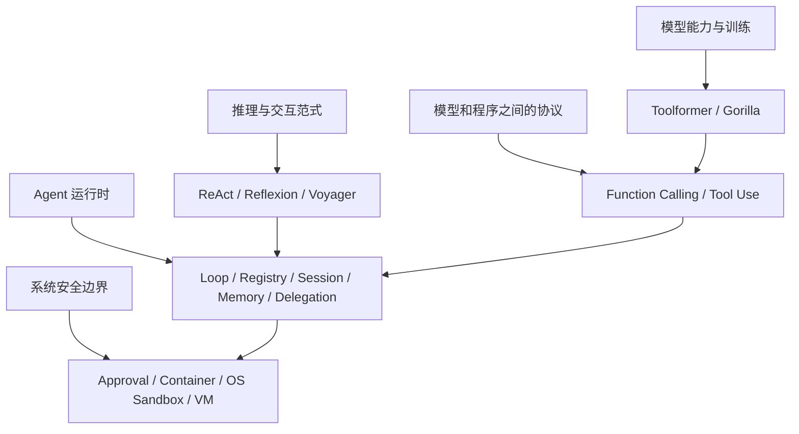
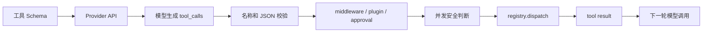
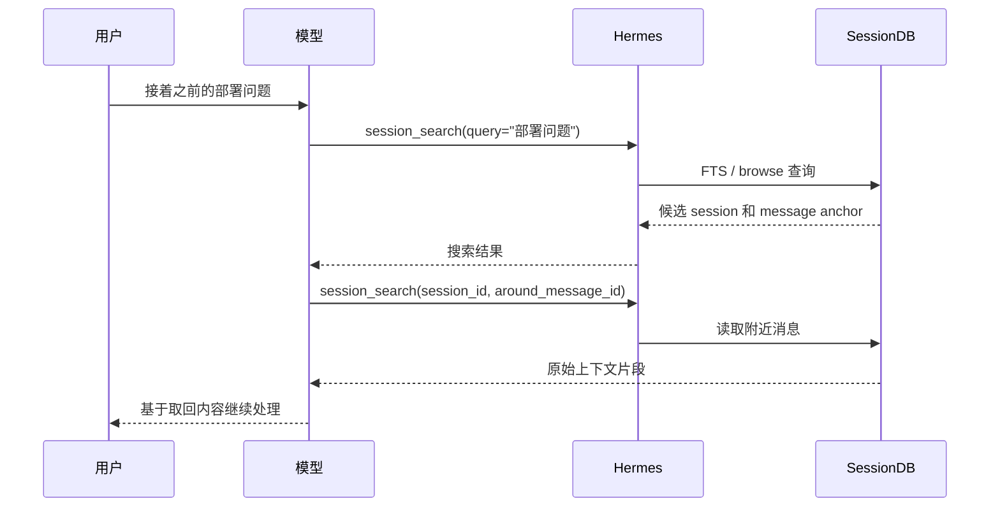
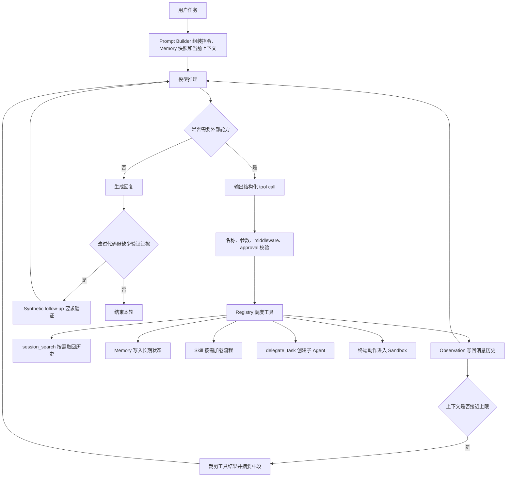

# 第 18 讲：从论文概念到 Hermes 工程实现

读 Agent 源码时，最容易出现一种误判：只要代码里有“思考后调用工具”，就说它实现了 ReAct；只要能搜索历史，就说它实现了 RAG；只要失败后重试，就说它实现了 Reflexion。

这些说法听起来熟悉，却会挡住真正的工程问题。论文可能研究训练方法，API 文档描述的是协议，框架源码实现的是运行时，Docker 和操作系统解决的又是隔离问题。它们经常出现在同一个 Agent 里，但不在同一层。

本文以 `NousResearch/hermes-agent@590a19332e898fc9bda55a31999926572d8fbc26` 为源码快照，沿着十组概念回答三个问题：

1. 原始论文或技术方案究竟解决了什么问题。
2. Hermes 哪些代码与它有对应关系。
3. 哪些地方只能说“思想相近”，不能说“复现了论文”。

## 先建立分层：同一个 Agent 里有五类技术

先看一张总图：



这五层会互相影响，但不能互相替代。

| 层次 | 主要问题 | 典型产物 | Hermes 是否直接实现 |
|---|---|---|---|
| 模型训练 | 模型怎样学会选工具、填参数 | 数据集、训练目标、模型权重 | 否，Hermes 使用已有模型 |
| 交互范式 | 推理、行动、反馈怎样循环 | Prompt 模式、轨迹结构、学习算法 | 部分体现为运行流程 |
| 调用协议 | 模型怎样表达一次工具请求 | JSON Schema、`tool_calls`、`tool_result` | 是，且适配多个 Provider |
| Agent 运行时 | 谁执行工具、保存状态、控制重试 | Loop、Registry、SessionDB、Memory | 是，这是 Hermes 的主体 |
| 安全边界 | 模型生成的动作能影响什么 | 审批、权限、容器、系统调用限制 | 是，但强度取决于运行后端 |

后面遇到任何 Agent 术语，先问它属于哪一层。这个动作比背论文名称有用得多。

---

## 功能 1：ReAct 解决的是“推理和行动脱节”

### 1.1 原论文在研究什么

[ReAct: Synergizing Reasoning and Acting in Language Models](https://arxiv.org/abs/2210.03629) 把语言推理轨迹与环境动作交错起来。一个典型轨迹可以抽象成：

```text
Thought: 我还缺什么信息？
Action: Search[某个查询]
Observation: 搜索结果
Thought: 结果不够，需要继续查证
Action: Lookup[某个实体]
Observation: 新证据
Answer: 最终回答
```

论文关心的不是“模型能不能输出 JSON”，而是推理和外部交互怎样放在同一条轨迹里。纯 Chain-of-Thought 只能在模型已有知识里推演，容易把错误前提越推越远；纯动作策略又缺少显式计划。ReAct 让推理负责维护计划，让动作向环境取证。

### 1.2 Hermes 的 Agent loop 为什么有 ReAct 的形状

Hermes 每轮把消息和工具定义发给模型。模型如果返回 `tool_calls`，运行时执行工具，把结果写成 `role="tool"` 消息，再进入下一次模型调用。模型可以根据 Observation 修正计划，也可以结束并回复用户。

源码锚点：

- `NousResearch/hermes-agent/agent/conversation_loop.py::run_conversation`
- `NousResearch/hermes-agent/agent/tool_executor.py::execute_tool_calls_concurrent`
- `NousResearch/hermes-agent/agent/tool_executor.py::execute_tool_calls_sequential`

对话循环中的分支可以缩成：

```python
if assistant_message.tool_calls:
    for tc in assistant_message.tool_calls:
        if tc.function.name not in agent.valid_tool_names:
            repaired = agent._repair_tool_call(tc.function.name)
            if repaired:
                tc.function.name = repaired

    assistant_msg = agent._build_assistant_message(
        assistant_message, finish_reason
    )
    messages.append(assistant_msg)
    # 后续交给 tool executor，工具结果再追加进 messages
```

这段代码没有保存一个名为 `Thought` 的字段。ReAct 的核心形状仍然存在：

```text
模型输出动作
    ↓
Hermes 执行动作
    ↓
工具结果进入消息历史
    ↓
模型读取结果并决定下一步
```

现代模型常把内部推理放在 Provider 专用的 reasoning 字段中，或者根本不向应用暴露完整思维链。Agent 运行时真正需要的是稳定的动作与观察协议，不需要强制把每段内部思考写进普通消息。

### 1.3 Hermes 不能直接被称为“ReAct 复现”

Hermes 是一个具有 ReAct 式交互循环的运行时，不是 ReAct 论文实验的逐项复现。两者至少有四个差别：

- ReAct 论文用特定任务和示例轨迹研究 prompting、finetuning 效果；Hermes 不负责训练模型。
- Hermes 使用结构化 tool call，也兼容多种 Provider 格式；早期 ReAct 常用文本形式的 `Action[...]`。
- Hermes 增加了校验、审批、并发、会话落库和失败恢复，这些不是 ReAct 算法本身。
- Hermes 的最终行为受模型、system prompt、工具描述、历史消息和运行时守卫共同决定。

因此更准确的表述是：Hermes 的主循环属于 reason-act-observe 的 Agent 范式，ReAct 是理解这条循环的重要论文来源。

### 1.4 工程实现比论文图多了什么

论文图里的 Action 看上去像一个原子步骤。生产运行时必须处理很多脏输入：

- 工具名拼错时，先尝试修复，再决定是否把错误返回模型。
- 参数不是合法 JSON 时，不能直接执行。
- 参数可能因为输出长度限制被截断，这时应停止，而不是补一个右花括号后冒险执行。
- 同一批调用可能互相写同一个文件，不能无条件并发。
- 工具失败要成为 Observation，让模型有机会调整，而不是让整个 Python 进程退出。

ReAct 解释了循环为什么存在；Hermes 源码展示了这条循环怎样在不可靠输入下继续运行。

---

## 功能 2：Function Calling 是协议，不是工具执行器

### 2.1 一次 function call 有四个参与者

[OpenAI 早期 Function Calling 说明](https://openai.com/index/function-calling-and-other-api-updates/) 把函数名称、说明和参数 Schema 提供给模型，模型可以返回结构化参数。[Structured Outputs](https://openai.com/index/introducing-structured-outputs-in-the-api/) 又增加了严格 Schema 约束。

这里有四个参与者：

1. 开发者定义工具名、描述和参数结构。
2. 模型判断是否需要工具，并生成工具请求。
3. Agent 运行时校验请求，决定是否执行。
4. 业务代码执行函数，把结果返回模型。

模型只负责第 2 步。它不会因为输出了 `send_email(...)` 就自动发送邮件。

### 2.2 Hermes 怎样把 Python 工具变成模型可见的 Schema

`ToolRegistry` 保存 handler、Schema、所属 toolset 和运行时检查。对模型暴露时，Registry 生成 OpenAI 风格定义：

源码锚点：

- `NousResearch/hermes-agent/tools/registry.py::ToolRegistry.get_definitions`
- `NousResearch/hermes-agent/model_tools.py::get_tool_definitions`

```python
schema_with_name = {**entry.schema, "name": entry.name}

if entry.dynamic_schema_overrides is not None:
    overrides = entry.dynamic_schema_overrides()
    if isinstance(overrides, dict):
        schema_with_name.update(overrides)

result.append({"type": "function", "function": schema_with_name})
```

Schema 不是静态文档副本。Hermes 可以根据当前配置更新工具说明，例如委派深度、并发上限或执行环境。`get_tool_definitions()` 还会按 toolset、平台可用性和 Tool Search 策略筛选工具，并缓存最终结果。

### 2.3 模型返回 tool call 后，Hermes 才开始执行

真正调用 Python handler 的入口在 Registry 的 `dispatch()`：

```python
def dispatch(self, name: str, args: dict, **kwargs) -> str:
    entry = self.get_entry(name)
    if not entry:
        return json.dumps({"error": f"Unknown tool: {name}"})
    try:
        if entry.is_async:
            return _run_async(entry.handler(args, **kwargs))
        return entry.handler(args, **kwargs)
    except Exception as e:
        return json.dumps({"error": sanitize_error(e)})
```

实际调用链更长：



Function Calling 只规定了 A、B、C 和 H 的消息形状。D 到 G 是 Agent 框架的工程价值。

### 2.4 Provider 兼容为什么是独立工作

OpenAI 使用 `tool_calls`，Anthropic Messages API 使用 `tool_use` 与 `tool_result` content block，Gemini 和 Bedrock 也有自己的字段。Hermes 内部尽量归一为统一的 `ToolCall` 表示，再由 transport/adapter 做转换。

源码锚点：

- `NousResearch/hermes-agent/agent/transports/chat_completions.py`
- `NousResearch/hermes-agent/agent/transports/anthropic.py`
- `NousResearch/hermes-agent/agent/gemini_native_adapter.py`
- `NousResearch/hermes-agent/agent/bedrock_adapter.py`
- `NousResearch/hermes-agent/agent/agent_runtime_helpers.py`

这也是“协议”和“执行器”必须拆开的原因。工具 handler 不应该知道当前模型把参数放在 `input` 还是 `function.arguments` 中。

### 2.5 单个工具、单个 tool call 和一批 tool calls

三个概念要分开：

- 工具是能力定义，例如 `session_search`。
- tool call 是模型在某一轮发出的一次调用实例，有自己的 id 和参数。
- tool calls 是同一轮里的一批调用实例，可能调用同一个工具，也可能调用多个工具。

一批调用并不天然能并发。Hermes 的 `_should_parallelize_tool_batch()` 会拒绝以下情况：只有一个调用、命中永不并发名单、参数无法解析、多个文件操作可能争用同一路径，或 MCP 服务没有声明并发安全。

```python
if len(tool_calls) <= 1:
    return False

if any(name in _NEVER_PARALLEL_TOOLS for name in tool_names):
    return False

try:
    function_args = json.loads(tool_call.function.arguments)
except Exception:
    return False
```

所以“模型一次返回了多个调用”和“运行时并行执行多个调用”是两个判断。前者由模型输出，后者由 Hermes 的安全策略决定。

---

## 功能 3：Toolformer 和 Gorilla 研究的是模型怎样学会用 API

### 3.1 Toolformer 的问题比 Function Calling 更早一层

[Toolformer: Language Models Can Teach Themselves to Use Tools](https://arxiv.org/abs/2302.04761) 研究的是训练方法。它希望模型学会：

- 是否应该调用 API。
- 在文本的什么位置调用。
- 选择哪个 API。
- 参数应该是什么。
- API 返回值怎样影响后续 token。

论文从少量工具示例出发，生成候选 API 调用，再根据调用结果是否降低语言模型损失筛选训练样本。直观地说，如果插入某次 API 调用后，模型更容易预测后续文本，这次调用就可能是有价值的训练信号。

这发生在模型训练或再训练阶段。Hermes 的 `ToolRegistry`、Prompt Builder 和 tool executor 都发生在推理时。

### 3.2 Gorilla 关注大规模 API 与幻觉

[Gorilla: Large Language Model Connected with Massive APIs](https://arxiv.org/abs/2305.15334) 关注模型生成 API 调用时的两个难题：参数不准确，以及虚构不存在的 API。它引入 APIBench，并把模型微调与 API 文档检索结合起来，使调用能够适应文档变化。

Gorilla 里的“检索”主要服务于 API 选择和参数生成。Hermes 的 Tool Search 也会减少一次性暴露给模型的工具数量，但它是运行时工具目录桥接，不是 Gorilla 的 retrieval-aware training。

### 3.3 Hermes 能控制什么，不能控制什么

Hermes 不能在运行时把一个不擅长调用工具的基础模型变成 Toolformer。它能做的是改善模型与工具之间的接口：

- 写清楚工具 description 和参数 Schema。
- 只暴露当前可用的工具。
- 工具过多时先暴露 `tool_search` / `tool_describe`。
- 修复近似工具名和部分参数格式。
- 把执行错误返回模型，让它重新选择。
- 用 toolset 限制当前任务的动作空间。

这些措施能降低失败率，却不能补齐模型本身的选择能力。模型是否能在正确时机调用 `session_search`，仍取决于模型能力、工具描述、system prompt、当前问题和已有上下文。

### 3.4 一个实用判断

看到“模型会调用工具”时，可以这样归类：

| 现象 | 更接近哪个概念 |
|---|---|
| 模型输出符合 Schema 的调用参数 | Function Calling / Structured Output |
| 框架根据名称找到 Python 函数并执行 | Tool Registry / Dispatch |
| 模型经训练学会什么时候插入 API 调用 | Toolformer |
| 模型结合实时 API 文档减少调用幻觉 | Gorilla |
| 工具结果回到模型，模型继续决策 | ReAct 式运行循环 |

把这五行分清，工具系统的大多数术语混乱就消失了。

---

## 功能 4：RAG 与 session_search 都有检索，但系统边界不同

### 4.1 原始 RAG 不是“搜一下再回答”的统称

[Retrieval-Augmented Generation for Knowledge-Intensive NLP Tasks](https://arxiv.org/abs/2005.11401) 把参数化生成模型与非参数化知识库结合。原始方案用 retriever 找到文档，再让 generator 在文档条件下生成答案，并讨论了序列级和 token 级的潜变量边缘化。

后来工程实践把 RAG 用成了更宽的术语：查询改写、向量检索、重排、上下文拼装、生成和引用都可能被放进 RAG pipeline。这个扩展用法没有问题，但读源码时仍要说清楚具体实现。

### 4.2 Hermes 的 session_search 是运行时检索工具

`session_search` 面向 SessionDB 中的历史会话，支持四种形状：

- discovery：给查询，搜索相关会话或消息。
- scroll：给 session id 和 message id，读取附近窗口。
- read：给 session id，读取整条会话。
- browse：不传查询，列出最近会话。

源码锚点：

- `NousResearch/hermes-agent/tools/session_search_tool.py::session_search`
- `NousResearch/hermes-agent/hermes_state.py::SessionDB`

```python
if session_id and around_message_id is not None:
    return _scroll(...)

if session_id:
    return _read_session(db, session_id)

if not query or not query.strip():
    return _list_recent_sessions(db, limit, current_session_id)

return _discover(db=db, query=query.strip(), ...)
```

SessionDB 使用 SQLite 持久化消息，并用 FTS5 索引 `content`、`tool_name` 和 `tool_calls`。这是一条词法检索路线，不等于向量数据库，也没有原始 RAG 论文里的 retriever-generator 联合训练。

### 4.3 谁决定什么时候搜索

通常是模型决定。

Hermes 把 `session_search` 的名称、description 和参数 Schema 放进工具列表。模型读到当前问题后，判断现有上下文是否足够。如果用户说“接着上个月那个部署问题”，而当前消息里没有部署细节，模型应该调用搜索工具；如果当前 session 已经包含答案，就没有必要搜索。

运行时会做三类辅助，但不会替模型完成语义判断：

1. Prompt 告诉模型历史会话可检索，以及什么情况下值得查。
2. Tool Search 在工具目录过大时帮助模型发现 `session_search`。
3. 工具执行后返回候选片段，模型再决定读取哪条会话或哪个窗口。

所以完整流程更像两阶段检索：



模型可能不搜、搜错词、看到候选后选错会话。工具存在并不保证调用正确，这正是模型能力与运行时能力的边界。

### 4.4 session_search 可以叫 RAG 吗

宽泛地说，它完成了 retrieval-augmented generation：先取回历史，再把结果作为上下文交给模型。严格地说，它不是原始 RAG 模型，也不是典型的向量知识库 pipeline。

开源笔记里更准确的写法是：`session_search` 是面向会话历史的检索增强机制，底层以 SQLite FTS5 和锚点窗口读取为主。

---

## 功能 5：MemGPT 提供了“上下文分层”的系统视角

### 5.1 MemGPT 为什么借用操作系统比喻

[MemGPT: Towards LLMs as Operating Systems](https://arxiv.org/abs/2310.08560) 把有限上下文窗口类比为内存，把外部存储类比为磁盘。系统需要在不同层级之间移动信息，让模型在固定上下文窗口内处理长文档和跨会话对话。

这个比喻有两个重点：

- 所有历史不可能同时放进上下文。
- 模型或运行时必须能决定哪些信息常驻、哪些信息按需调入、哪些信息要被写回外部存储。

### 5.2 Hermes 也有层级，但不是 MemGPT 的直接实现

Hermes 的状态可以画成：

| Hermes 层级 | 生命周期 | 怎样进入模型输入 | 主要用途 |
|---|---|---|---|
| system prompt 中的 memory / user snapshot | 当前 session 内冻结 | Prompt Builder 直接注入 | 稳定偏好与长期事实 |
| 当前消息历史 | 当前 session | 每轮随请求发送，过长时压缩 | 当前任务连续性 |
| 压缩摘要 | 当前或续接 session | 替换较早的中段消息 | 节省上下文窗口 |
| SessionDB | 跨 session 持久化 | 恢复会话或由 `session_search` 取回 | 完整历史与检索 |
| MEMORY.md / USER.md live state | 跨 session 持久化 | 下一 session 重建 snapshot | 长期记忆和用户画像 |

源码锚点：

- `NousResearch/hermes-agent/tools/memory_tool.py::MemoryStore`
- `NousResearch/hermes-agent/agent/context_compressor.py::ContextCompressor`
- `NousResearch/hermes-agent/hermes_state.py::SessionDB`
- `NousResearch/hermes-agent/tools/session_search_tool.py::session_search`

`MemoryStore` 明确维护两套状态：

```python
class MemoryStore:
    """Maintains two parallel states:
      - _system_prompt_snapshot: frozen at load time
      - memory_entries / user_entries: live state, persisted to disk
    """
```

这意味着本轮调用 `memory(action="add")` 后，文件中的 live state 已经变化，工具结果也能看到新状态，但当前 session 的 system prompt 不会被中途改写。新内容要到下一次 session 启动时进入冻结快照。

### 5.3 为什么快照要冻结

冻结不是为了模拟人脑，而是为了两个工程目标：

1. 保持 system prompt 前缀稳定，便于 Provider 的 prompt cache 命中。
2. 避免模型在同一 session 中通过写 memory 立刻改写高优先级指令区。

加载快照时，Hermes 还会对磁盘条目做 deterministic threat scan。命中规则的原文仍留在 live state 供用户检查，但进入 system prompt 的版本会替换成 `[BLOCKED: ...]`。

```python
findings = scan_for_threats(entry, scope="strict")
if findings:
    sanitized.append("[BLOCKED: ... Removed from system prompt]")
```

这不是模型在“凭感觉判断危险”。它是运行时对字符串执行规则扫描。优点是稳定、便宜、可审计；缺点是规则会有漏报和误报，无法理解所有语义变体。

### 5.4 Hermes 与 MemGPT 的主要差别

MemGPT 把虚拟上下文管理当作论文与系统的中心机制。Hermes 的上下文分层只是完整 Agent runtime 的一部分，且各层职责由不同模块完成。

Hermes 没有把 SessionDB 中每条消息都包装成由模型显式管理的“页”。很多调入调出由固定算法完成，例如达到阈值后压缩、session id 恢复、FTS 搜索和冻结 memory。更合适的说法是：MemGPT 提供了理解 Hermes 多层状态的操作系统视角，Hermes 采用了相似的层级思想，但有自己的生命周期和安全约束。

---

## 功能 6：Context Compression 不只有一种算法

### 6.1 为什么“大上下文窗口”仍然需要压缩

上下文窗口变大后，问题没有消失：

- 输入 token 仍然有成本和延迟。
- 工具结果、日志和文件内容会迅速膨胀。
- 重要信息在长输入中的位置会影响模型是否利用它。
- Provider 有不同的上下文上限与消息格式限制。

[Lost in the Middle](https://arxiv.org/abs/2307.03172) 的实验表明，相关信息处在长上下文中部时，模型利用效果往往比位于开头或结尾差。压缩不只是为了“塞得下”，也为了重新组织信息密度。

### 6.2 LLMLingua 是 token 级压缩路线

[LLMLingua](https://arxiv.org/abs/2310.05736) 使用小语言模型、预算控制器和 token 级迭代压缩来删减低信息量 token。[LongLLMLingua](https://arxiv.org/abs/2310.06839) 又加入查询感知的内容选择与重排，面向长上下文的位置偏差。

这条路线的特点是尽可能保留原始 prompt 中的信息单元，同时删掉冗余 token。它不是“让大模型写一篇摘要”。

### 6.3 Hermes 使用结构化摘要和受保护区间

Hermes 的 `ContextCompressor.compress()` 走的是另一条路线：

```python
messages, pruned_count = self._prune_old_tool_results(messages, ...)

compress_start = self._protect_head_size(messages)
compress_end = self._find_tail_cut_by_tokens(messages, compress_start)
turns_to_summarize = messages[compress_start:compress_end]

summary = self._generate_summary(
    turns_to_summarize,
    focus_topic=summary_focus_topic,
)
```

源码锚点：

- `NousResearch/hermes-agent/agent/context_compressor.py::ContextCompressor.compress`

它的步骤是：

1. 先裁剪较早、体积大的工具结果，这一步不调用 LLM。
2. 保护开头消息，避免 system prompt 和最初任务定义丢失。
3. 按 token 预算保护最近尾部，让当前工作状态保留原文。
4. 只摘要中间区间。
5. 再次压缩时，把旧摘要作为已有状态增量更新。
6. 清理孤立的 tool call / tool result，保证 Provider 消息协议合法。

这是一种“结构感知的会话摘要”，不是 LLMLingua 的 token 级压缩。

### 6.4 压缩失败也是设计的一部分

摘要模型可能鉴权失败、网络断开、返回空内容，或者摘要后几乎没有节省 token。Hermes 根据失败类型选择行为：

- 鉴权或网络错误时保留原消息，终止本次压缩，避免无依据地丢历史。
- 配置允许时，可生成 deterministic fallback handoff，但会记录丢弃了多少消息。
- 连续无效压缩会增加计数，避免每轮反复触发同一个无效操作。
- 压缩后检查是否仍有 user 消息，防止某些 Provider 以 `No user query found` 拒绝请求。

论文常报告平均压缩率和任务指标，框架还必须回答失败时是否丢数据、怎样恢复、怎样保证消息角色合法。

### 6.5 怎样选择压缩路线

| 路线 | 优点 | 主要风险 | 更适合什么 |
|---|---|---|---|
| 直接截断 | 快、确定 | 容易丢任务约束 | 可丢弃日志尾部 |
| 工具结果裁剪 | 成本低、结构明确 | 可能丢证据细节 | 冗长搜索和终端输出 |
| LLM 摘要 | 可保留任务语义 | 会遗漏、会幻觉、要额外调用 | 长对话与任务交接 |
| Token 级压缩 | 保留更多原文结构 | 需要额外模型和算法 | 大型静态 prompt |
| 检索后按需调入 | 不必常驻全部历史 | 依赖检索召回 | 跨会话知识与档案 |

Hermes 实际上组合了前三项与最后一项，而不是押注单一压缩算法。

---

## 功能 7：Reflexion 不是“报错后再试一次”

### 7.1 Reflexion 的闭环

[Reflexion: Language Agents with Verbal Reinforcement Learning](https://arxiv.org/abs/2303.11366) 不更新模型权重。它把环境反馈、评分或自我评价转成语言形式的反思，再写入 episodic memory，供后续 trial 使用。

可以压缩成：

```text
执行一次任务
  ↓
得到结果与反馈
  ↓
生成“为什么失败、下次怎么改”的反思
  ↓
保存反思
  ↓
下一次尝试读取反思
```

闭环里最容易被忽略的是“反思必须影响后续尝试”。只有错误消息和重试计数，还不够构成 Reflexion。

### 7.2 Hermes 有反馈闭环，但多数不是 Reflexion

工具名错误时，Hermes 会把可恢复错误写成 `role="tool"` 消息，让模型下一轮自行修正：

```python
messages.append({
    "role": "tool",
    "name": tc.function.name,
    "tool_call_id": tc.id,
    "content": "Tool does not exist. Please retry...",
})
continue
```

这属于环境反馈驱动的 self-correction。它没有单独生成一条反思，也不一定跨 trial 持久化，因此不能直接叫 Reflexion。

Hermes 的 verify-on-stop 更接近一个确定性的质量门：如果本轮改了代码，却没有新鲜的通过证据，运行时生成一条 synthetic follow-up，要求模型运行测试、构建或针对性验证。

源码锚点：

- `NousResearch/hermes-agent/agent/verification_stop.py::build_verify_on_stop_nudge`
- `NousResearch/hermes-agent/agent/verification_evidence.py`
- `NousResearch/hermes-agent/agent/verify_hooks.py`

```python
status = verification_status(session_id=session_id, cwd=cwd)
if status.get("status") == "passed":
    return None

return (
    "[System: You edited code in this turn, but the workspace does not "
    "have fresh passing verification evidence yet. ...]"
)
```

这段逻辑不是让模型自由反思“我是否测试过”。运行时查 evidence ledger，发现缺少通过记录后再强制续跑。判断条件比自然语言自评更可审计。

### 7.3 什么情况下才更像 Reflexion

如果 Hermes 完成下面整条链，才可以说实现了 Reflexion 风格机制：

1. 从失败轨迹提炼出一般化原因，而不是只保存原始报错。
2. 把反思写入专门的 episodic memory。
3. 下一次相关任务主动检索这条反思。
4. 反思参与新计划生成。
5. 根据新结果更新或淘汰旧反思。

Hermes 的 Memory、SessionDB、skill 沉淀和 verification 已经提供了构建这条链的零件，但零件存在不等于闭环自动成立。

### 7.4 为什么工程系统常把一部分反思改成规则

“测试通过了吗”“工具名存在吗”“JSON 能解析吗”都有可计算答案。让模型反思这些问题会增加 token、延迟和不确定性。Hermes 用代码处理能确定的部分，只把“下一步怎样修复”留给模型。

这是论文概念落地时常见的变化：开放式认知步骤会被拆成 deterministic guard、状态机和少量模型判断。

---

## 功能 8：Voyager 的 Skill Library 与 Hermes Skills 不是一回事

### 8.1 Voyager 的三个组件

[Voyager: An Open-Ended Embodied Agent with Large Language Models](https://arxiv.org/abs/2305.16291) 在 Minecraft 环境中组合了：

- 自动课程，让 Agent 持续提出适合当前能力的新目标。
- 可执行技能库，把成功代码保存并按任务检索复用。
- 环境反馈、执行错误和自我验证驱动的迭代 prompting。

它的 skill 是 Agent 在环境中产生、验证并积累的可执行代码。技能库增长本身就是论文研究对象。

### 8.2 Hermes Skills 是渐进披露的流程包

Hermes 的 skill 目录以 `SKILL.md` 为入口，还可以带 references、templates、scripts 和 assets。`skills_list()` 只返回名称与描述，模型确定需要后再调用 `skill_view()` 加载正文或关联文件。

源码锚点：

- `NousResearch/hermes-agent/tools/skills_tool.py::skills_list`
- `NousResearch/hermes-agent/tools/skills_tool.py::skill_view`
- `NousResearch/hermes-agent/tools/skill_manager_tool.py::skill_manage`
- `NousResearch/hermes-agent/tools/skills_guard.py::scan_skill`

```python
def skills_list(...):
    """List skills, returning only minimal metadata."""
    return json.dumps({
        "skills": all_skills,
        "hint": "Use skill_view(name) to see full content...",
    })
```

渐进披露解决的是上下文预算问题。Agent 不需要在 system prompt 里常驻每个技能的完整操作手册。

### 8.3 两种 Skill 的差别

| 问题 | Voyager | Hermes |
|---|---|---|
| Skill 从哪里来 | Agent 在环境中生成并验证 | 官方、用户、插件或 Agent 经管理工具创建 |
| 主要内容 | 可执行程序 | 指令文档，可带脚本、模板和参考资料 |
| 怎样选择 | 根据任务检索技能代码 | 先看 metadata，按需 `skill_view` |
| 是否自动课程驱动 | 是 | 普通会话默认不是 |
| 是否有安全扫描 | 论文重点不在此 | 有结构检查、内容扫描和写入门 |
| 是否保证执行成功后才入库 | Voyager 闭环强调验证 | 取决于创建与审查流程 |

因此 Hermes skill 更接近“可安装、可审计、按需加载的 Agent 操作规程”。它可以承载 Voyager 风格的经验，但不会因为叫 skill 就自动具备自主课程和环境学习。

### 8.4 Memory 与 Skill 怎样分工

- Memory 适合短小、稳定、跨任务有用的事实，例如用户偏好或环境约束。
- Skill 适合多步骤流程、命令模板、故障处理方法和配套脚本。
- Session history 保存某次任务的完整轨迹。
- 从失败轨迹提炼出可复用流程，再写成经过审查的 skill，才接近“经验沉淀”。

把长教程塞进 Memory 会挤占每轮 system prompt。把一个用户偏好写成 Skill，又会让检索和维护变得笨重。工程上需要按信息形状分层。

---

## 功能 9：Sandbox、Approval 和 Prompt Injection 防护是三道不同的门

### 9.1 Sandbox 解决的不是“模型会不会做坏事”

Sandbox 假设被执行的程序可能不可信，然后限制它能看到的文件、能写的路径、网络出口、系统调用和资源。它关心的是动作造成的实际影响。

[Firecracker](https://www.usenix.org/conference/nsdi20/presentation/agache) 用轻量 microVM 在较低开销下提供更强的工作负载隔离。这篇论文来自 serverless 基础设施，不是 Agent 论文，但它说明了一个重要事实：隔离强度来自执行边界，不来自 prompt 中的一句“请小心”。

### 9.2 Hermes 的 DockerEnvironment 做了什么

Hermes 的 Docker 后端把容器当作执行边界。默认安全参数包括：

```python
_BASE_SECURITY_ARGS = [
    "--cap-drop", "ALL",
    "--cap-add", "DAC_OVERRIDE",
    "--cap-add", "CHOWN",
    "--cap-add", "FOWNER",
    "--security-opt", "no-new-privileges",
    "--tmpfs", "/tmp:rw,nosuid,size=512m",
]
```

源码锚点：

- `NousResearch/hermes-agent/tools/environments/docker.py::DockerEnvironment`
- `NousResearch/hermes-agent/tools/approval.py::check_dangerous_command`

它还可以限制 CPU、内存和 PID，决定是否开放网络，把 credential、skills 和 cache 以只读方式挂载。工作区是否 bind mount 到宿主机，会直接改变风险边界。

### 9.3 为什么容器里有时不用审批，有时仍要审批

Hermes 的判断写得很直白：

```python
def _should_skip_container_guards(env_type, has_host_access=False):
    if env_type == "docker":
        return not has_host_access
    return env_type in ("singularity", "modal", "daytona")
```

纯隔离容器中的 `rm -rf /workspace` 只破坏容器内部临时空间，运行时可以跳过一部分危险命令审批。一旦 `/workspace` bind mount 到宿主目录，同一条命令会删除真实文件，此时必须恢复普通 approval 流程。

这说明 approval 不是 sandbox 的替代品：

- Sandbox 缩小动作能影响的范围。
- Approval 让用户决定某个高风险动作是否允许。
- Hardline block 对不可恢复命令直接拒绝，即使开启宽松模式也不放行。
- Prompt injection 扫描试图阻止不可信文本影响模型决策。

### 9.4 规则检测和模型判断怎样分工

危险 Shell 命令先经过规则匹配：

```python
for command_variant in _command_detection_variants(command):
    for pattern_re, description in DANGEROUS_PATTERNS_COMPILED:
        if pattern_re.search(command_variant.lower()):
            return True, description, description
```

这类规则擅长识别 `mkfs`、原始设备写入、递归删除和关机命令。Hermes 还会处理 Unicode、引号拆分和部分混淆变体。规则命中后，可以阻断、请求用户批准，或在配置允许时交给辅助模型做低风险分类。

规则的优势是结果可重复。模型分类适合模糊语境，但不能成为唯一安全边界。最终保护仍应由权限、挂载方式、容器或操作系统沙箱落实。

### 9.5 Hermes、Codex、Claude Code 的隔离侧重点

| 系统 | 主要执行边界 | 典型特点 |
|---|---|---|
| Hermes | 可选 Docker/远程环境加 approval | 跨平台通用 runtime，容器可持久化，也可挂载宿主目录 |
| Codex CLI | 主机 OS 沙箱加 approval | macOS 使用 Seatbelt，Linux 路线使用 bubblewrap/Landlock 等，Windows 使用受限令牌 |
| Claude Code | permissions、sandbox 与 Hooks | 官方开源 sandbox runtime 在 Linux 使用 bubblewrap，在 macOS 使用 Seatbelt，并代理网络访问 |
| Firecracker 系统 | KVM microVM | 隔离强度高于普通共享内核容器，启动和资源成本也不同 |

Codex 的公开实现可见于 [openai/codex](https://github.com/openai/codex)，Claude 的实验性沙箱实现可见于 [anthropic-experimental/sandbox-runtime](https://github.com/anthropic-experimental/sandbox-runtime)。它们可以帮助理解不同隔离层，但不能据此说 Hermes 的 Docker 后端等同于 OS sandbox 或 microVM。

---

## 功能 10：Multi-Agent 的核心是上下文与责任边界

### 10.1 多个 Agent 不等于多个 tool call

同一模型一轮调用三个搜索工具，仍然是一个 Agent 在发出三次动作。多个 Agent 至少意味着存在多个相对独立的执行上下文，它们可能有各自的 system prompt、消息历史、工具集、模型、预算和生命周期。

[CAMEL](https://arxiv.org/abs/2303.17760) 用 role-playing 和 inception prompting 研究多个通信 Agent 的协作。[AutoGen](https://arxiv.org/abs/2308.08155) 把可对话 Agent 抽象成框架，允许 LLM、工具和人类以可编程对话模式协作。

论文和框架关注的重点包括：谁向谁发消息、角色怎样保持、何时终止、怎样插入工具与人类反馈。

### 10.2 Hermes 把子 Agent 暴露成 delegate_task

Hermes 的父 Agent 调用 `delegate_task`，传入 goal、context、role 和是否后台运行。子 Agent 由运行时创建，不只是一次普通函数调用。

源码锚点：

- `NousResearch/hermes-agent/tools/delegate_tool.py::delegate_task`
- `NousResearch/hermes-agent/tools/async_delegation.py::dispatch_async_delegation`
- `NousResearch/hermes-agent/hermes_cli/kanban_db.py`

```python
def delegate_task(goal=None, context=None, tasks=None,
                  role=None, background=None, parent_agent=None):
    depth = getattr(parent_agent, "_delegate_depth", 0)
    max_spawn = _get_max_spawn_depth()
    if depth >= max_spawn:
        return error("Delegation depth limit reached")

    max_children = _get_max_concurrent_children()
    if tasks and len(tasks) > max_children:
        return error("Too many tasks")
```

这里有两个独立上限：

- `max_spawn_depth` 控制委派树深度，防止子 Agent 无限再派生。
- `max_concurrent_children` 控制同一层的扇出，防止并发和成本失控。

`role="leaf"` 的子 Agent 不能继续委派；`role="orchestrator"` 可以保留 delegation toolset。角色不是文案标签，它会影响可用工具和拓扑。

### 10.3 后台子 Agent 怎样回到原会话

后台委派不能只启动一个线程后就忘掉。Hermes 在调度时记录 `delegation_id`、goal、session key、状态和完成时间，并把并发检查与记录写入放在同一把锁下：

```python
with _records_lock:
    running = sum(
        1 for r in _records.values() if r.get("status") == "running"
    )
    if running >= max_async_children:
        return {"status": "rejected", "error": "capacity reached"}
    _records[delegation_id] = record

executor.submit(propagate_context_to_thread(_worker))
```

子 Agent 完成后，结果进入共享 completion queue，再按 dispatch 时捕获的 session key 回到原会话。这个路由不能临时读取进程全局变量，因为 Gateway 可能同时服务多个用户和 session。

### 10.4 Hermes 与会话式多 Agent 框架的差别

AutoGen 的中心抽象是 Agent 之间的 conversation，可以定义轮流发言、群聊管理和自动回复。Hermes 的常用路径更像层级委派：父 Agent 定义子任务，子 Agent 独立执行，再把摘要结果返回父会话。

```text
AutoGen 常见形状：Agent A ↔ Agent B ↔ Agent C

Hermes 常见形状：Parent
                   ├─ Child A
                   ├─ Child B
                   └─ Child C
```

Hermes 也有 Kanban，把更长生命周期的任务、依赖、认领和 worktree 放入持久状态。它解决的是工作编排，不是让几个模型在聊天框里自由讨论。

### 10.5 多 Agent 为什么不一定更好

多 Agent 会增加：

- 多份 prompt 和历史的 token 成本。
- 子任务描述不完整导致的上下文损失。
- 结果合并、冲突处理和重复工作的成本。
- 并发写文件、共享服务和凭证时的竞争风险。
- 失败传播、取消和超时管理难度。

只有任务可以明确拆分、子任务之间依赖较少，或者需要不同工具与模型时，委派才可能带来收益。把同一个模糊问题复制给五个 Agent，通常只是把不确定性和账单一起放大。

---

## 把十组概念接回一条 Hermes 运行链

现在把论文和源码放回一次真实任务：



每个论文概念只解释其中一部分：

- ReAct 帮助理解 M、TC、O 之间的循环。
- Function Calling 定义 TC 和 O 的结构化协议。
- Toolformer、Gorilla研究模型怎样更可靠地产生 TC。
- RAG 帮助理解 SS 取回信息后增强生成。
- MemGPT 帮助理解当前上下文、外部会话和长期 Memory 的层级。
- LLMLingua 提供另一种 CP 压缩路线，但 Hermes 没有照搬。
- Reflexion 帮助审视反馈是否真正沉淀并影响下一次尝试。
- Voyager 帮助区分“技能文档”与“由环境验证后自动积累的技能库”。
- Sandboxing 约束 X 对真实系统的影响。
- Multi-Agent 解释 DA 为什么需要独立上下文、预算和生命周期。

不存在一篇论文能完整解释 Hermes。生产 Agent 是多条研究路线和大量系统工程的交叉结果。

---

## 常见误解与判断方法

### 问题 1：Hermes 是一个 ReAct Agent 吗

可以说它有 ReAct 式的 reason-act-observe 主循环。不能据此说 Hermes 复现了 ReAct 的训练、prompt 轨迹和实验设置。Hermes 的工具协议、并发、安全、会话和 Provider 兼容远超 ReAct 论文讨论范围。

### 问题 2：模型会 function calling，就代表它会正确使用工具吗

不代表。格式正确只说明参数符合协议。模型仍可能选错工具、给出语法合法但语义错误的值、在不该调用时调用，或者漏掉必要调用。Structured Output 约束的是结构，不保证业务事实正确。

### 问题 3：session_search 是不是 RAG

它是检索增强机制，可以放在广义 RAG 家族中。底层是会话数据库、FTS5 和锚点窗口读取，不是原始 RAG 论文中的联合训练模型，也不是默认的 embedding 向量检索。

### 问题 4：Hermes 有 Memory，所以就是 MemGPT 吗

不是。两者都承认上下文窗口有限，也都采用分层存储。Hermes 的 Memory 快照、SessionDB、压缩器和 session_search 分属不同模块，生命周期与 MemGPT 的虚拟上下文管理并不相同。

### 问题 5：工具失败后模型修正了，这是不是 Reflexion

通常只是 in-context self-correction。Reflexion 还要求把反馈提炼成语言反思并放入 episodic memory，让后续 trial 读取。一次对话内看到报错后重试，不足以证明这条闭环存在。

### 问题 6：Hermes Skills 是不是 Voyager 的技能库

不是。Hermes Skill 主要是人工、官方、插件或 Agent 管理的流程包，支持渐进加载和安全审查。Voyager 的技能是 Agent 在环境中生成、执行验证并自动积累的代码，两者来源和验证闭环不同。

### 问题 7：Docker 里执行就绝对安全吗

不绝对。容器共享宿主内核，安全性还取决于 capability、网络、挂载、Docker socket、凭证和运行用户。尤其是 bind mount 宿主工作区后，容器内删除文件会直接影响宿主。Hermes 因此会根据 `has_host_access` 决定是否恢复 approval。

### 问题 8：多个并行工具调用是不是多 Agent

不是。它们共享同一模型上下文和一次决策。子 Agent 有自己的运行实例、历史、工具集、预算和完成状态。并发是执行方式，多 Agent 是责任与状态边界。

### 问题 9：这些 guardrail 会不会削弱模型自主性

会限制动作空间，这是有意的。模型擅长处理开放式语义，运行时擅长验证可计算约束。工具名是否存在、JSON 是否完整、命令是否触碰硬性禁区、有没有新鲜测试证据，都不应只依赖模型自觉。

### 问题 10：应该先读论文还是先读源码

先用论文建立问题模型，再回源码确认实际边界。对 Hermes 可以按下面顺序：

1. 用 ReAct 看懂 Agent loop。
2. 用 Function Calling 区分模型请求与程序执行。
3. 用 RAG、MemGPT 和压缩论文看懂上下文分层。
4. 用 Reflexion、Voyager检查“自我改进”是否真的形成闭环。
5. 用 sandbox 和 multi-agent 系统资料理解运行边界与并发成本。

读完每个概念都要回到一个问题：Hermes 的哪段代码在维护这个不变量？找不到源码或公开行为证据时，就暂时把它当作类比，不要写成已实现事实。

---

## 一张概念边界表

| 概念 | 发生阶段 | 核心状态 | Hermes 对应 | 最常见误标 |
|---|---|---|---|---|
| ReAct | 推理时 | Thought / Action / Observation 轨迹 | conversation loop 与工具结果回填 | 有工具就叫 ReAct |
| Function Calling | 推理时协议 | Schema、call id、arguments、result | Registry、adapter、executor | 模型输出调用等于工具已执行 |
| Toolformer | 训练时 | 自监督 API 调用样本 | 无直接实现 | Runtime tool use 叫 Toolformer |
| Gorilla | 训练与 API 文档检索 | APIBench、retrieved docs | Tool Search 仅有局部类比 | 工具目录搜索叫 Gorilla |
| RAG | 检索加生成 | query、documents、generator context | SessionDB + session_search | 任意数据库读取都叫 RAG |
| MemGPT | 虚拟上下文管理 | 多级 memory 与调入调出 | Memory snapshot、SessionDB、压缩 | 有长期记忆就叫 MemGPT |
| LLMLingua | Prompt 压缩 | token budget、压缩后 prompt | Hermes 使用另一种摘要路线 | 所有摘要都叫 LLMLingua |
| Reflexion | trial 间学习 | feedback、reflection、episodic memory | error feedback 与 verify gate 仅部分相似 | 任意重试都叫 Reflexion |
| Voyager | 开放环境持续学习 | curriculum、verified code skills | Skills 系统有概念相似处 | 有 SKILL.md 就叫 Voyager |
| Sandboxing | 执行时 | 权限、文件、网络、系统调用 | DockerEnvironment 与 approval | Prompt 提醒等于隔离 |
| Multi-Agent | 编排时 | 独立上下文、角色、消息和预算 | delegate、async、Kanban | 并行 tool calls 叫多 Agent |

---

## 进一步阅读

### 推理与工具

- Shunyu Yao et al., [ReAct: Synergizing Reasoning and Acting in Language Models](https://arxiv.org/abs/2210.03629)
- Timo Schick et al., [Toolformer: Language Models Can Teach Themselves to Use Tools](https://arxiv.org/abs/2302.04761)
- Shishir G. Patil et al., [Gorilla: Large Language Model Connected with Massive APIs](https://arxiv.org/abs/2305.15334)
- OpenAI, [Function Calling and Other API Updates](https://openai.com/index/function-calling-and-other-api-updates/)
- OpenAI, [Introducing Structured Outputs in the API](https://openai.com/index/introducing-structured-outputs-in-the-api/)
- Anthropic, [Tool use with Claude](https://docs.anthropic.com/en/docs/agents-and-tools/tool-use/overview)

### 记忆、检索与压缩

- Patrick Lewis et al., [Retrieval-Augmented Generation for Knowledge-Intensive NLP Tasks](https://arxiv.org/abs/2005.11401)
- Charles Packer et al., [MemGPT: Towards LLMs as Operating Systems](https://arxiv.org/abs/2310.08560)
- Huiqiang Jiang et al., [LLMLingua: Compressing Prompts for Accelerated Inference of Large Language Models](https://arxiv.org/abs/2310.05736)
- Huiqiang Jiang et al., [LongLLMLingua: Accelerating and Enhancing LLMs in Long Context Scenarios via Prompt Compression](https://arxiv.org/abs/2310.06839)
- Nelson F. Liu et al., [Lost in the Middle: How Language Models Use Long Contexts](https://arxiv.org/abs/2307.03172)

### 反馈学习与技能

- Noah Shinn et al., [Reflexion: Language Agents with Verbal Reinforcement Learning](https://arxiv.org/abs/2303.11366)
- Guanzhi Wang et al., [Voyager: An Open-Ended Embodied Agent with Large Language Models](https://arxiv.org/abs/2305.16291)

### 隔离与多 Agent

- Alexandru Agache et al., [Firecracker: Lightweight Virtualization for Serverless Applications](https://www.usenix.org/conference/nsdi20/presentation/agache)
- OpenAI, [Codex open-source repository](https://github.com/openai/codex)
- Anthropic, [sandbox-runtime](https://github.com/anthropic-experimental/sandbox-runtime)
- Guohao Li et al., [CAMEL: Communicative Agents for Mind Exploration of Large Language Model Society](https://arxiv.org/abs/2303.17760)
- Qingyun Wu et al., [AutoGen: Enabling Next-Gen LLM Applications via Multi-Agent Conversation](https://arxiv.org/abs/2308.08155)
- Anthropic, [How we built our multi-agent research system](https://www.anthropic.com/engineering/multi-agent-research-system)

## 本讲结论

理解 Agent 工程，不能停在“这个功能像哪篇论文”。更可靠的方法是沿五层追问：模型是否经过专门训练，模型与程序使用什么协议，运行时如何维护状态，失败由谁恢复，动作最终被什么安全边界约束。

Hermes 最值得学习的部分也在这里。它没有发明上述所有研究概念，而是把模型调用、工具协议、会话检索、长期记忆、压缩、技能、安全和委派接进同一个可运行系统。论文告诉我们某个机制为什么可能有效，源码则告诉我们：输入不合法、网络中断、历史过长、并发冲突或权限不足时，这个机制还能不能工作。
